# 阿里巴巴投研分析

## 目录

### [第一部分：财务报表分析](#第一部分财务报表分析)

- [一、营业收入与净利润（FY2017–FY2026）](#一营业收入与净利润fy2017fy2026)
- [二、刨除投资收益看什么：Non-GAAP vs Adjusted EBITA / EBITDA](#二刨除投资收益看什么non-gaap-vs-adjusted-ebita--ebitda)
- [三、分部收入与 EBITA（FY2025 vs FY2026）](#三分部收入与-ebitafy2025-vs-fy2026)
- [四、利润表关键项（FY2025 vs FY2026）](#四利润表关键项fy2025-vs-fy2026)
- [五、股东分红、回购与年度股东收益率（FY2021–FY2026）](#五股东分红回购与年度股东收益率fy2021fy2026)

### [第二部分：阿里云分析](#第二部分阿里云分析)

- [六、阿里云季度营收与增速（1Q23–1Q26）](#六阿里云季度营收与增速1q231q26)
- [七、中国 AI 云份额与 AI 相关产品收入](#七中国-ai-云份额与-ai-相关产品收入)
- [八、C 端用户：豆包 / 千问 / DeepSeek / 元宝](#八c-端用户豆包--千问--deepseek--元宝)

### [第三部分：大模型能力分析](#第三部分大模型能力分析)

- [九、国内大模型能力排序（2026 年 8–9 月）](#九国内大模型能力排序2026-年-89-月)


### [第四部分：平头哥分析](#第四部分平头哥分析)

- [十、平头哥芯片全栈矩阵](#十平头哥芯片全栈矩阵)


### [第五部分：即时零售分析](#第五部分即时零售分析)

- [十一、即时零售（淘宝闪购 / 饿了么体系）](#十一即时零售淘宝闪购--饿了么体系)


### [第六部分：企业文化分析](#第六部分企业文化分析)

- [十二、使命愿景、价值观与战略转译](#十二使命愿景价值观与战略转译)
  - [近一两年 AI / 大模型人才出走](#6-近一两年-ai--大模型人才出走)
  - [合伙人委员会：机制与核心成员](#7-合伙人委员会机制与核心成员)


### [第七部分：历史收购与投资分析](#第七部分历史收购与投资分析)

- [十三、主要收购、投资与成败](#十三主要收购投资与成败)

---


## 第一部分：财务报表分析


## 一、营业收入与净利润（FY2017–FY2026）

口径说明：

- 公司：阿里巴巴集团控股有限公司（港股 `9988.HK` / 美股 ADR `BABA`）
- 财年：每年 **4 月 1 日–次年 3 月 31 日**（下表「FY20xx」指截至该年 3 月 31 日的财年）
- 单位：人民币百万元（表内）；图表换算为 **亿元**
- 净利润：合并报表 **Net income**（非「归属于普通股股东净利润」）
- 来源：公司业绩公告 / 年报（港交所、SEC）；原始数据见 `data/alibaba_revenue_net_income_fy2017_2026.json`


| 财年     | 截至         | 营业收入（百万元） | 净利润（百万元） | 营收同比  | 净利润同比  |
| ------ | ---------- | --------- | -------- | ----- | ------ |
| FY2017 | 2017-03-31 | 158,273   | 41,226   | —     | —      |
| FY2018 | 2018-03-31 | 250,266   | 61,412   | 58.1% | 49.0%  |
| FY2019 | 2019-03-31 | 376,844   | 80,234   | 50.6% | 30.6%  |
| FY2020 | 2020-03-31 | 509,711   | 140,350  | 35.3% | 74.9%  |
| FY2021 | 2021-03-31 | 717,289   | 143,284  | 40.7% | 2.1%   |
| FY2022 | 2022-03-31 | 853,062   | 47,079   | 18.9% | -67.1% |
| FY2023 | 2023-03-31 | 868,687   | 65,573   | 1.8%  | 39.3%  |
| FY2024 | 2024-03-31 | 941,168   | 71,332   | 8.3%  | 8.8%   |
| FY2025 | 2025-03-31 | 996,347   | 125,976  | 5.9%  | 76.6%  |
| FY2026 | 2026-03-31 | 1,023,670 | 102,127  | 2.7%  | -18.9% |


### 营业收入与净利润（亿元，并排）

各用独立纵轴，避免量级差把净利润压扁。预览宽度足够时左右并排；窄屏可能上下折行。


|     |
| --- |
|     |


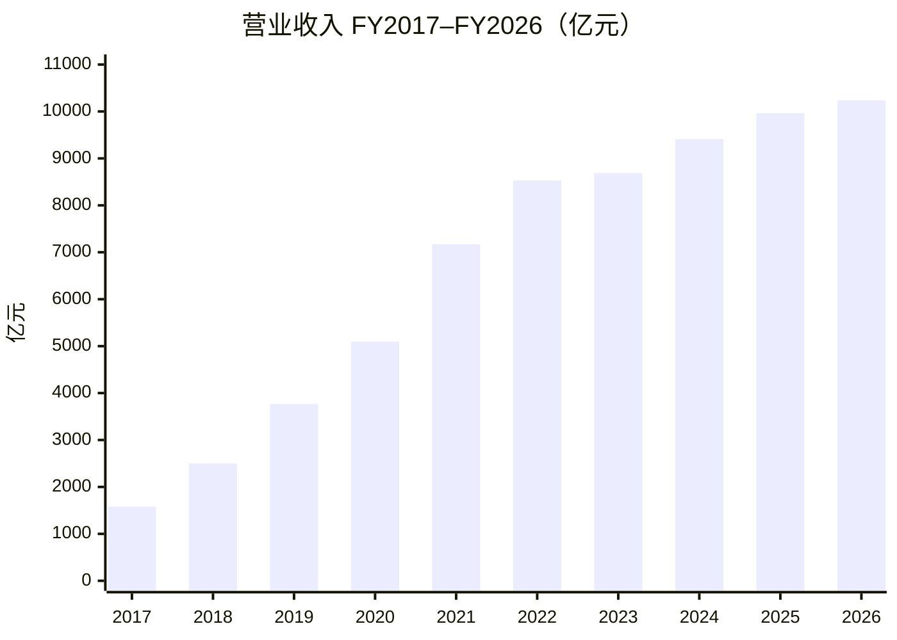


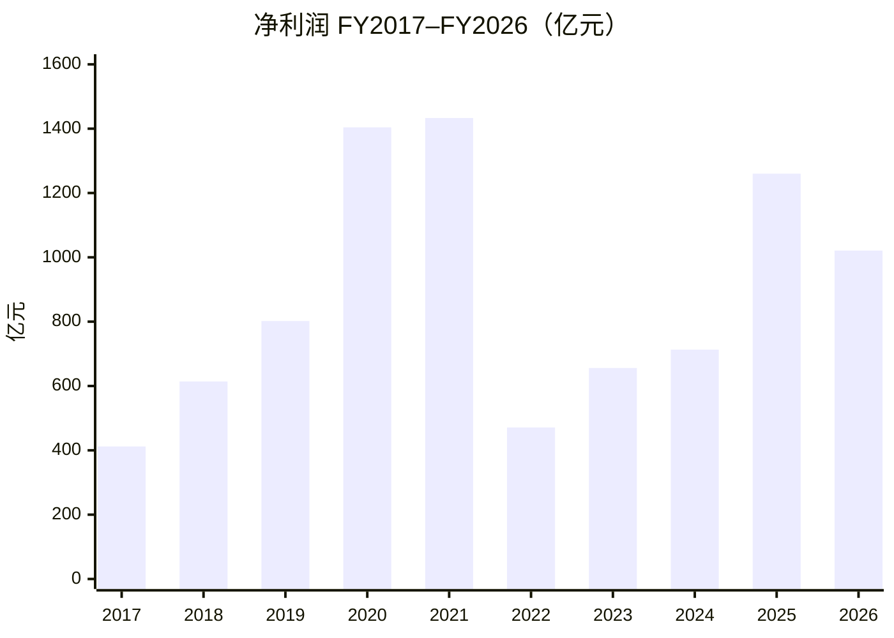


简要观察：

- **先纠正一点**：偏高的主要是 **净利润**，不是营业收入。投资公允价值变动 / 处置收益走「利息及投资收益」等线下科目，**不会抬高营收**。
- 营收从 FY2017 约 **1,583 亿元** 增至 FY2026 约 **10,237 亿元**，十年量级约 **6.5 倍**；近三年增速明显放缓（FY2024–FY2026 分别约 8%/6%/3%）。
- GAAP 净利润在 FY2020–FY2021 冲高（含股权投资浮盈等），FY2022 因投资浮亏大跌；FY2025 回升、FY2026 仍含较大投资相关收益（见下一节）。


## 二、刨除投资收益看什么：Non-GAAP vs Adjusted EBITA / EBITDA


### 该用哪个？


| 指标                     | 是否剔除投资浮盈/浮亏/处置     | 还剔除什么                      | 适合回答的问题                            |
| ---------------------- | ------------------ | -------------------------- | ---------------------------------- |
| **Non-GAAP 净利润**（优先）   | ✅ 是                | SBC、无形资产摊销/减值、商誉减值等 + 税项调整 | 「把非常规投资损益拿掉后，赚了多少钱？」               |
| **Adjusted EBITA**（主业） | ✅ 天然不含（在利息及投资收益之上） | SBC、摊销等；**不含税、利息**         | 「主业经营利润质量如何？」分部也主要看这个              |
| **Adjusted EBITDA**    | ✅ 同上               | 在 EBITA 上再加回 PP&E/土地使用权折旧  | 现金流粗看、杠杆（Debt/EBITDA）；比 EBITA 更「厚」 |


**结论：**

1. 要对照 FY2020/2021/2026 那种「投资收益把净利润打歪」→ 用 **Non-GAAP 净利润** 最直接。
2. 要看电商/云/即时零售等经营投入是否拖累主业 → 用 **Adjusted EBITA**（公司分部考核也用它）。
3. **EBITDA 不是替代 Non-GAAP 看投资收益的首选**；它只是经营利润的加回折旧版。三者都看最好：Non-GAAP 看「干净利润」，EBITA 看「干净经营」，GAAP 看「含投资噪声的账面」。


### 指标数据（人民币百万元）

来源：公司业绩公告 / 20-F / 港交所年报；原始 JSON：`data/alibaba_nongaap_ebita_ebitda_fy2017_2026.json`


| 财年     | GAAP 净利润 | Non-GAAP 净利润 | Adjusted EBITA | Adjusted EBITDA | GAAP−Non-GAAP（约） |
| ------ | -------- | ------------ | -------------- | --------------- | ---------------- |
| FY2017 | 41,226   | 57,871       | 69,172         | 74,456          | -16,645          |
| FY2018 | 61,412   | 83,214       | 97,003         | 105,792         | -21,802          |
| FY2019 | 80,234   | 93,407       | 106,981        | 121,943         | -13,173          |
| FY2020 | 140,350  | 132,479      | 137,136        | 157,659         | **+7,871**       |
| FY2021 | 143,284  | 171,985      | 170,453        | 196,842         | -28,701          |
| FY2022 | 47,079   | 136,388      | 130,397        | 158,205         | **-89,309**      |
| FY2023 | 65,573   | 141,379      | 147,911        | 175,710         | -75,806          |
| FY2024 | 71,332   | 157,479      | 165,028        | 191,668         | -86,147          |
| FY2025 | 125,976  | 158,122      | 173,065        | 202,325         | -32,146          |
| FY2026 | 102,127  | 60,658       | 76,416         | 113,483         | **+41,469**      |


> GAAP−Non-GAAP **为正** ≈ 当期 GAAP 相对 Non-GAAP「更肥」（常见：投资浮盈/处置收益进了 GAAP，却被 Non-GAAP 剔除）。  
> **为负** ≈ GAAP「更瘦」（常见：投资浮亏，或 Non-GAAP 加回了 SBC/罚款等）。


### FY2020–FY2026：GAAP − Non-GAAP 差值原因表

单位：人民币百万元。差值 = GAAP 净利润 − Non-GAAP 净利润。  
调节项来自公司业绩公告「Net income → Non-GAAP net income」调节表（加项抬高 Non-GAAP，减项压低 Non-GAAP）。


| 财年     | GAAP − Non-GAAP = 差值                     | 主要原因（按影响大致排序）                                                                                                | 关键调节项（摘自公告）                                                                                     |
| ------ | ---------------------------------------- | ------------------------------------------------------------------------------------------------------------ | ----------------------------------------------------------------------------------------------- |
| FY2020 | 140,350 − 132,479 = **+7,871**（GAAP更肥）   | **一次性获得蚂蚁 33% 股权相关收益约 716 亿**计入 GAAP，Non-GAAP 整笔剔除；虽加回 SBC/减值等，仍盖不过该项                                        | −蚂蚁股权收益 **71,561**；+SBC 31,742；+商誉/投资减值 25,656；+无形资产摊销减值 13,388；−其他投资重估/处置净收益 4,764；税项 −2,429 等 |
| FY2021 | 143,284 − 171,985 = **-28,701**（GAAP更瘦）  | Non-GAAP **加回反垄断罚款约 182 亿 + SBC 约 501 亿**；同时剔除投资重估/处置等净收益约 663 亿——加回项合计仍大于剔除的投资收益，故 Non-GAAP > GAAP          | +SBC **50,120**；+反垄断罚款 **18,228**；+商誉/投资减值 14,737；+无形资产摊销 12,427；−投资重估/处置等收益 **66,305**；税项 −506 |
| FY2022 | 47,079 − 136,388 = **-89,309**（GAAP显著更瘦） | **公开市场股权投资公允价值大跌**（投资亏损进 GAAP）；叠加商誉/投资减值约 403 亿、SBC 约 240 亿被 Non-GAAP 加回                                     | +商誉/投资减值 **40,264**；+SBC 23,971；+投资重估/处置等亏损 **21,671**；+无形资产摊销减值 11,647；税项 −8,244               |
| FY2023 | 65,573 − 141,379 = **-75,806**（GAAP更瘦）   | 仍以 **SBC + 商誉/投资减值 + 投资相关净亏损** 加回为主；公允价值亏损较 FY2022 收窄，但 GAAP 仍明显低于 Non-GAAP                                  | +SBC **30,831**；+商誉/投资减值 **24,351**；+投资重估/处置等净亏损 13,857；+无形资产摊销减值 13,504；+股权捐赠 511；税项 −7,248    |
| FY2024 | 71,332 − 157,479 = **-86,147**（GAAP更瘦）   | **投资相关净亏损约 217 亿**（含市值变动）+ **商誉/投资减值及其他约 337 亿**（高鑫、优酷等减值）+ 无形资产摊销减值约 216 亿 + SBC；GAAP 被拖瘦                   | +商誉/投资减值及其他 **33,679**；+投资重估/处置亏损 **21,659**；+无形资产摊销减值 **21,592**；+SBC 18,546；税项 −9,329         |
| FY2025 | 125,976 − 158,122 = **-32,146**（GAAP略瘦）  | 出现 **投资重估/处置净收益约 88 亿**（抬高 GAAP），但 Non-GAAP 仍加回减值约 224 亿 + SBC 约 140 亿等，整体 Non-GAAP 仍更高；另有高鑫/银泰等处置亏损在经营叙述中出现 | +商誉/投资减值及其他 **22,435**；+SBC 13,970；+无形资产摊销减值 6,336；−投资重估/处置净收益 **8,764**；税项 −1,831              |
| FY2026 | 102,127 − 60,658 = **+41,469**（GAAP更肥）   | **投资重估/处置净收益约 744 亿被 Non-GAAP 剔除**（含股权投资市值变动净收益、Trendyol 本地生活等处置收益；对比 FY2025 高鑫/银泰处置亏损）。经营利润大降，但账面净利被投资收益撑住  | −投资重估/处置净收益 **74,416**；+商誉/投资减值及其他 17,746；+SBC 11,180；+无形资产摊销减值 5,079；税项 −1,058                 |


一句话对照：


| 财年        | 一句话                                 |
| --------- | ----------------------------------- |
| FY2020    | 蚂蚁 33% 股权一次性收益把 GAAP 抬过 Non-GAAP    |
| FY2021    | 投资收益不小，但罚款 + SBC 加回更大 → Non-GAAP 更高 |
| FY2022    | 投资浮亏 + 大额减值 → GAAP 塌、Non-GAAP 稳     |
| FY2023–24 | 持续「SBC + 减值 + 投资噪声」格局，GAAP 系统性偏低    |
| FY2025    | 投资收益回正，但加回项仍占优，缺口收窄                 |
| FY2026    | 超大额投资/处置收益抬高 GAAP；Non-GAAP 暴露主业承压   |


### 非常规投资收益相关注明

- **FY2020**：GAAP 净利润（约 1,404 亿）**高于** Non-GAAP（约 1,325 亿）。公司披露净利含股权投资市值变动等投资收益；Non-GAAP 明确剔除投资重估/处置损益。  
- **FY2021**：GAAP 净利仍高（约 1,433 亿），但 Non-GAAP 更高（约 1,720 亿）——因反垄断罚款、股份支付等被 Non-GAAP 加回；投资相关损益仍在 GAAP 路径里，不能把「FY21 净利高」全当成投资收益。  
- **FY2022**：GAAP 净利暴跌至约 471 亿，Non-GAAP 仍约 1,364 亿——主因公开市场股权投资公允价值下跌（公司明确写入业绩说明）。  
- **FY2025→FY2026**：GAAP 净利仅降约 19%（1,260→1,021 亿），但 **Non-GAAP 净利 -62%**（1,581→607 亿）、**Adjusted EBITA -56%**（1,731→764 亿）。差额来自：  
  - 「利息及投资收益，净额」FY2026 约 **875 亿元**（FY2025 约 208 亿；FY2024 为亏损约 100 亿）；  
  - 含股权投资市值变动净收益，以及处置收益（含 Trendyol 本地生活服务等）；对比 FY2025 有高鑫零售、银泰等处置亏损。  
  - 经营侧：即时零售（淘宝闪购）与技术投入显著压缩 Adjusted EBITA。


### Non-GAAP 净利润（亿元）

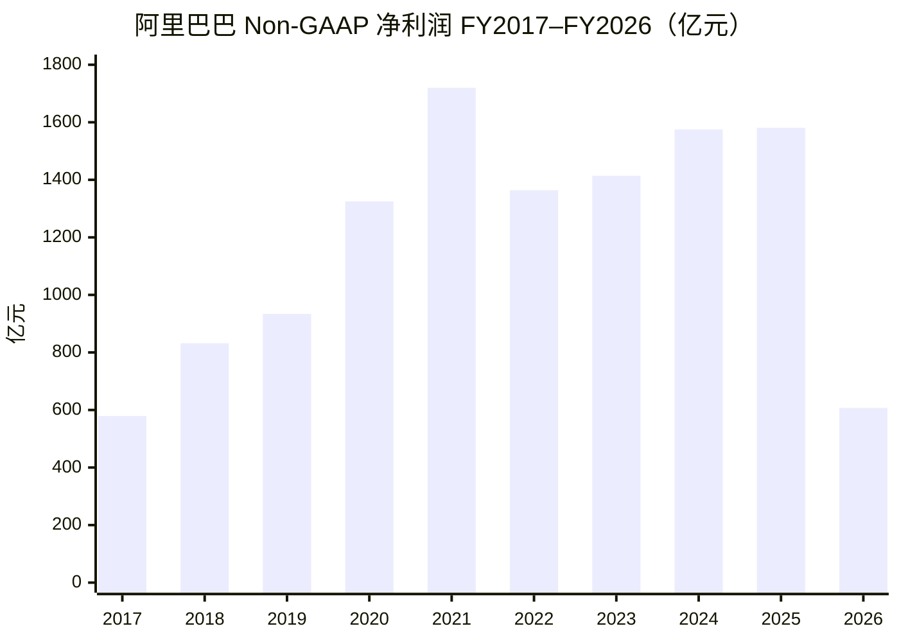


### Adjusted EBITA（亿元）

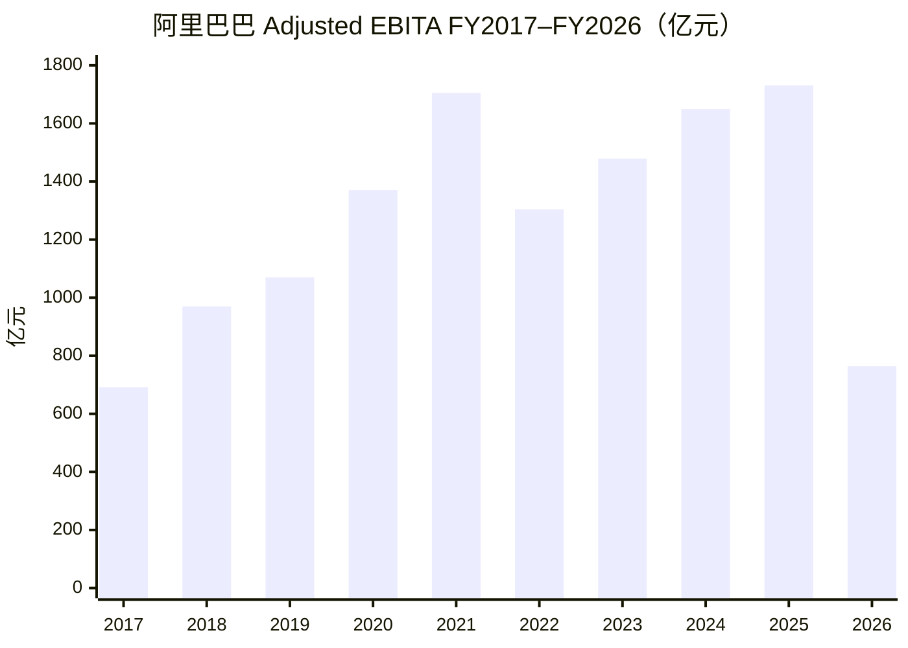


### Adjusted EBITDA（亿元）

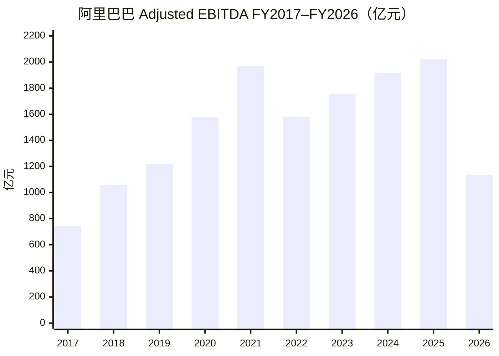


### GAAP vs Non-GAAP 净利润对照（亿元）

```mermaid
xychart-beta
    title "GAAP vs Non-GAAP 净利润（亿元）"
    x-axis [2017, 2018, 2019, 2020, 2021, 2022, 2023, 2024, 2025, 2026]
    y-axis "亿元" 0 --> 1800
    bar [412, 614, 802, 1404, 1433, 471, 656, 713, 1260, 1021]
    bar [579, 832, 934, 1325, 1720, 1364, 1414, 1575, 1581, 607]
```


> 每组左柱 GAAP、右柱 Non-GAAP。FY2020、FY2026 GAAP 高于 Non-GAAP（投资收益抬高账面）；FY2022 GAAP 远低于 Non-GAAP（投资浮亏）。


## 三、分部收入与 EBITA（FY2025 vs FY2026）

口径：公司分部披露；单位 **亿元人民币**（由公告百万元÷100）；EBITA 为 Adjusted EBITA；利润率 = EBITA ÷ 该分部收入。  
来源：公司 FY2026 业绩公告 / 年报分部表。

### 简表（主分部）


| 分部           | 收入 FY25   | 收入 FY26    | EBITA FY25 | EBITA FY26 | 利润率 FY25  | 利润率 FY26 |
| ------------ | --------- | ---------- | ---------- | ---------- | --------- | -------- |
| 中国电商集团       | 5,084     | 5,542      | 1,932      | 1,075      | 38.0%     | 19.4%    |
| └ 其中：淘天集团    | —         | —          | 1,962      | 2,046      | 43.1%*    | 43.0%*   |
| └ 其中：即时零售    | 536       | 785        | -30        | -970       | -5.6%     | -123.6%  |
| 国际数字商业（AIDC） | 1,323     | 1,442      | -151       | -21        | -11.4%    | -1.4%    |
| 云计算（云智能）     | 1,180     | 1,581      | 106        | 143        | 8.0%      | 9.9%     |
| 所有其他         | 3,383     | 2,544      | -95        | -357       | -2.8%     | -14.0%   |
| **合并合计**     | **9,963** | **10,237** | **1,731**  | **764**    | **17.4%** | **7.5%** |


淘天利润率按公司披露口径（相对淘天相关收入）；「所有其他」EBITA 取年报分部 Adjusted EBITA。合并合计含未分摊及分部间抵消，不等于各分部简单加总。

要点：FY26 合并 EBITA 利润率从 17.4% 掉到 7.5%，主因 **即时零售亏损扩大至约 -970 亿元**；淘天利润率仍约 43%，云与国际在改善。

### 分部收入对比（亿元）

```mermaid
xychart-beta
    title "分部营业收入 FY25 vs FY26（亿元）"
    x-axis [中国电商, 国际AIDC, 云计算, 所有其他]
    y-axis "亿元" 0 --> 6000
    bar [5084, 1323, 1180, 3383]
    bar [5542, 1442, 1581, 2544]
```


> 每组左柱 FY25、右柱 FY26。


### 分部 EBITA 对比（亿元）

```mermaid
xychart-beta
    title "分部 Adjusted EBITA FY25 vs FY26（亿元）"
    x-axis [淘天集团, 即时零售, 国际AIDC, 云计算, 所有其他]
    y-axis "亿元" -1000 --> 2200
    bar [1962, -30, -151, 106, -95]
    bar [2046, -970, -21, 143, -357]
```


> 每组左柱 FY25、右柱 FY26。淘天 EBITA 仍稳增；即时零售 FY26 亏损显著扩大，拖累中国电商集团整体 EBITA。


## 四、利润表关键项（FY2025 vs FY2026）

单位：人民币百万元。摘自合并利润表（截至 3/31）。


| 项目              | FY25    | FY26      | 同比      |
| --------------- | ------- | --------- | ------- |
| 营业收入            | 996,347 | 1,023,670 | +2.7%   |
| 营业成本            | 598,285 | 616,136   | +3.0%   |
| 销售费用            | 144,021 | 245,023   | +70.1%  |
| 营业利润            | 140,905 | 50,150    | -64.4%  |
| 投资损益（利息收入及投资损益） | 20,759  | 87,512    | +321.6% |
| 净利润（含少数股东权益）    | 125,976 | 102,127   | -18.9%  |


说明：

- 营业成本、销售费用按费用绝对值列示（原表为负向支出）。
- 投资损益取「利息收入及投资损益」；另有「应占股权投资损益」FY25 **5,966** / FY26 **2,785**，未并入上表。
- 归母净利润（归属普通股东）为 FY25 **129,470** / FY26 **105,904**。


### 关键项同比柱状图（亿元）

```mermaid
xychart-beta
    title "利润表关键项 FY25 vs FY26（亿元）"
    x-axis [营业收入, 营业成本, 销售费用, 营业利润, 投资损益, 净利润]
    y-axis "亿元" 0 --> 11000
    bar [9963, 5983, 1440, 1409, 208, 1260]
    bar [10237, 6161, 2450, 502, 875, 1021]
```


> 每组左柱 FY25、右柱 FY26。成本费用用绝对额便于同比；形成过程请看上方利润桥。


## 五、股东分红、回购与年度股东收益率（FY2021–FY2026）

口径：金额以公司业绩公告 / 股份回购更新 / 年报披露的 **美元** 为主（回购为当年执行额；分红为对应财年**宣布**总额）。股东收益率 ≈（当年回购 + 宣布分红）÷ **财年末（约 3/31）市值**；市值为约值，用于量级判断，非审计指标。上市至 FY2022 基本无常态现金分红；正式年度分红自 **FY2023** 起。

### 分红（宣布口径）


| 对应财年   | 宣布时点    | ADS 每股      | 合计约         | 构成                           |
| ------ | ------- | ----------- | ----------- | ---------------------------- |
| FY2023 | 2023-11 | **US$1.00** | **US$25 亿** | 首次年度常规分红                     |
| FY2024 | 2024-05 | **US$1.66** | **US$40 亿** | 常规 1.00 + 特别 0.66（处置金融资产）    |
| FY2025 | 2025-05 | **US$2.00** | **US$46 亿** | 常规 1.05 + 特别 0.95（处置业务/金融资产） |
| FY2026 | 2026-05 | **US$1.05** | **US$25 亿** | **仅常规**，无特别分红                |


累计宣布约 **US$136 亿**。特别分红依赖资产处置回笼，不宜当作可持续派息率。

### 回购（执行口径）

授权：约 2018 起 US$60 亿计划 → 多次扩额；2022-11 至 US$400 亿；2024-02 再加 US$250 亿、有效至 **2027-03**。截至 2025-03-31 剩余额度约 **US$201 亿**。


| 财年     | 回购约          | 要点                      |
| ------ | ------------ | ----------------------- |
| FY2021 | ~US$1 亿量级    | 几乎可忽略                   |
| FY2022 | **US$96 亿**  | 约 6000 万 ADS / 4.8 亿普通股 |
| FY2023 | **US$109 亿** | 现金流口径约 108.8 亿          |
| FY2024 | **US$125 亿** | 流通股净减约 **5.1%**（扣 ESOP） |
| FY2025 | **US$119 亿** | 流通股再净减约 **5.1%**        |
| FY2026 | **US$10 亿**  | 仅约 7300 万普通股；相对前四年断崖式下降 |


FY2022–FY2026 回购合计约 **US$460 亿**；流通普通股大致自 2023-03 约 **205 亿股** → 2025-03 约 **185 亿股**。

### 每年股东现金回报与收益率


| 财年     | 回购约（亿美元） | 宣布分红约 | 合计回报约 | 财年末市值约 | 股东收益率约  |
| ------ | -------- | ----- | ----- | ------ | ------- |
| FY2021 | ~1       | —     | ~1    | ~6000  | **~0%** |
| FY2022 | 96       | —     | 96    | ~2900  | **~3%** |
| FY2023 | 109      | 25    | 134   | ~2670  | **~5%** |
| FY2024 | 125      | 40    | 165   | ~1820  | **~9%** |
| FY2025 | 119      | 46    | 165   | ~3070  | **~5%** |
| FY2026 | 10       | 25    | 35    | ~2990  | **~1%** |


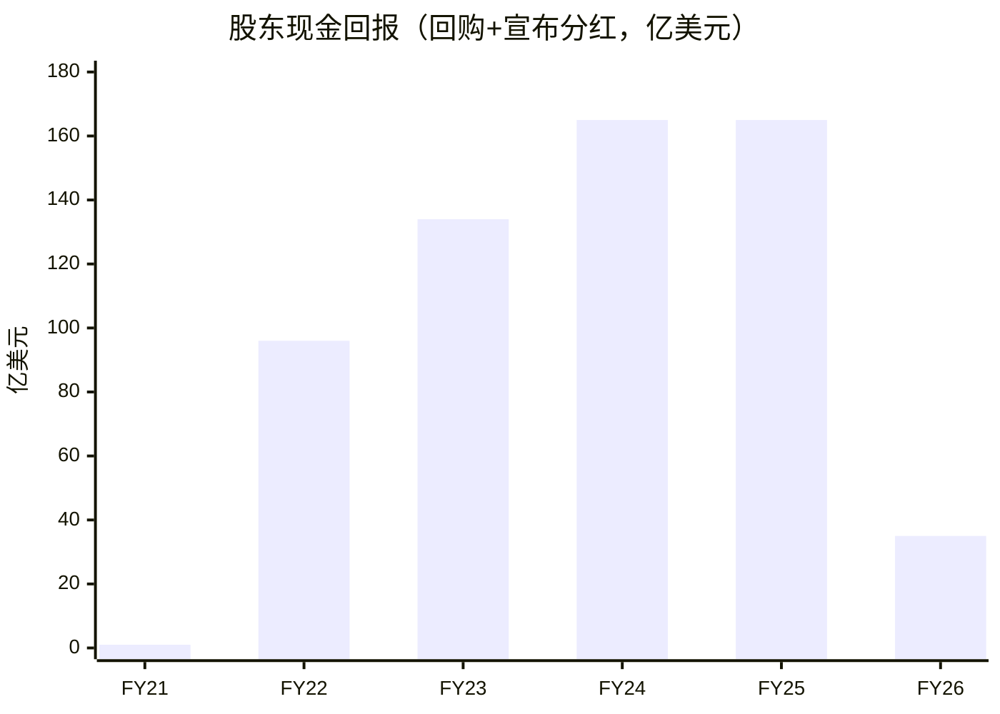


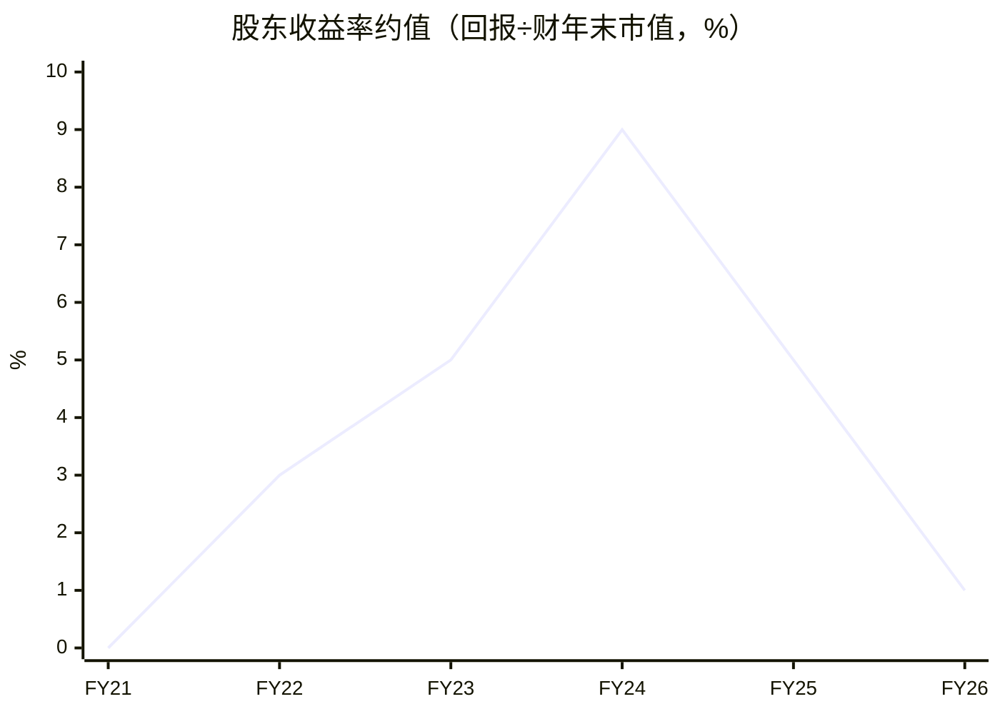


读法：

1. **FY2023–FY2025** 现金回报偏厚（约 **5%–9%**），主因百亿级回购；FY2024 的 ~9% 含「市值被砸低、分母变小」成分。
2. 六年并非每年都 ≥5%：简单平均大约 **4%** 量级；**FY2026 回购砍至约 10 亿**，收益率回落至约 **1%**，与云/AI、即时零售抢现金同向。
3. 这是 **股东收益率（cash return）**，不是含股价的总回报（TSR）。
4. 与「客户第一、股东第三」并不矛盾：高峰期用存量现金与股本缩减回馈；投入期优先客户与算力，回报节奏可明显退坡。


## 第二部分：阿里云分析


## 六、阿里云季度营收与增速（1Q23–1Q26）

口径说明：

- 主体：云智能集团（阿里云）分部收入；**自 2Q26 起**公司将云智能与平头哥整合，分部更名为 **「AI云与算力服务」**（序列仍可比，公司披露同比 +45%）
- 横轴为**日历季度**（1Q=截至 3/31，2Q=6/30，3Q=9/30，4Q=12/31）
- 收入：公司业绩公告；同比：公司披露或同季收入重算
- 数据文件：`data/alibaba_cloud_quarterly_revenue.json`


| 季度       | 截至             | 收入（亿元）     | 同比         |
| -------- | -------------- | ---------- | ---------- |
| 1Q23     | 2023-03-31     | 185.82     | -2.0%      |
| 2Q23     | 2023-06-30     | 251.23     | +4.0%      |
| 3Q23     | 2023-09-30     | 276.48     | +2.0%      |
| 4Q23     | 2023-12-31     | 280.66     | +3.0%      |
| 1Q24     | 2024-03-31     | 255.95     | +3.0%      |
| 2Q24     | 2024-06-30     | 265.49     | +5.7%      |
| 3Q24     | 2024-09-30     | 296.10     | +7.1%      |
| 4Q24     | 2024-12-31     | 317.42     | +13.1%     |
| 1Q25     | 2025-03-31     | 301.27     | +17.7%     |
| 2Q25     | 2025-06-30     | 334.18     | +25.9%     |
| 3Q25     | 2025-09-30     | 398.24     | +34.5%     |
| 4Q25     | 2025-12-31     | 432.84     | +36.4%     |
| 1Q26     | 2026-03-31     | 416.26     | +38.2%     |
| **2Q26** | **2026-06-30** | **484.37** | **+45.0%** |


> 2Q26：AI云与算力服务收入 **484.37 亿元**（同比 +45%；上年同期公司可比基数 334.18 亿元）。其中 AI 相关产品收入 **123.76 亿元**，连续第 12 个季度三位数增长。来源：公司 2026 年 6 月季度业绩公告。

阿里云季度营收与增速

### 营收柱状图（亿元）

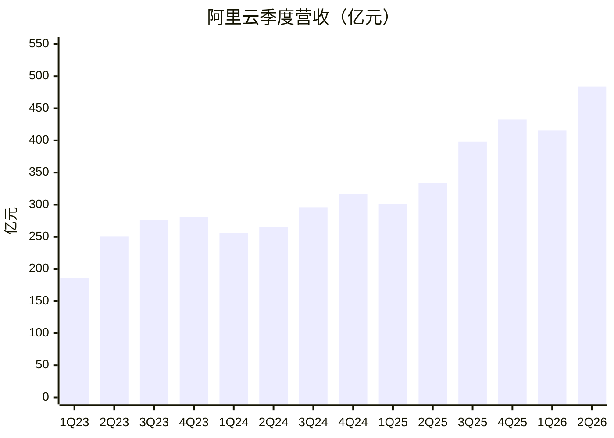


### 同比增速（%）

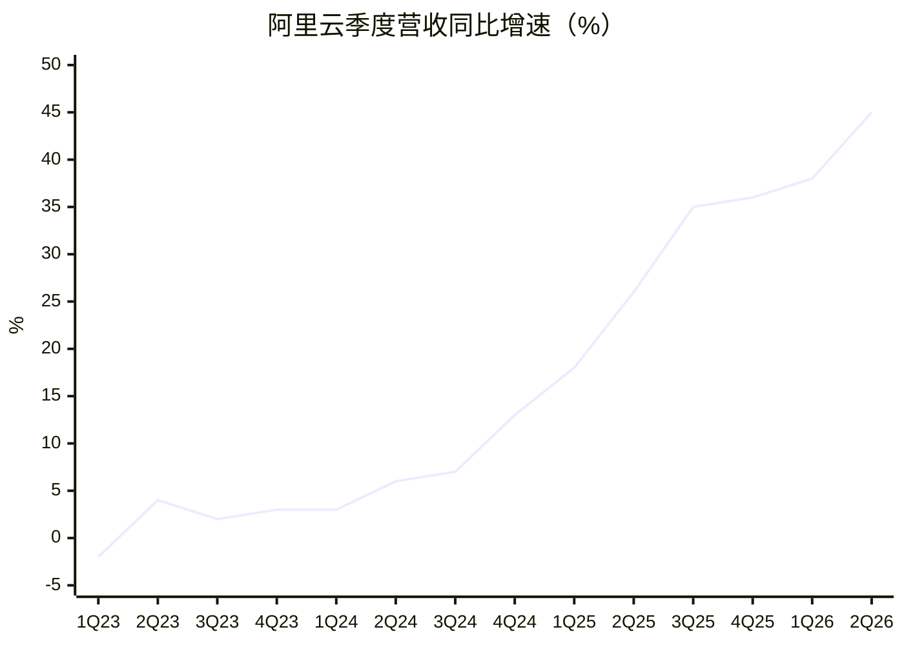


简要观察：2023–2024 总收入同比多在个位数；自 2025 起增速台阶式抬升，**2Q26 达约 +45%**（484 亿元），继续由 AI/公共云放量驱动。

## 七、中国 AI 云份额与 AI 相关产品收入

说明：第三方机构口径不同，会出现「两个第一」。**2026 全年完整份额表尚未公开**；份额为目前可核对的 **2025** 数据。另附公司披露的 **AI 相关产品收入**（狭义，勿与云分部总收入混淆）。

### 口径 A：Omdia 全链条营收（IaaS + MaaS 等）

测的是 AI 云相关**收入**谁卖得多。2025 年中国 AI 云市场规模约 **567 亿元**（Omdia《中国 AI 云市场份额 2025》，2026 年 5 月发布）。


| 排名  | 厂商       | 2025 全年份额 | 2025 上半年份额（对照） |
| --- | -------- | --------- | -------------- |
| 1   | **阿里云**  | **38.1%** | 35.8%          |
| 2   | **火山引擎** | **20.4%** | 14.8%          |
| 3   | 百度智能云    | 9.4%      | 6.1%           |
| 4   | 腾讯云      | 6.3%      | 7.0%           |
| 5   | 天翼云      | 5.9%      | —              |
| —   | 华为云      | —         | 13.1%（上半年第 3）  |


> 前五合计超过八成。全年榜公开报道中华为云未进 Top5；上半年华为云仍第 3。阿里云在 AI IaaS（约 38.6%）、MaaS-MPS（约 42.3%）亦居首。

```mermaid
xychart-beta
    title "Omdia：中国AI云营收份额 2025（%）"
    x-axis [阿里云, 火山引擎, 百度, 腾讯云, 天翼云]
    y-axis "%" 0 --> 45
    bar [38.1, 20.4, 9.4, 6.3, 5.9]
```


### 口径 B：IDC 公有云大模型 Token 调用量

测的是外部客户 **Token 调用量**（不含厂商自有业务），谁被用得多。2025 年中国公有云大模型调用量约 **1944 万亿 Tokens**（同比约 +16 倍）。


| 排名  | 厂商       | 2025 全年份额 | 2025 上半年份额（对照） |
| --- | -------- | --------- | -------------- |
| 1   | **火山引擎** | **49.5%** | 49.2%          |
| 2   | **阿里云**  | **约 28%** | 约 27%          |
| 3   | 百度智能云    | 约 10%     | —              |


> 按 MaaS **营收**口径，IDC 亦显示火山引擎占 **40%+**，阿里、百度、智谱、移动云等进入前五。IDC 预计 2026 年 Token 消耗约 4 万万亿、MaaS 营收约 186 亿元（规模预测，非份额）。

```mermaid
xychart-beta
    title "IDC：公有云大模型Token调用量份额 2025（%）"
    x-axis [火山引擎, 阿里云, 百度]
    y-axis "%" 0 --> 55
    bar [49.5, 28, 10]
```


### 怎么读份额


| 问题                      | 看哪张表  | 2025 结论              |
| ----------------------- | ----- | -------------------- |
| 谁 AI 云**卖得多**（全栈收入）     | Omdia | **阿里云约 38%**，火山约 20% |
| 谁大模型 API **用得多**（Token） | IDC   | **火山约 50%**，阿里约 28%  |


两套尺子不矛盾：阿里强在算力/全栈与政企；火山强在公有云 MaaS 调用生态。

### 阿里 AI 相关产品收入（公司口径）

指标为业绩公告中的 **「AI 相关产品收入」**（AI 算力/存储、MaaS、AI 应用等），**不是**「云智能 / AI云与算力服务」分部总收入（后者 2Q26 约 484 亿元、同比约 +45%）。

公司自约 **3Q23** 起持续披露「三位数同比」（≥100%）；至 **2Q26** 为**连续第十二个季度**。更早季度多未公布绝对额。

已披露绝对额（来源：集团业绩公告）：

- **1Q26**（至 2026-03-31）：**89.71 亿元**，连续第 **11** 个季度三位数同比。  
- **2Q26**（至 2026-06-30）：**123.76 亿元**，连续第 **12** 个季度三位数同比。


## 八、C 端用户：豆包 / 千问 / DeepSeek / 元宝

口径：QuestMobile **AI 原生 App** 月活（独立下载安装，**不含**手机厂商预装助手）。用户可同时使用多款 App，下列「占行业月活池比例」会重叠、加总可超过 100%，仅作体量对照，不是互斥市场份额。

### 2026 年 6 月（最新可比）

行业 AI 原生 App 整体月活约 **4.99 亿**（2026 年 5–6 月量级）。


| 产品           | 归属       | 月活 MAU     | 占行业月活池*     | 四者内部占比**    |
| ------------ | -------- | ---------- | ----------- | ----------- |
| **豆包**       | 字节       | **3.82 亿** | **约 76.6%** | **约 52.4%** |
| **千问**       | 阿里       | **1.67 亿** | **约 33.5%** | **约 22.9%** |
| **DeepSeek** | DeepSeek | **1.30 亿** | **约 26.1%** | **约 17.8%** |
| **元宝**       | 腾讯       | **0.50 亿** | **约 10.0%** | **约 6.9%**  |
| 四者合计（未去重）    | —        | 7.29 亿     | —           | 100%        |


占行业月活池 = 各产品 MAU ÷ 约 4.99 亿。  
四者内部占比 = 各产品 MAU ÷（豆包+千问+DeepSeek+元宝）；因重叠，合计 MAU > 行业去重用户。

```mermaid
xychart-beta
    title "C端AI原生App月活 2026年6月（亿）"
    x-axis [豆包, 千问, DeepSeek, 元宝]
    y-axis "亿人" 0 --> 4
    bar [3.82, 1.67, 1.30, 0.50]
```


```mermaid
xychart-beta
    title "豆包/千问/DeepSeek/元宝 内部用户占比（%）"
    x-axis [豆包, 千问, DeepSeek, 元宝]
    y-axis "%" 0 --> 55
    bar [52.4, 22.9, 17.8, 6.9]
```


### 近期演变（同口径 MAU）


| 时点      | 豆包         | 千问         | DeepSeek   | 元宝         |
| ------- | ---------- | ---------- | ---------- | ---------- |
| 2025-12 | 约 2.27 亿   | 约 0.25 亿   | —          | —          |
| 2026-03 | 约 3.45 亿   | 约 1.66 亿   | 约 1.27 亿   | —          |
| 2026-06 | **3.82 亿** | **1.67 亿** | **1.30 亿** | **0.50 亿** |


简要观察：C 端呈 **豆包断层第一 → 千问第二 → DeepSeek 第三（约 1.3 亿，同比有所下滑）→ 元宝第四（约半亿）**；豆包月活约是千问的 **2.3 倍**、DeepSeek 的约 **2.9 倍**、元宝的约 **7.6 倍**。来源：QuestMobile 2026 年 AI 应用相关报告 / 月活榜。

## 第三部分：大模型能力分析


## 九、国内大模型能力排序（2026 年 8–9 月）

口径：综合 SuperCLUE 中文综合、Artificial Analysis 智能指数、Arena/Code 专项等公开榜做**合成判断**（非单一官方名次）。旗舰代际更迭快，名次会轮动；**1–2 名基本双雄，差一档都不大**。

### 综合能力（旗舰）


| 档      | 排序      | 厂商 / 代表模型                | 一句话                       |
| ------ | ------- | ------------------------ | ------------------------- |
| **S**  | **1**   | **月之暗面 · Kimi K3**       | 国际第三方验证最完整，Agent/长程任务常最强  |
| **S**  | **2**   | **阿里 · 千问 Qwen3.8-Max**  | 中文综合最稳，Arena 国产综合常最高，生态最厚 |
| **A+** | **3**   | **智谱 · GLM-5.2/5.3**     | 编程/前端偏科顶尖，综合略逊于前二         |
| **A+** | **4**   | **DeepSeek · V4 / V4.1** | 推理与性价比仍强，综合已从「独一档」回落到第一梯队 |
| **A**  | **5**   | **字节 · 豆包 Seed 2.1**     | 国内中文榜常进前三，国际盲测参与少，公开坐标偏少  |
| **A−** | **6**   | **MiniMax · M 系列**       | Coding/多模态可用，综合一般不进前五     |
| **B+** | **7–9** | 腾讯混元 / 百度文心 / 小米 MiMo 等  | 能用、有场景，旗舰综合明显落后头五家        |


### 专项谁更强（勿与综合混读）


| 用途            | 更优先          |
| ------------- | ------------ |
| Agent / 长工程编码 | **Kimi**     |
| 前端/代码盲测       | **智谱 GLM**   |
| 中文综合 / 少幻觉办公  | **千问**       |
| 数学推理 / 极致性价比  | **DeepSeek** |
| 科学推理等（国内榜）    | **豆包** 偶有亮点  |


补充：开源榜上常是 **Kimi / GLM / DeepSeek** 轮流领跑；千问开源家族仍是下载量与衍生模型生态第一。C 端月活另册（见上节），**与模型能力榜不是一回事**。

### 对千问的威胁：开源大模型 vs 豆包

结论先说：**战场不同，威胁类型不同。**  
对**开发者心智 / 开源叙事 / API·Coding 份额**，开源厂（Kimi、智谱、DeepSeek 等）威胁更大；对**C 端用户与大众心智**，豆包威胁更大。落到阿里「千问 + 云」整体，**豆包（+火山）的商业挤压通常更硬，开源对手的技术叙事更锋利。**


| 维度                        | 开源大模型（Kimi / 智谱 / DeepSeek 等） | 豆包（字节 Seed + App + 火山）          | 孰大                 |
| ------------------------- | ----------------------------- | ------------------------------- | ------------------ |
| 模型能力对标                    | 常在开源/Agent/编程榜与千问互换领先         | 综合常进国内前三，但少刷国际开源榜               | 开源略大（榜面）           |
| 开源声望与开发者心智                | **直接抢「国产开源第一」叙事**，逼千问持续发版、价格战 | 旗舰偏闭源，不靠开源榜获客                   | **开源更大**           |
| API / Coding Plan / Token | 收入高度 API 化，直接分流高价值调用          | 火山 Token/MaaS 份额高，与阿里云抢企业与开发者负载 | **双方都大**（云侧豆包系常更硬） |
| C 端助手月活                   | Kimi 等千万级，远小于千问               | 豆包约 **3.8 亿**，约千问 **2.3 倍**     | **豆包更大**           |
| 分发与产品生态                   | 缺大厂级分发，变现靠 API/订阅             | 抖音系流量 + 免费体验 + 多端入口             | **豆包更大**           |
| 对阿里云 AI 云份额               | 抬高「可替代模型」预期，压 API 毛利          | 全栈竞对（算力+MaaS+应用），改份额尺子          | **豆包（火山）更大**       |
| 对阿里集团主业                   | 几乎不动电商/本地生活盘子                 | 间接争注意力与 AI 入口，仍非主业存亡级           | 均有限；豆包略更可见         |


### 怎么读威胁

1. **开源威胁 =「技术可替代 + 叙事被改写」**
  某代 Kimi/GLM 开源跑赢 Qwen 开源款时，媒体会改写「谁最强」；开发者与 Coding 订阅更容易搬家。这是**高频、可见、逼迭代**的压力，但对阿里云政企全栈订单的替代并不自动成立。
2. **豆包威胁 =「用户入口 + 云侧份额」**
  C 端已断层领先，削弱千问作为国民助手的心智；火山在 Token/MaaS 收入口径上常压过阿里。这是**更贴近收入与份额**的压力，且字节不需要靠开源榜也能持续获客。
3. **综合判断（投研口径）**
  - 盯**千问品牌/开源第一** → 开源厂威胁 **更大**。  
  - 盯**千问 App 用户、AI 云份额、ToC 入口** → 豆包威胁 **更大**。  
  - 盯**阿里集团估值与主业** → 两者都不是存亡级；相对而言，豆包系对「阿里 AI 故事完整性」的挤压更持续。


## 第四部分：平头哥分析


## 十、平头哥芯片全栈矩阵

口径：平头哥（T-Head）产品线梳理，覆盖 AI 芯片、服务器 CPU、智能网卡、SSD 主控，对应阿里「云 + 芯片 + 模型」全栈算力拼图。资料来源：平头哥官网，国联民生证券研究所（原表「表3」）。


| 类型       | 主要产品                    | 核心定位                            | 主要应用场景                     | 阿里全栈 AI                     |
| -------- | ----------------------- | ------------------------------- | -------------------------- | --------------------------- |
| AI 芯片    | 含光 800                  | 高能效 AI 推理芯片                     | 电商营销、电商搜索、AI 推理等           | 早期验证 AI 推理芯片降本与内部业务落地能力     |
| AI 芯片    | **真武 810E**、**真武 M890** | 高易用训推一体 AI 芯片 / 全场景训推一体 AI 加速芯片 | 大模型训推、多模态模型训推、自动驾驶模型训推等    | 支撑阿里云国产 AI 算力供给             |
| 服务器 CPU  | 倚天 710                  | 高能效服务器 CPU                      | 视频编解码、大数据分析、电子商务、AI 推理等    | 降低阿里云通用计算成本，提升云服务器能效        |
| 智能网卡     | 磐脉 920                  | 高性能智能网卡                         | 智算集群、通算集群、高性能存储、数据库与大数据分析等 | 有效缩短训练场景任务完成时间，确保关键业务免受拥塞影响 |
| SSD 主控芯片 | 镇岳 510                  | 高性能 SSD 主控芯片                    | AI 训推、分布式存储、在线交易等          | 为 AI 场景提供高容量、高性能存力          |


读表要点：含光偏早期推理验证；**真武系列**是当前训推一体主力、对接云上国产算力供给；倚天/磐脉/镇岳分别补齐通用算力、网络与存力，与 2Q26 起分部「AI云与算力服务」（云智能 + 平头哥）口径一致。

### 0. 由来与发展简史

**由来**：名称取自蜜獾别称「平头哥」。技术根脉含 **中天微**（2003 年起，国产 CPU IP）与阿里达摩院芯片团队。2018 年 4 月阿里全资收购中天微；**2018 年 9 月**云栖大会宣布二者整合，成立平头哥半导体，定位端云一体造芯主体（非单纯卖卡公司）。

**关键时间节点（产品）**


| 时间         | 里程碑                                        | 意义                                |
| ---------- | ------------------------------------------ | --------------------------------- |
| 2018-09    | 平头哥成立                                      | 阿里造芯唯一主体确立                        |
| 2019-07    | **玄铁 910**（RISC-V 处理器 IP）                  | 端侧/AIoT 高性能核起点                    |
| 2019-09    | **含光 800**（云端 AI 推理）                       | 首款自研 AI 芯片；内部电商搜索/营销等场景验证         |
| 2021-10    | **倚天 710**（5nm Arm 服务器 CPU）+ **羽阵** RFID 等 | 国内首款量产级 5nm 服务器 CPU，上云降本          |
| 约 2023     | **镇岳 510**（企业级 SSD 主控）                     | 从算力延伸到**存力**                      |
| 2026-01 前后 | **真武 810E**（训推一体 PPU）公开商用信息                | AI 加速从「推理专用」升级到训推一体；对标叙事进入 H20 档  |
| 2026-03    | **玄铁 C950** 等                              | RISC-V 继续冲高端                      |
| 2026-04    | **磐脉 920**（400G 智能网卡）正式发布并量产               | 补齐**网力**；宣称算力/网力/存力数据中心四件套齐备      |
| 2026-05    | **真武 M890**（云峰会）                           | 官方称整体性能约为 810E 的约 **3 倍**；随云大规模外售 |


路径概括：玄铁圈生态 → 含光验推理 → 倚天打通算 CPU → 真武冲训推算力 → 镇岳/磐脉补存与网 → 再与阿里云、千问模型做系统级协同。

### 1. 真武 ≈ 英伟达的哪一档？

不要简单说「等于某张卡」，宜分型号、分「硬件规格 / 软件生态 / 销售形态」三层看：


| 型号          | 较贴近的英伟达参照                                                             | 依据与边界                                                                                                                                           |
| ----------- | --------------------------------------------------------------------- | ----------------------------------------------------------------------------------------------------------------------------------------------- |
| **真武 810E** | 更接近面向中国市场的 **H20** 档（Hopper 裁切款），整体叙事「超 A800、对齐 H20」                  | 公开：最高约 **96GB HBM2e**、片间互联约 **700GB/s**（自研 ICN）；报道称功耗约 400W 量级。与 H20 同为训推一体、大显存路线；**非 H100 满血对等**（H100 峰值算力与 NVLink 生态显著更强）。制程/官方 FLOPS 多未完整披露。 |
| **真武 M890** | 仍落在 **Hopper 世代（H20/H100 叙事区间）**；显存容量接近 **H200** 量级，但不宜直接等同 H200/H100 | 约 **144GB HBM**、互联约 **800GB/s**；厂商标称相对 810E 约 **3×**。部分自媒体写「H200 的 80%–100%」**缺乏权威第三方验证**，投研宜保守。                                                |
| 形态类比        | 更像 **谷歌 TPU**：云内自研加速器 + 模型/云共优化，主要随 **阿里云算力** 交付                      | 不是英伟达那种全球零售 CUDA GPU 生态；差距最大往往在 **软件栈（CUDA vs 自研 SAIL 等）与开发者习惯**，而非单看显存数字。                                                                      |


**一句话**：真武是国产「云端训推一体加速卡」；**810E ≈ H20 档参照**，**M890 ≈ 同代上探、规格向 Hopper 高端靠**，整体仍远未到公开对标最新 Blackwell 旗舰的程度。

### 2. 出货量级、竞品对比与市场地位

口径说明：下列「AI 加速卡」以 **IDC《2025 中国云端 AI 加速器》** 等媒体转述为主；**累计出货**以阿里管理层/峰会披露为主。倚天 CPU、玄铁 IP 勿与 AI 卡混加。

**2025 年中国云端 AI 加速卡（年交付）**


| 主体            | 约出货                    | 地位（粗）                                 |
| ------------- | ---------------------- | ------------------------------------- |
| 市场合计          | 约 **400 万** 张          | —                                     |
| 英伟达等境外        | 约 **220 万**（约 **55%**） | 仍最大，但份额较此前约七成回落                       |
| 国产合计          | 约 **165 万**（约 **41%**） | 替代加速                                  |
| **华为昇腾**      | 约 **81.2 万**           | **国产第 1**（约占国产一半）                     |
| **平头哥**       | 约 **26.5 万**           | **国产第 2**（约占总市场 **6.6%**、国产约 **16%**） |
| 昆仑芯 / **寒武纪** | 各约 **11.6 万**          | 并列国产第 3 左右                            |


**累计（真武等 AI 加速，公司口径）**


| 时点             | 披露                            | 来源口径           |
| -------------- | ----------------------------- | -------------- |
| 截至 2026-02     | 累计规模化交付约 **47 万** 片；年化营收破百亿量级 | 阿里业绩电话会（吴泳铭）   |
| 截至 2026-04     | 真武系列累计出货约 **56 万** 片；客户约 400+ | 阿里云峰会 / 平头哥管理层 |
| 2026-06 季度公告语境 | 真武（含 M890）外溢至 **650+** 外部客户   | 公司 2Q26 业绩公告   |


**怎么定位**

- **相对华为**：出货约为昇腾的约 **1/3**，生态与政企「全栈国产」叙事仍弱一档；华为更像独立算力品牌，平头哥更贴 **阿里云供给**。
- **相对寒武纪**：2025 年加速卡年出货已 **明显高于** 寒武纪（约 26.5 万 vs 11.6 万）；寒武纪是独立芯片上市公司叙事，平头哥是 **云厂芯片臂**，商业模式不同。
- **相对英伟达**：国内份额仍差一个数量级以上；优势在管制环境下的**可供货 + 云模一体降本**，短板在 CUDA 生态与顶尖训练集群心智。
- **综合**：国产 AI 加速卡 **第二梯队领头羊 / 明确第二**；战略价值大于「纯芯片市占第一」——保障阿里云 AI 供给、抬高 AI 云毛利与自主可控故事。


### 3. 服务哪些领域、哪些客户？

**交付形态**：以 **阿里云智算/实例** 为主（不是主要走消费级显卡渠道）；管理层称平头哥芯片中 **六成以上** 服务外部商业化客户，亦支撑集团内大模型与云业务。

**领域（公开表述）**


| 领域             | 要点                                                                             |
| -------------- | ------------------------------------------------------------------------------ |
| 互联网 / 内容       | 大模型训推、搜推与内容理解等；公开案例含微博等                                                        |
| 金融服务           | 部署规模报道称突破 **10 万卡** 量级，覆盖银行/证券/保险/基金等 **150+** 机构；场景含财富管理、信贷风控、投研投顾、进件识别、合规监控等 |
| 自动驾驶 / 出行      | 智驾模型训推；报道称智驾相关部署超 **10 万卡** 量级、数十家客户；公开点名含 **小鹏** 等，另有比亚迪万片级订单传闻（媒体口径，需持续核对）   |
| 电信 / 智算中心      | **中国联通**「三江源」等绿电智算、**中国电信**等；真武万卡级集群                                           |
| 制造 / 车企 / 能源科研 | 公开提及 **中国一汽**、**国家电网**、**中科院** 等                                               |
| 阿里内部           | 早期含光服务电商营销/搜索；真武支撑通义/千问及云上 AI 产品                                               |


**客户规模**：2026 年 4 月约 **400+** 家 → 2026 年 6 月季度披露 **650+** 家外部客户，覆盖 **20+** 行业。代表性名单（公开报道，非完整名单）：国家电网、中科院、小鹏汽车、新浪微博、中国电信、中国联通、中国一汽、浦发银行等。

**产品分工（对客户）**：真武 = AI 训推算力；倚天 = 云服务器通用算力；磐脉 = 集群互联与网力；镇岳 = 存力主控；玄铁 = 端侧/IP 生态——客户感知上多数是「买阿里云 AI/算力」，而非单独「买一张平头哥卡」。

## 第五部分：即时零售分析


## 十一、即时零售（淘宝闪购 / 饿了么体系）

口径：公司分部「即时零售」含淘宝闪购、饿了么履约及相关近场零售（盒马等协同逐步并入大消费叙事）；财务以公司披露为准，订单/DAU 等运营指标多来自业绩电话会与公开报道。单位未特别注明时为人民币。

### 1. 为什么一定要做？对电商大盘有多重要？

**远场大盘正在被分流**：不只是「增长放缓」，而是 **零售额份额被持续切走**。下表读自中国银河证券援引 Euromonitor「图19：2020–2025 年中国电商市场龙头零售额份额」（零售额不含消费税；读图约值）。


| 年份   | 阿里巴巴            | 京东    | 拼多多       | 字节跳动          |
| ---- | --------------- | ----- | --------- | ------------- |
| 2020 | **约 43%**       | 约 30% | 约 7%      | —             |
| 2021 | **约 45%**（阶段高点） | 约 31% | 约 9%      | —             |
| 2022 | **约 35%**       | 约 26% | 约 13%     | **约 13%**（起量） |
| 2023 | **约 31%**       | 约 23% | 约 15%     | **约 19%**     |
| 2024 | **约 29%**       | 约 22% | 约 16%     | **约 21%**     |
| 2025 | **约 27%**       | 约 22% | **约 17%** | **约 22%**     |


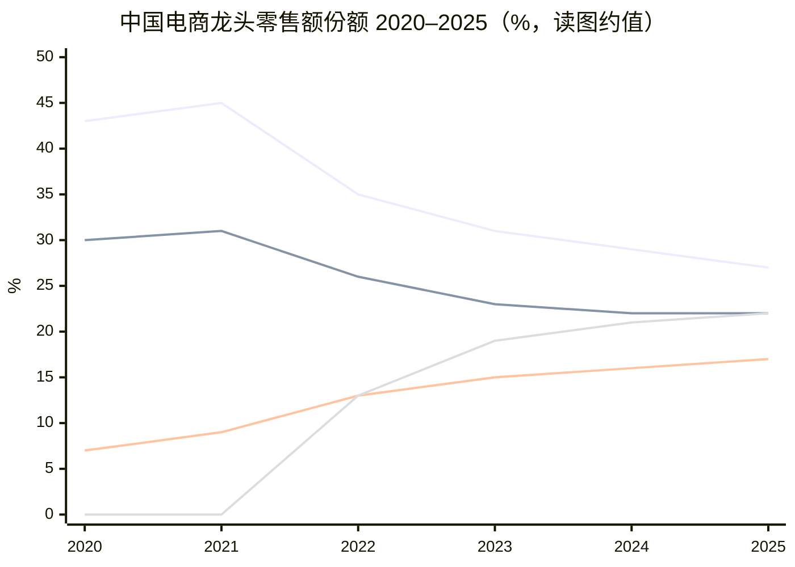


> 线序：阿里 / 京东 / 拼多多 / 字节（2020–21 字节未单列，图中记 0 仅占位）。来源：Euromonitor，中国银河证券研究所。

要点：阿里份额自 2021 高点约 **45%** 滑至 2025 约 **27%**（约 **-18pct**）；拼多多约 7%→17%，字节约 13%→22%（已追上京东）。远场「货架电商」心智被低价与内容电商两头夹击——**只守淘宝天猫快递达，份额还会继续失血**。

**因此必须做即时零售**：用闪购/外卖这类 **更高频打开 App 的场景**，把用户拉回淘宝体系，再外溢到远场成交与广告，以 **即时流量对冲远场份额流失**。同时，消费者对「**30 分钟达**」的预期正在变成常态（蔡崇信、吴泳铭 2026 年 5 月股东信）；京东把即时能力塞进主站也验证了「高频履约反哺电商 App」。若再缺席，本地生活被美团切、主站入口被拼多多/字节切，双线失守。

**对电商大盘的战略意义（管理层与公开数据口径）**


| 维度      | 体现                                                                                    |
| ------- | ------------------------------------------------------------------------------------- |
| 入口与频次   | 闪购是更高频场景：公开称曾拉动手淘 **DAU +20%**（2025-08），活跃天数上升，拉新并降低流失                                |
| 用户盘     | 闪购月交易买家一度约 **3 亿**；含闪购在内的电商大盘年度活跃买家增长约 **1.5 亿**，实物电商年活买家增约 **1 亿**（管理层回顾口径，超过此前数年合计） |
| 商业化外溢   | 流量回升带动广告/CMR；减少单纯为拉活而砸的市场费用                                                           |
| 品类与供给升级 | 食品、生鲜、健康等被即时需求拉动；猫超「远场→近场闪购」、品牌线下门店入驻，打开「送万物」增量                                       |
| 第二曲线叙事  | 长期目标：即时零售有望贡献中国电商平台整体交易额约 **30%**（蒋凡 2026-08 电话会表述）                                   |


一句话：即时零售不只是「再开一个外卖 App」，而是用**高频履约重做淘宝天猫的用户操作系统**——没有它，电商大盘难有新的日活与交易增量故事；有了它，短期利润让位于份额与入口。

### 2. 怎么做的？收获与代价


#### 过程（时间线）


| 阶段     | 时间         | 动作                                                                      |
| ------ | ---------- | ----------------------------------------------------------------------- |
| 买运力    | 2018-04    | 约 **95 亿美元** 全资收购饿了么；此后与口碑等组成本地生活，多年与美团拉锯，份额长期偏守势                       |
| 组织徘徊   | 2018–2024  | 本地生活多次重组（口碑、高德、飞猪分合）；饿了么偏履约，与淘天流量未真正一体                                  |
| 战略转向   | 2025 初     | 明确消费 + AI 双主线；加码即时零售投入（公开称消费侧约 **500 亿元** 量级投入计划等）                      |
| 主站入口   | 2025-04/05 | 「小时达」升级为 **淘宝闪购**，登上淘宝首页一级入口；与饿了么运力/供给打通                                |
| 组织并表作战 | 2025-06    | 饿了么、飞猪并入中国电商事业群，向蒋凡汇报，集中目标统一作战                                          |
| 规模战    | 2025 夏     | 补贴 + 运力扩张：日订单峰值约 **1.2 亿**、周日均约 **8000 万**；日活骑手约 **200 万**；月买家约 **3 亿** |
| 品牌统一   | 2025-12    | 饿了么 App 焕新为 **淘宝闪购**，品牌并入大消费平台                                          |
| 供应链加深  | 2025 下半年起  | 猫超近场化、品牌旗舰小时达、菜鸟协同、**淘宝便利店**/前置仓；盒马前置仓加速                                |
| 下半场    | 2026       | 份额与规模已有实质变化后，重点转向 **UE 改善 + 非餐/前置仓**；维持份额同时亏损收窄                         |


#### 收获（阶段性）

**补贴大战前后份额（餐饮/外卖订单口径，第三方；非公司官方审计份额）**


| 时点                  | 口径来源                  | 美团            | 阿里（饿了么→淘宝闪购） | 京东             |
| ------------------- | --------------------- | ------------- | ------------ | -------------- |
| 大战前（结构惯性，约至 2025 初） | 艾瑞等既有餐饮外卖格局           | **约 67%–70%** | **约 30%**    | **≈0**（尚未正式起量） |
| 大战中段（2025-06）       | 日 GMV 调研（雷锋网等约 7:2:1） | **约 70%**     | **约 20%**    | **约 10%**      |
| 大战高峰后（2025Q3）       | 红餐产业研究院·日订单           | **46.9%**     | **42.8%**    | **约 10%**      |
| 参考（2025-11）         | 摩根大通调研·订单             | **约 50%**     | **约 42%**    | **约 8%**       |


> 大战由京东 2025-02 点燃，淘宝闪购 2025-05 起全面加码。读表：美团从约七成降到约五成附近；阿里从约三成抬到约四成+，逼近双寡头；京东稳住约一成后略回落。口径（订单 vs GMV）不同会差几个点，趋势一致。

**单均 UE 拆解：美团为何更「省」**

口径：以下为餐饮外卖/即时履约 **单均单位经济（UE）** 的卖方与媒体跟踪测算，非两家公司官方披露；公式可理解为：

`UE ≈ 单均平台收入（佣金/技术服务费 + 用户侧配送费等）− 履约成本 − C 端/B 端补贴 − 其他运营分摊`


| 构成项         | 美团大致画像                                   | 淘宝闪购大致画像                             | 对 UE 的影响                                           |
| ----------- | ---------------------------------------- | ------------------------------------ | -------------------------------------------------- |
| 客单价（AOV）    | 约 **32 元**（高客单、正餐占比更高）                   | 约 **27–28 元**（茶饮/低价补贴单更多）            | 价差约 4–5 元，按约 **17%** 量级抽成折算，美团单均收入约高 **0.6–0.7 元** |
| 商户侧抽成/服务费   | 费率透明化后技术服务费约 **6%–8%** + 履约服务费；高客单订单贡献更厚 | 份额扩张期更依赖补贴换单，同等抽成下「有效实收」被补贴冲薄        | 美团收入端更稳                                            |
| 单均补贴（用户+商家） | 份额守成后更快收敛；同量级留存所需补贴更低                    | 大战高峰补贴更猛；跟踪口径单均补贴约比美团高 **0.5–0.6 元** | 闪购 UE 主拖累项之一                                       |
| 履约成本（骑手等）   | 骑手密度、调度、外卖+闪购运力复用成熟；履约标准更激进（如更短送达）       | 运力曾靠高补贴挖骑手快速起量；饿了么与闪购整合初期协同摩擦        | 差距已由约 **0.8–1.0 元** 收窄到约 **0.3–0.4 元**，仍略逊美团       |
| 订单结构        | 高客单订单市占显著更高；非餐闪购与外卖协同                    | 起量阶段低价高频单占比高；非餐即时零售单均亏损常 **高于** 餐饮外卖 | 结构差异在补贴退坡后更难抹平                                     |


**双方单均 UE 水平（跟踪口径，元/单）**


| 时点               | 美团                  | 淘宝闪购（阿里系）       | 差距（闪购更亏）      |
| ---------------- | ------------------- | --------------- | ------------- |
| 补贴高峰附近（约 2025Q3） | 约 **-2.5**          | 约 **-5.5～-6**   | 约 **3+**      |
| 2025Q4 前后        | 约 **-1.6～-2**       | 约 **-4**        | 约 **2**       |
| 2026Q1           | 约 **-1.0**          | 约 **-2.8**      | 约 **1.8**     |
| 2026Q2（补贴规范后）    | 约 **+0.1～+0.2**（转正） | 约 **-1.5～-1.6** | 约 **1.7～1.8** |


差距拆开（约 2026 中期、约 **1.7–1.8 元/单**）大致是：


| 来源       | 约贡献         |
| -------- | ----------- |
| 客单价/抽成结构 | **0.6–0.7** |
| 单均补贴更省   | **0.5–0.6** |
| 履约效率     | **0.3–0.4** |


**为何美团效率更高（一句话版）**：十年本地生活沉淀带来的 **高客单用户盘 + 骑手密度/调度 + 更低的「买份额」补贴强度**；闪购用淘宝流量换来了份额，但订单更「便宜」、履约网更新、补贴更重，故同样一单美团少亏（或已微利）约 **1.5–2 元**。履约差距在缩小，**结构和补贴效率**才是中期仍难追上的部分。


| 收获     | 证据要点                                                                           |
| ------ | ------------------------------------------------------------------------------ |
| 订单与份额  | 见上表：阿里系份额由约 **30%** 抬至约 **42%–43%**，与美团差距大幅收窄                                  |
| 收入上台阶  | 分部即时零售收入 FY25 **536 亿** → FY26 **785 亿**（约 **+46%**）；单季曾现同比 **+45%～+60%** 的加速段 |
| 反哺主站   | DAU/月活消费者双位数故事；618/双 11 期间即时零售带动品牌与猫超、盒马订单（公开称猫超半日达、盒马等同比大增）                   |
| 供给与运力  | 商户与骑手规模短时间跳升；非餐订单增速常快于餐饮，验证「送万物」                                               |
| 战略地位确认 | 股东信定调为淘宝天猫升级的**核心战略支柱**                                                        |


#### 代价（账面与机会成本）


| 代价          | 量级与含义                                                                                                                    |
| ----------- | ------------------------------------------------------------------------------------------------------------------------ |
| **利润牺牲**    | FY26 即时零售 Adjusted EBITA 约 **-970 亿**（FY25 约 -30 亿）；几乎单季即可吞噬中国电商大部分利润弹性。合并 EBITA 利润率 FY25 **17.4%** → FY26 **7.5%**，主因即此 |
| 销售费用飙升      | 集团销售费用 FY26 同比约 **+70%**，与补贴、履约扩张同向                                                                                      |
| 现金流与估值压力    | 烧钱期自由现金流承压；资本市场反复追问补贴退坡与 UE，股价对「双线投入（即时零售 + AI）」敏感                                                                       |
| 单季亏损测算（第三方） | 中金等测算 2025 年三/四季度闪购相关 EBITA 流出约 **-367 亿 / -211 亿** 量级；2026 年一季度整体即时零售亏损仍约百亿级但 UE 环比改善                                   |
| 组织与品牌成本     | 饿了么独立品牌心智让位于淘宝闪购；本地生活多年投入沉淀被并入电商主叙事，等于承认「独立本地生活难赢」、改打主站协同牌                                                               |


读法：收获主要在**用户、份额、主站协同**；代价集中在**EBITA 与费用**。公司明确表态：**不单独考核外卖盈亏**，要看闪购对平台综合收益（广告、留存、交易增量）。

### 3. 未来战略往哪走？

管理层公开指引可概括为「**守份额 → 改 UE → 非餐扛增长 → 远期占大盘三成**」：


| 时间锚              | 目标（公司/电话会口径）                        |
| ---------------- | ----------------------------------- |
| FY27（约至 2027-03） | 有信心实现**月度 UE（单位经济）转正**              |
| FY28             | 即时零售整体**交易规模过万亿**；在此规模上追求规模化正向现金流   |
| FY29             | 即时零售板块**整体盈利**                      |
| 更长期              | 即时零售有望贡献中国电商平台交易额约 **30%**，成为第二增长曲线 |


**战略抓手（2026 中后段定调）**

1. **外卖守基本盘，非餐做增量**：餐饮零售仍要份额，但下一财年目标是**非餐交易额超过餐饮**；食品百货、酒水、3C、生鲜等沉淀粘性与笔单价。
2. **整合盒马、天猫超市，猛攻前置仓**：从「流量补贴换单」转向「仓网密度 + 供应链」；淘宝便利店等连锁化近场业态对标对手便利/前置仓网络。
3. **远近场一体**：猫超与品牌从纯 B2C 远场升级为「价格竞争力 + 小时达」；百万品牌门店入驻叙事服务三年约 **1 万亿** 交易增量预期（蒋凡 2025-08 口径）。
4. **与 AI 双线并行**：即时零售抢消费入口与频次，AI+云抢效率与利润率；短期都烧钱，中期用规模与效率对冲补贴。
5. **投入纪律**：宣称会按市场情况控制节奏，但在万亿交易与份额目标达成前，**未来约两年仍处坚定投入期**。


### 投研小结


| 问题       | 结论                                                            |
| -------- | ------------------------------------------------------------- |
| 为何必做     | 远场电商增长见顶 + 「30 分钟达」成用户默认；不做则丢入口与频次                            |
| 对大盘重要性   | 拉 DAU/年活、外溢 CMR、打开近场品类，长期或占平台 GMV 约三成                         |
| 过程       | 收购饿了么 → 长期本地生活拉锯 → 2025 闪购上主站并组织合并 → 补贴换份额 → 品牌统一 → UE/非餐/前置仓 |
| 收获 vs 代价 | 份额与主站协同显著；FY26 即时零售 EBITA 约 **-970 亿** 是主要代价                  |
| 未来       | FY28 万亿交易、FY29 板块盈利；非餐超餐饮、前置仓与猫超/盒马整合是胜负手                     |


风险点：补贴退坡后留存是否稳；非餐履约密度能否追上对手；与 AI 资本开支争抢集团现金流时，资本市场容忍度是否够到 FY29。

## 第六部分：企业文化分析


## 十二、使命愿景、价值观与战略转译

口径：企业文化本身不直接进三表，但决定**投入优先级、亏损容忍度、组织协同方式**。读法是把公开使命/价值观，对照近年战略动作（用户为先、AI 驱动、即时零售烧钱、云与大模型饱和式投入），看文化是「口号」还是「约束函数」。来源：阿里官网 About、2019「新六脉神剑」发布、吴泳铭全员信/内网帖等公开表述。

### 1. 使命、愿景（不变的锚）


| 层级         | 官方表述                             | 投研含义                                              |
| ---------- | -------------------------------- | ------------------------------------------------- |
| **使命**     | 让天下没有难做的生意                       | 长期叙事仍是「帮商家/客户做成生意」的平台公司，而非纯消费品牌公司                 |
| **愿景**     | 不追求大、不追求强；追求成为一家活 **102 年** 的好公司 | 容忍短期利润波动（如 FY26 EBITA 率腰斩），用长周期逻辑为即时零售与 AI 资本开支辩护 |
| **优先级口头禅** | 客户第一，员工第二，股东第三                   | 利益冲突时的排序；解释为何可在股东短期体验差时，仍加码用户补贴与算力                |


**客户第一、员工第二、股东第三**：本质是利益冲突时的排序，不是三句口号。

- **客户第一**：使命是「让天下没有难做的生意」，客户/用户体验优先于当期利润。落地就是闪购可亏约 **-970 亿** EBITA 仍做、不单独考核外卖盈亏、让利与体验优先于短期 CMR。文化给了管理层「可以亏着抢入口」的合法性。
- **员工第二**：排在股东之前，历史上支撑平台聚人、长期激励与战役动员；但不是「人才永久护城河」——近年通义骨干出走说明：战役高压、组织反复拆合，仍可能压过「员工第二」的体感。
- **股东第三**：冲突时股东让位，不等于零回报。FY2023–FY2025 回购+分红曾到约 **5%–9%** 股东收益率；**FY2026 回落到约 1%**，现金让给云/AI 与即时零售（见第一部分第五节）。更准确是：回购/分红与投入并行，叙事上投入优先；利润率修复的承诺硬度因此变弱。

一句话：这是允许用利润换用户、入口与算力的长期主义操作系统——和 102 年愿景自洽；对估值，既解释双线投入为何能坚持，也带来「若故事兑不了现，文化会变成烧钱借口」的风险。财务上对应 Non-GAAP / EBITA 承压时，叙事仍能自洽。

### 2. 「新六脉神剑」（价值观骨架）

2019 年 20 周年升级版，官网沿用至今，六句「阿里土话」：


| #   | 价值观                 | 在当下业务里怎么落地（观察）                                       |
| --- | ------------------- | ---------------------------------------------------- |
| 1   | **客户第一，员工第二，股东第三**  | 淘宝闪购补贴、降低平台收费叙事、云价竞争——用户/客户体验优先于当期利润                 |
| 2   | **因为信任，所以简单**       | 平台规则、开放合作（含竞对场景下的开放）、内部「少猜忌、快协同」；组织合并饿了么进电商体系也是「少扯皮」 |
| 3   | **唯一不变的是变化**        | 1+6+N → 再聚焦、用户为先 + AI 驱动、本地生活并入主站——文化允许甚至鼓励架构反复拆合    |
| 4   | **今天最好的表现是明天最低的要求** | 对云增速、AI 份额、闪购订单密度的内部高压；也解释「做到第一仍要继续砸」                |
| 5   | **此时此刻，非我莫属**       | 核心战役（电商用户、AI 云、即时零售）用「舍我其谁」动员；对应饱和式投入而非跟随式试错         |
| 6   | **认真生活，快乐工作**       | 对「996 文化」的官方纠偏表述；实际考核与战役节奏仍偏高压，口号与体感常有落差             |


### 3. 吴泳铭阶段的战略转译：用户为先 × AI 驱动

2023 年上任后公开确立两大战略重心，是把旧价值观**翻译成资本开支与业务排序**：

1. **用户为先**：用户需求优先级高于一切；更多用户 → 商家机会；体验要靠开放与合作，不只靠闭环。映射到财报：即时零售抢频次与 DAU、电商侧让利与体验投入优先于 CMR 短期最大化。
2. **AI 驱动**：各场景成为 AI 最佳试验田；跟不上则会被取代。映射到财报：阿里云与通义/千问、平头哥算力、AI 相关产品收入——文化上的「变化」变成了可量化的云与 Token 投入。
3. **重新创业 / 无守成基因**（2025 前后内网口径）：湖畔小屋搬进总部等符号动作，服务「饱和式投入几大核心战役、选长期全局价值」的动员；与 FY26 利润率下行、双线烧钱（闪购 + AI）同向。


### 4. 文化 → 组织与考核（和财报的接口）


| 文化主张         | 组织/考核表现               | 对财务的直接影响                               |
| ------------ | --------------------- | -------------------------------------- |
| 客户/用户第一      | 不单独考核外卖盈亏，看对主站综合收益    | 即时零售 EBITA 可大幅为负（FY26 约 **-970 亿**）仍继续 |
| 唯一不变的是变化     | 业务拆分又再聚焦；饿了么并入淘宝闪购体系  | 分部口径、品牌心智频繁切换，同比解读要小心                  |
| 非我莫属 + 今天最好… | 核心战役「饱和式投入」；年轻化管理团队口号 | 费用率、capex、销售费用（FY26 销售费用约 **+70%**）上冲  |
| 股东第三         | 回购/分红与投入并行，但叙事上投入优先   | 估值更吃「故事兑现节奏」（UE 转正、云增速、AI 份额）          |


### 5. 投研小结：文化是加分项还是风险项？


| 问题      | 结论                                                                                               |
| ------- | ------------------------------------------------------------------------------------------------ |
| 文化是否自洽？ | 使命（帮客户做生意）+ 客户第一 + 102 年愿景，与「亏利润换用户与 AI」高度自洽                                                     |
| 对估值的正面  | 解释双线投入的 persistence：不是一年主题炒作，而是价值观约束下的多期战役                                                       |
| 对估值的负面  | 「股东第三」降低对利润率修复速度的承诺硬度；若 UE/云增速不及预期，文化叙事会从护城河变成「烧钱借口」                                             |
| 观察清单    | ① 闪购 UE 与「不单独考核盈亏」是否滑向无限期亏损；② AI 投入是否持续转化为云收入与份额（见第二、三部分）；③ 「快乐工作」与战役高压、组织反复拆合的落差是否带来关键人才流失（见下节） |


**一句话**：阿里文化的投资含义，不是口号清单，而是**允许用利润换入口与算力的长期主义操作系统**；读第六部分要和第一、五部分的 EBITA，以及第二、三部分的云与模型投入对照着看。

### 6. 近一两年 AI / 大模型人才出走

口径：下列为 **2024 年中–2026 年中** 公开报道较集中的通义 / 千问侧出走（偏负责人与核心贡献者）；去向以媒体交叉报道为准，部分尚未官方确认。贾扬清等更早离职、以及 **周靖人「辞职」已被集团辟谣** 的不列入「出走表」，但后者角色从通义业务实权转向首席科学家/研究院，本身也是组织信号。

#### 主表（大模型相关）


| 时间（约）             | 人物                  | 原岗位 / 标签                                             | 公开去向（媒体口径）                                       | 备注                                             |
| ----------------- | ------------------- | ---------------------------------------------------- | ------------------------------------------------ | ---------------------------------------------- |
| **2024-07**（约秋落地） | **周畅**（花名钟煌）        | 通义千问大模型技术负责人之一；M6/OFA 骨干                             | **字节 Seed**（视觉/多模态生成方向负责人）；据报道带十余名原团队成员          | 先称「创业」后曝入职字节；有竞业仲裁相关报道；字节侧称高薪挖角                |
| **2025 前后**       | **黄非**              | 通义实验室 NLP / 应用算法方向负责人（AliceMind、灵码等）                 | 离职（去向公开较少）                                       | 资深 NLP；团队改向周靖人直接汇报                             |
| **2025-02**       | **鄢志杰**             | 通义语音团队负责人；听悟技术负责人；达摩院「扫地僧」之一（P10）                    | 先 **腾讯 AI Lab** 副主任 → 架构调整后再转 **京东**             | 语音/听悟链路；短时间内两跳                                 |
| **2025-04**       | **薄列峰**             | 通义应用视觉团队负责人（图像/多模态，P10）                              | **腾讯混元** 多模态相关（向蒋杰汇报）                            | 2022 自京东入职阿里 XR / 通义视觉                         |
| **2026-01**       | **惠彬原**             | Qwen Code / Coder 负责人                                | 曾报道赴 **Meta**；2026 年中又传改投**国内某大厂** AI Coding 负责人 | 去向口径有迭代，宜标注「未官方确认」                             |
| **2026-03**       | **林俊旸**             | 通义千问系列技术负责人（最年轻 P10 之一）；Qwen 开源叙事核心                  | 卸任后创业（媒体称 **Pragmatik / p7k Labs**，智能体方向）        | 组织拆分为预训练/后训练等水平团队、管理权收缩后离职；吴泳铭内邮批准辞职           |
| **2026-03**       | **郁博文**             | Qwen **后训练**负责人                                      | **字节 Seed**（视觉模型与多模态交互后训练）                       | 与林俊旸同日波次；接任方为前 DeepMind 的周浩                    |
| **2026-03**       | **李凯新**（Kaixin Li）等 | Qwen3.5 / VL / Coder 核心贡献者                           | 随千问人事波次公开表态离职                                    | 属骨干层，非单一岗位负责人                                  |
| **2026-08**（约）    | **林伟**              | 阿里云计算平台首席架构师、PAI 负责人（P10）；后转 ATH 负责通义千问 **AI Infra** | **离职创业**（赛道未披露）                                  | 在阿里约 11 年；此前微软约 10 年；内网告别帖；三轮 AI 组织调整后出走；官方未确认 |


#### 怎么读（投研）

1. **流失结构**：不是零星个例，而是 **「千问底座负责人 → 后训练 → Code → 语音/视觉 → AI Infra」多条线** 在约 18–24 个月内被抽空一茬；字节（Seed）与腾讯（混元）是主要接收方，林伟等则偏创业。
2. **与文化/组织的接口**：官方仍讲「认真生活，快乐工作」「唯一不变的是变化」，但实测是 **战役高压 + 组织反复水平拆分/空降汇报线**；林俊旸波次的直接导火索是权责收缩，不是「不爱开源」。这与第 5 点观察清单③同向。
3. **对能力榜的含义**：第三部分「千问综合仍强」与「灵魂人物出走」可并存——模型权重与开源生态有惯性，但 **下一世代预训练/后训练/Coding Agent 的迭代速度与士气** 更依赖现团队；需盯 Qwen 发版节奏、开源下载/衍生模型、以及云侧 AI 收入是否跟得上（第二、六–七节）。
4. **对估值的含义**：人才出走本身不自动改财报，但提高两条风险溢价——① 对标字节/腾讯时 **组织与分发短板被放大**；② 「AI 驱动」叙事若兑现慢，市场会把投入解读为 **烧钱换故事**，文化上的「股东第三」更难卖。
5. **对冲信号**：集团加大外部挖人（如周浩等）、吴泳铭直管 Token Foundry / 基础模型支持小组，是在用组织与资源补洞；能否留住下一批评测与工程型骨干，比辟谣单一高管去留更重要。


### 7. 合伙人委员会：机制与核心成员

口径：合伙人制度是阿里文化与公司治理的交汇点——对外叫「湖畔合伙人 / Alibaba Partnership」，对投资人最硬的含义是：**可提名/任命董事会简单多数席位**（港股口径下的 WVR 结构之一）。来源：集团官网 IR《Partnership》、FY2025/FY2026 年报披露、公开履历。

#### 机制（投研必记）


| 要点                   | 内容                                                          |
| -------------------- | ----------------------------------------------------------- |
| 起源                   | 2010 年正式化「湖畔合伙人」，目的是固化使命/愿景/价值观，避免双层股权把控制权锁死在少数创始人股票上       |
| 规模                   | 现任合伙人约 **18** 人（上限一般 26，不含长期合伙人口径以官网为准）；每年可增补，须过半数合伙人同意     |
| **合伙人委员会**           | **5–7** 人；负责合伙人选举提名、递延奖金池相关管理；除长期委员外任期约 **5 年**             |
| **长期委员（Continuity）** | 目前仅 **马云、蔡崇信**——不参与委员会换届选举，可任职至不再任合伙人或因健康等无法履职              |
| 董事会权                 | 合伙人对董事会有**最多简单多数**的提名/（特定情形）任命权；现董事会 10 人中约 4 人为合伙人提名，权利未用满 |
| 合伙人资格                | 通常含：诚信、在阿里服务 ≥5 年、关键岗位、业务贡献、**文化传承者（culture carrier）**      |


现任委员会（官网 / FY2026 口径）：**马云、蔡崇信、吴泳铭、蒋凡、吴泽明**。相对 FY2025：蒋凡入委；邵晓锋因年满约 60 岁退出；**吴泽明（范禹）2026 年入委**——委员会内已有两位 80 后，技术背景占比上升。

#### 四人深描（委员会执行层主力）


| 人物                | 现职（公开）                                                            | 背景速写                                                                                                                                                 | 在委员会里的「代表什么」                                                    |
| ----------------- | ----------------------------------------------------------------- | ---------------------------------------------------------------------------------------------------------------------------------------------------- | --------------------------------------------------------------- |
| **蔡崇信**           | 集团**主席**；合伙人长期委员；蚂蚁董事                                             | 耶鲁经济/东亚研究 + 耶鲁法学院 JD；苏利文·克伦威尔律师、纽约私募法务/投融资；1999 年加入，创始人之一，长期任 CFO 至 2013，后任执行副主席，**2023-09** 起任主席                                                    | **资本、治理、对外叙事与股东沟通**；管理层中持股通常最高档之一；与马云并列「文化与控制权锚」                |
| **吴泳铭**           | 集团董事兼 **CEO**（2023-09 起）；创始人之一                                    | 1999 年即任技术总监；历任支付宝 CTO、阿里妈妈、淘宝 CTO、集团搜索/广告/移动负责人；创办元璟资本；长期合伙人                                                                                        | **战略总闸**：用户为先 × AI 驱动、双线投入（云/模型 + 即时零售）、组织反复聚焦的拍板人；委员会里的「执行一把手」 |
| **蒋凡**            | **电商事业群 CEO**（约 2024-11 起统筹淘天、国际数字商业等）                            | 复旦计算机；谷歌中国产品；2010 创办友盟，2013 被阿里收购入职；手淘无线化核心；2017 淘宝总裁、2019 兼天猫/阿里妈妈；2019 成最年轻合伙人 → **2020 因个人事件取消合伙人并降级** → 转战海外 → **2023 恢复合伙人** → **2025 入合伙人委员会** | **商业基本盘与用户增长**；「用户为先」在电商/闪购协同上的业务操盘手；回归委员会 = 电商权杖与文化投票权重新对齐     |
| **吴泽明**（花名**范禹**） | 集团 **CTO**；曾兼任饿了么董事长/CEO、淘宝闪购 CEO（2026-04 起闪购交棒，主攻集团技术 / AI 推理平台） | 杭电计算机；**2004** 加入淘宝，电商技术架构早期建设者；2016 双 11 总技术负责人；**2017** 成首批 80 后合伙人；历任新零售技术、本地生活 CTO、达摩院副院长、集团 CTO                                                 | **技术底座 + 本地生活/闪购战役经验**入最高决策圈；与「AI 驱动」、EBITA 大额投入（第五部分）直接相关      |


#### 怎么读（和前文对照）

1. **委员会不是「荣誉堂」**：它管合伙人入口与部分激励，并间接决定董事会多数席位候选人——文化口号能否变成长期投入，最终要过这层治理。
2. **四人分工可映射报告结构**：蔡崇信（治理/股东）→ 吴泳铭（集团战略/AI）→ 蒋凡（电商与用户，第一/五部分）→ 吴泽明（技术与即时零售战役执行，第四/五部分及 AI Infra）。
3. **迭代信号**：张勇时代一批合伙人退出后，委员会向「CEO + 电商一把手 + CTO」收束，叠加马云/蔡崇信长期锚——更利于打饱和式战役，也意味着**决策更集中**；模型侧人才动荡（第 6 点）时，委员会能否稳住组织与激励，是文化条款之外的硬观察项。
4. **蒋凡路径的文化含义**：取消合伙人 → 海外立功 → 恢复合伙人 → 进委员会，是「文化载体」标准可执行、也可修复的案例；同时说明合伙人身份对阿里内部权责仍是强约束。


## 第七部分：历史收购与投资分析


## 十三、主要收购、投资与成败

口径分两类：

1. **收购 / 控股**：取得控制权或私有化（含与蚂蚁联合全资）。
2. **战略投资**：少数股权、战投加仓、基石认购等——**不强求控股**，看生态协同与资本回报。

成败仍用三问：战略意图、经营/份额、资本回报（含减值、出售、浮盈）。评级：**成功 / 部分成功 / 偏失败 / 进行中**。金额与持股多为公开报道或年报约数；阿里全市场投资极多，下表抓**标志性、金额大或与当前 AI/电商叙事相关**的标的，无法穷尽。

### 1. 收购 / 控股主表


| 时间（约）       | 标的               | 代价（约）                 | 战略意图        | 后来怎样                                    | 成败             |
| ----------- | ---------------- | --------------------- | ----------- | --------------------------------------- | -------------- |
| **2013**    | **友盟**           | 约 **0.8 亿美元**         | 移动数据；带入蒋凡团队 | 并入体系；蒋凡成电商操盘手                           | **成功**         |
| **2014**    | **UC 优视**        | 约 **40+ 亿美元** 级       | 移动流量入口      | 长期占分发一席，未成「第二手淘」                        | **部分成功**       |
| **2014**    | **高德** 私有化       | 累计约 **10–15 亿美元**     | 地图/出行基础设施   | 国内地图头部，服务本地生活与履约                        | **成功**         |
| **2015–16** | **优酷土豆**         | 约 **45–48 亿美元**       | 文娱时长        | 份额落后、亏损减值，大文娱拖累叙事                       | **偏失败**        |
| **2016**    | **Lazada**       | 首轮约 **10 亿美元**，后增持控股  | 东南亚电商       | 与 Shopee 苦战，仍是国际电商支柱                    | **进行中 / 部分成功** |
| **2016**    | **豌豆荚**          | 约 **2 亿美元**           | 安卓分发        | 势能衰减、沉寂                                 | **偏失败**        |
| **2016–18** | **饿了么**          | 联合蚂蚁约 **95 亿美元** 全资   | 本地生活/外卖     | 长期落后美团；2025 起并入淘宝闪购再赌（见第五部分）            | **部分成功**       |
| **2017**    | **银泰**           | 累计百亿级人民币              | 新零售百货       | **2024-12** 约 74 亿出售，预计亏损约 **93 亿**     | **偏失败**        |
| **2017–**   | **高鑫零售**         | 增持合计数百亿港元量级           | 商超新零售       | **2025-01** 最高约 **131 亿港元** 售约 78.7% 股权 | **偏失败**        |
| **2017–**   | **菜鸟** 增持控股      | 多轮增资                  | 物流网络        | 履约基建必要；分拆上市反复                           | **部分成功**       |
| **2018**    | **Trendyol**     | 约 **7.3 亿美元** 控股约 85% | 土耳其/新兴市场电商  | 国际电商拼图；部分本地生活资产后有处置                     | **部分成功 / 进行中** |
| **2019**    | **网易考拉**         | **20 亿美元**            | 跨境进口份额      | 并入天猫国际叙事，独立品牌沉寂                         | **部分成功**       |
| **2017–21** | **Daraz** 等      | 区域电商收购                | 南亚等         | 国际拼图，回报周期长                              | **进行中**        |
| 早期/并行       | **虾米、天天动听、酷盘** 等 | 相对较小                  | 音乐/网盘       | 多停服或沉寂                                  | **偏失败**        |


### 2. 战略投资主表（少数股权 / 战投）


#### 2.1 社交、内容与广告触达


| 时间（约）       | 标的         | 投入 / 持股（约）                          | 意图             | 后来怎样                          | 成败                            |
| ----------- | ---------- | ----------------------------------- | -------------- | ----------------------------- | ----------------------------- |
| **2013–16** | **微博**     | 首轮 **5.86 亿美元** 约 18%，后增至约 **30%+** | 社交电商、广告投放      | 长期第二大股东级存在；广告协同有，电商闭环未达早期想象   | **部分成功**（财务与投放渠道价值 > 社会化电商革命） |
| **2018**    | **分众传媒**   | 阿里系约 **150 亿元** 级，持股约 **8–10%+**    | 线下电梯广告 + 新零售触达 | 曾为第二大股东档；广告协同有阶段性价值           | **部分成功**                      |
| **2018**    | **B 站**    | 增资扩股（金额未完整公开）                       | 年轻用户/二次元流量     | A/T 同台股东；内容电商协同有限             | **部分成功 / 偏财务**                |
| **2016–**   | **小红书**    | 参与多轮（含过亿美元级轮次）                      | 生活方式社区导购       | 仍独立；与腾讯等共投；电商协同不如预期强          | **进行中**                       |
| **2015–**   | **华人文化** 等 | 持股约 **20%+** 档（公开口径有变动）             | 文娱资本版图         | 媒体/文娱投资收缩期部分退出他标的（如芒果超媒曾持后转出） | **部分成功→收缩**                   |
| 并行          | **陌陌** 等   | 财务/战略参股                             | 社交流量           | 非主航道                          | **偏财务**                       |


#### 2.2 物流与快递（绑菜鸟）


| 时间（约）     | 标的       | 投入 / 持股（约）                    | 意图         | 后来怎样               | 成败                   |
| --------- | -------- | ----------------------------- | ---------- | ------------------ | -------------------- |
| **2015–** | **圆通速递** | 联合云锋等，持股一度约 **10–17%** 档      | 通达系绑定、服务升级 | 仍为重要快递股东；支撑双 11 运力 | **部分成功**（生态必要，非暴利财务） |
| **2018**  | **中通快递** | 阿里+菜鸟约 **13.8 亿美元**，约 **10%** | 快递龙头协同     | 上市快递龙头持股，物流话语权     | **部分成功**             |
| **较早–**   | **百世** 等 | 持股一度近 **28%** 档               | 仓配/供应链     | 后有资本重组与业务调整        | **部分成功 / 复杂**        |


#### 2.3 出行与本地运力


| 时间（约）       | 标的      | 投入 / 持股（约）                  | 意图           | 后来怎样                | 成败                   |
| ----------- | ------- | --------------------------- | ------------ | ------------------- | -------------------- |
| **2016–**   | **滴滴**  | 多轮，持股曾约 **5–10%**           | 出行入口、支付/地图协同 | 监管与竞争后叙事降温；持股被稀释/调整 | **偏失败→持有观望**（战略溢价消退） |
| **2017–18** | **ofo** | 约 **3.4 亿美元** 等，持股约 **12%** | 共享单车         | 爆雷退场，资本基本归零叙事       | **偏失败**              |
| **2021–**   | **哈啰**  | 与蚂蚁等同轮（如约 **2.8 亿美元** 轮）    | 两轮出行/换电      | 相对 ofo 存活更好，协同中     | **进行中 / 部分成功**       |


#### 2.4 新零售与实体（少数股权，非全资收购）


| 时间（约）     | 标的         | 投入 / 持股（约）                  | 意图          | 后来怎样         | 成败           |
| --------- | ---------- | --------------------------- | ----------- | ------------ | ------------ |
| **2015**  | **苏宁易购**   | 约 **283 亿元**，约 **20%**      | 家电 3C 新零售联盟 | 协同不及预期；市值波动大 | **部分成功→偏冷**  |
| **2016**  | **三江购物** 等 | 约 **21.5 亿元** 入股约 **32%** 等 | 区域商超        | 新零售退潮后存在感弱   | **偏失败 / 沉寂** |
| **2018–** | **居然之家** 等 | 家装家居入股                      | 家装新零售       | 非核心，后聚焦期边缘化  | **偏冷**       |
| **2018**  | **万达电影** 等 | 约 **46.8 亿元**，约 **7–8%**    | 文娱线下        | 非主航道         | **偏财务**      |


> 银泰、高鑫见上节「收购/控股」——已折价退出，是新零售资本账最清晰的失败样本。


#### 2.5 金融、运营商与资本市场


| 时间（约）    | 标的                  | 投入 / 持股（约）            | 意图        | 后来怎样              | 成败                    |
| -------- | ------------------- | --------------------- | --------- | ----------------- | --------------------- |
| **2017** | **中国联通**            | 约 **43 亿元**，约 **2%**  | 混改、云与通信协同 | 持股市值随联通波动；战略象征意义大 | **部分成功**              |
| **2018** | **华泰证券**            | 约 **35 亿元**，约 **3%+** | 金融牌照/财富生态 | 财务投资色彩浓           | **偏财务**               |
| （蚂蚁侧）    | **Paytm / One97** 等 | 累计近 **10 亿美元** 量级、高持股 | 海外支付      | 印度监管与竞争剧烈，叙事降温    | **偏失败 / 进行中**（主体多在蚂蚁） |


#### 2.6 国际电商少数股权（后或转控股）


| 时间（约）       | 标的            | 投入 / 持股（约）                           | 意图   | 后来怎样               | 成败      |
| ----------- | ------------- | ------------------------------------ | ---- | ------------------ | ------- |
| **2017–18** | **Tokopedia** | 约 **4.5–9+ 亿美元** 累计，持股约 **29%** 档后继续 | 印尼电商 | 后与 GoTo 等资本整合；长期投入 | **进行中** |


#### 2.7 AI / 算力 / 半导体产业链（近年重心）


| 时间（约）       | 标的                  | 投入 / 持股（约）                                                            | 意图                            | 后来怎样                                               | 成败                            |
| ----------- | ------------------- | --------------------------------------------------------------------- | ----------------------------- | -------------------------------------------------- | ----------------------------- |
| **2021–25** | **长鑫科技**（长鑫存储）      | 累计约 **76 亿元**；IPO 前合计持股近 **5%**（阿里云约 3.85% + 阿里网络约 1.12%），产业投资方中持股最高档 | DRAM「粮草」+ 云采购绑定、国产算存          | 冲刺科创板超大 IPO；阿里亦为客户；媒体按上市估值测算浮盈可达十余倍量级（**视定价，非保证**） | **进行中 → 偏成功**（战略+账面目前最亮的样本之一） |
| **2026**    | **澜起科技**（港股 A+H 等）  | 基石认购约 **5 亿元** 档                                                      | 内存接口 / PCIe·CXL Retimer、服务器互连 | 算力互连配套；报道称浮盈数倍（随股价变）                               | **进行中 / 偏成功**                 |
| **近年**      | **翱捷、曦智、瀚博、硅基流动** 等 | 早期/成长期战投（单笔小于长鑫）                                                      | 通信芯片、光计算、推理芯片、AI Infra        | 「投早投小投前沿」组合；成败分化中                                  | **进行中**                       |
| 说明          | **平头哥**             | 自研子公司，非外部收购                                                           | 云+芯片                          | 见第四部分                                              | —                             |
| 说明          | **寒武纪等**            | 以采购/兼容为主，大规模股权战投未成公开主叙事                                               | 一云多芯                          | 曾辟谣「巨量采购」类传闻                                       | 供应链关系 ≠ 控股投资                  |


媒体不完全统计：阿里近三年对外 **AI 相关股权投资约 360 亿元** 量级，组合浮盈曾被估算超千亿——**波动大，只作方向参考**，投研仍应以招股书/年报持股与减值测试为准。

### 3. 分类读法（收购 + 投资合一）


| 类型              | 代表                           | 规律                                   |
| --------------- | ---------------------------- | ------------------------------------ |
| **基础设施（收购或战投）** | 高德、菜鸟、圆通/中通、**长鑫**、澜起        | 嵌进电商/云主航道的，成功率与「必要性」最高               |
| **入口/流量**       | UC、微博、分众、B 站、小红书             | 买得到曝光，难买到独占闭环                        |
| **内容/文娱**       | 优酷、音乐系、部分传媒股                 | 最容易战略高估、财务低估                         |
| **新零售实体**       | 银泰、高鑫、苏宁、三江                  | 故事退潮后多折价退出或沉寂                        |
| **本地生活/出行**     | 饿了么、滴滴、ofo、哈啰                | 入场券贵；运营与监管决定最终分数                     |
| **跨境/国际**       | 考拉、Lazada、Tokopedia、Trendyol | 卡位常成，利润慢                             |
| **AI 供应链战投**    | 长鑫、澜起及早期芯片/Infra             | 当前资本开支叙事下的「第二战场」；浮盈亮眼但集中度与流动性风险要单独评估 |


### 4. 投研小结

1. **收购成绩单**：成功样本少（**高德、友盟**）；大额现金收购里 **优酷、银泰、高鑫** 偏失败；**饿了么** 仍是「部分成功 + 二期加注」。
2. **投资成绩单**：物流与地图类偏「战略分红」；社交广告类（微博、分众）偏「部分成功」；共享单车/部分出行偏失败；**近年 AI 链（尤其长鑫）是少数同时讲得通战略与账面的方向**。
3. **长鑫的含义**：不是「又买一个 App」，而是云与 AI 资本开支的**上游保险**——持股 + 采购；读第七部分要和第四部分（平头哥）与第二、六–七节（云/AI 收入）对照。
4. **纪律变化**：蔡崇信口径下非核心实体可退；战投从「新零售/文娱广撒网」转向 **AI 产业链投早投小 + 少数硬核重仓**。观察清单：后续大额动作是继续买「嵌主航道的粮草/管道」，还是再买需独立烧钱的平行王国。

