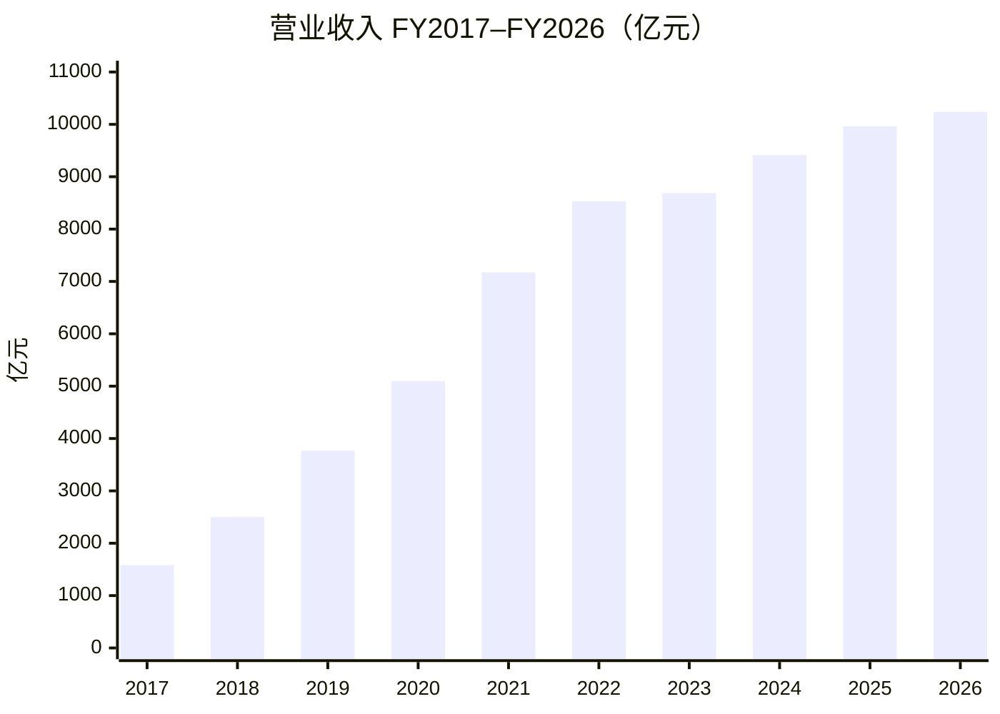
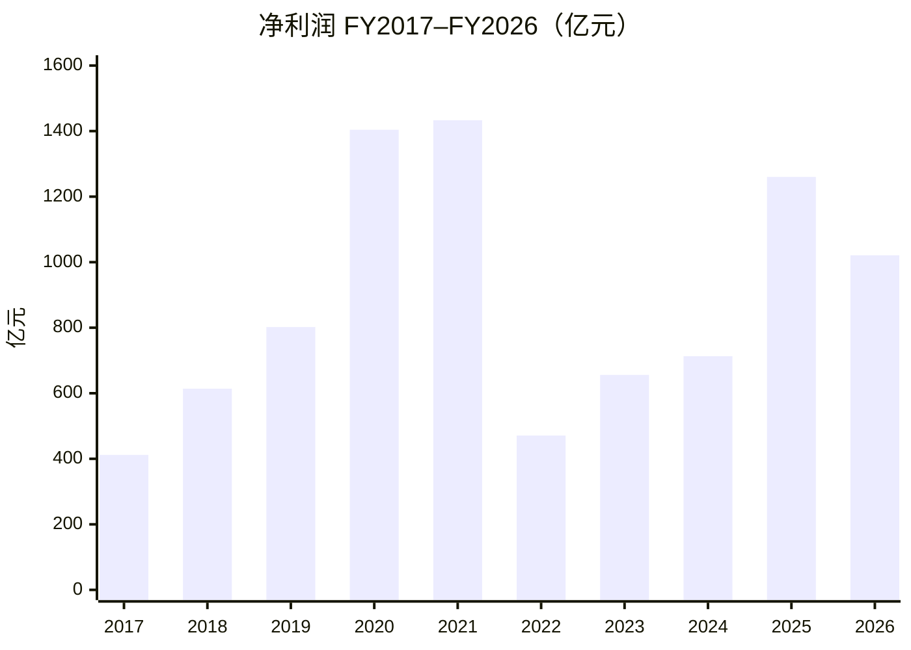
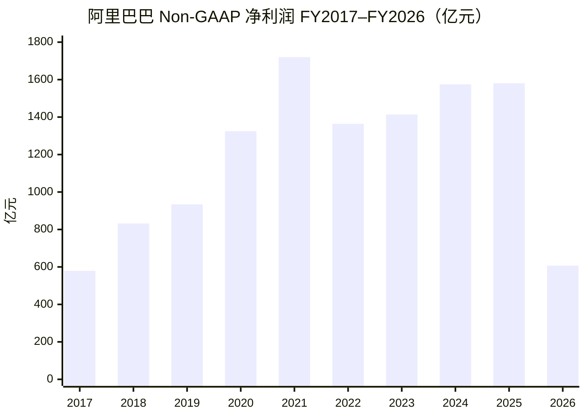
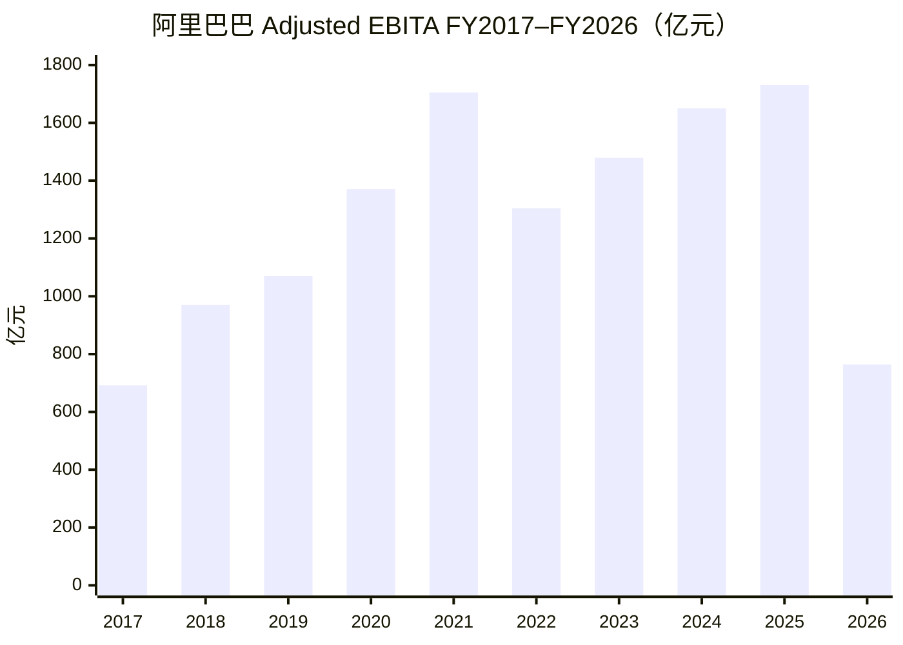
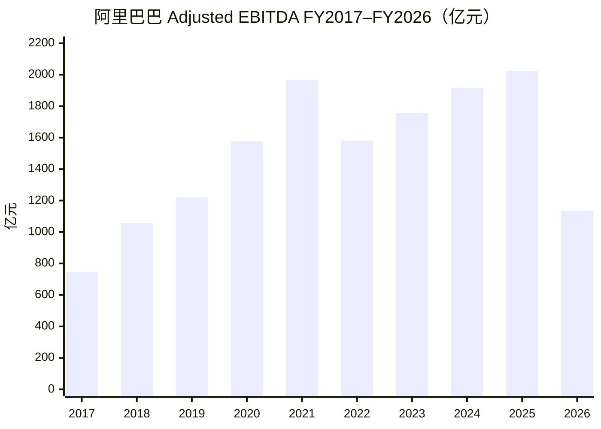
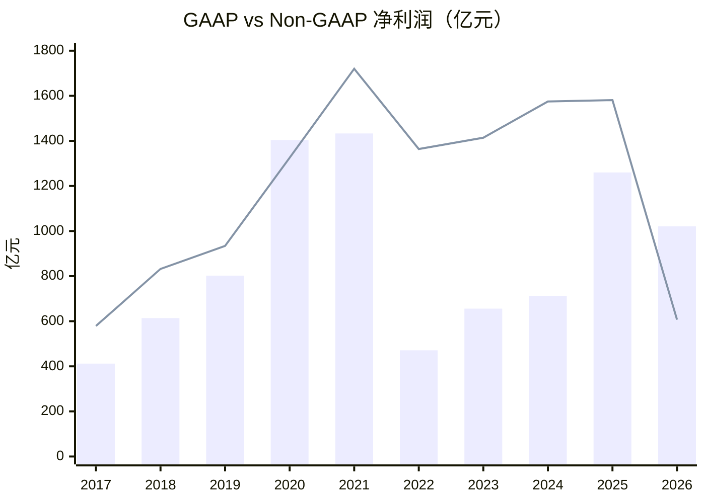
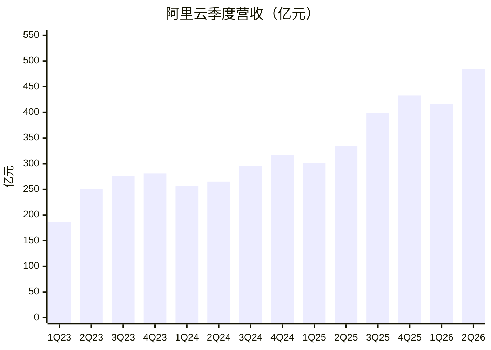
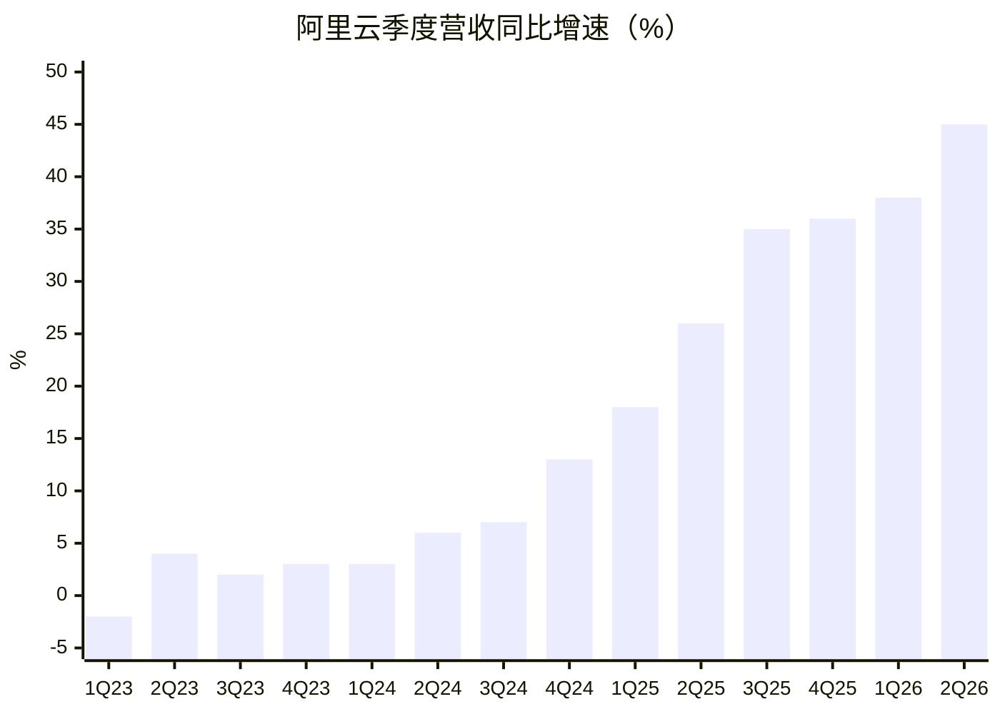
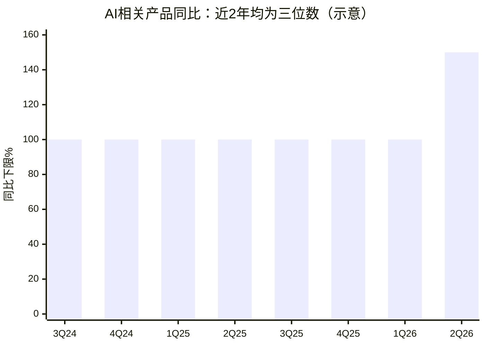

# 阿里巴巴投研分析

图表 8：阿里即时零售收入和增速

## 一、营业收入与净利润（FY2017–FY2026）

口径说明：

- 公司：阿里巴巴集团控股有限公司（港股 `9988.HK` / 美股 ADR `BABA`）
- 财年：每年 **4 月 1 日–次年 3 月 31 日**（下表「FY20xx」指截至该年 3 月 31 日的财年）
- 单位：人民币百万元（表内）；图表换算为 **亿元**
- 净利润：合并报表 **Net income**（非「归属于普通股股东净利润」）
- 来源：公司业绩公告 / 年报（港交所、SEC）；原始数据见 `data/alibaba_revenue_net_income_fy2017_2026.json`


| 财年     | 截至         | 营业收入（百万元） | 净利润（百万元） | 营收同比  | 净利润同比  |
| ------ | ---------- | --------- | -------- | ----- | ------ |
| FY2017 | 2017-03-31 | 158,273   | 41,226   | —     | —      |
| FY2018 | 2018-03-31 | 250,266   | 61,412   | 58.1% | 49.0%  |
| FY2019 | 2019-03-31 | 376,844   | 80,234   | 50.6% | 30.6%  |
| FY2020 | 2020-03-31 | 509,711   | 140,350  | 35.3% | 74.9%  |
| FY2021 | 2021-03-31 | 717,289   | 143,284  | 40.7% | 2.1%   |
| FY2022 | 2022-03-31 | 853,062   | 47,079   | 18.9% | -67.1% |
| FY2023 | 2023-03-31 | 868,687   | 65,573   | 1.8%  | 39.3%  |
| FY2024 | 2024-03-31 | 941,168   | 71,332   | 8.3%  | 8.8%   |
| FY2025 | 2025-03-31 | 996,347   | 125,976  | 5.9%  | 76.6%  |
| FY2026 | 2026-03-31 | 1,023,670 | 102,127  | 2.7%  | -18.9% |


### 营业收入与净利润（亿元，并排）

各用独立纵轴，避免量级差把净利润压扁。预览宽度足够时左右并排；窄屏可能上下折行。


|     |
| --- |
|     |








简要观察：

- **先纠正一点**：偏高的主要是 **净利润**，不是营业收入。投资公允价值变动 / 处置收益走「利息及投资收益」等线下科目，**不会抬高营收**。
- 营收从 FY2017 约 **1,583 亿元** 增至 FY2026 约 **10,237 亿元**，十年量级约 **6.5 倍**；近三年增速明显放缓（FY2024–FY2026 分别约 8%/6%/3%）。
- GAAP 净利润在 FY2020–FY2021 冲高（含股权投资浮盈等），FY2022 因投资浮亏大跌；FY2025 回升、FY2026 仍含较大投资相关收益（见下一节）。

## 二、刨除投资收益看什么：Non-GAAP vs Adjusted EBITA / EBITDA

### 该用哪个？


| 指标                     | 是否剔除投资浮盈/浮亏/处置     | 还剔除什么                      | 适合回答的问题                            |
| ---------------------- | ------------------ | -------------------------- | ---------------------------------- |
| **Non-GAAP 净利润**（优先）   | ✅ 是                | SBC、无形资产摊销/减值、商誉减值等 + 税项调整 | 「把非常规投资损益拿掉后，赚了多少钱？」               |
| **Adjusted EBITA**（主业） | ✅ 天然不含（在利息及投资收益之上） | SBC、摊销等；**不含税、利息**         | 「主业经营利润质量如何？」分部也主要看这个              |
| **Adjusted EBITDA**    | ✅ 同上               | 在 EBITA 上再加回 PP&E/土地使用权折旧  | 现金流粗看、杠杆（Debt/EBITDA）；比 EBITA 更「厚」 |


**结论：**

1. 要对照 FY2020/2021/2026 那种「投资收益把净利润打歪」→ 用 **Non-GAAP 净利润** 最直接。
2. 要看电商/云/即时零售等经营投入是否拖累主业 → 用 **Adjusted EBITA**（公司分部考核也用它）。
3. **EBITDA 不是替代 Non-GAAP 看投资收益的首选**；它只是经营利润的加回折旧版。三者都看最好：Non-GAAP 看「干净利润」，EBITA 看「干净经营」，GAAP 看「含投资噪声的账面」。

### 指标数据（人民币百万元）

来源：公司业绩公告 / 20-F / 港交所年报；原始 JSON：`data/alibaba_nongaap_ebita_ebitda_fy2017_2026.json`


| 财年     | GAAP 净利润 | Non-GAAP 净利润 | Adjusted EBITA | Adjusted EBITDA | GAAP−Non-GAAP（约） |
| ------ | -------- | ------------ | -------------- | --------------- | ---------------- |
| FY2017 | 41,226   | 57,871       | 69,172         | 74,456          | -16,645          |
| FY2018 | 61,412   | 83,214       | 97,003         | 105,792         | -21,802          |
| FY2019 | 80,234   | 93,407       | 106,981        | 121,943         | -13,173          |
| FY2020 | 140,350  | 132,479      | 137,136        | 157,659         | **+7,871**       |
| FY2021 | 143,284  | 171,985      | 170,453        | 196,842         | -28,701          |
| FY2022 | 47,079   | 136,388      | 130,397        | 158,205         | **-89,309**      |
| FY2023 | 65,573   | 141,379      | 147,911        | 175,710         | -75,806          |
| FY2024 | 71,332   | 157,479      | 165,028        | 191,668         | -86,147          |
| FY2025 | 125,976  | 158,122      | 173,065        | 202,325         | -32,146          |
| FY2026 | 102,127  | 60,658       | 76,416         | 113,483         | **+41,469**      |


> GAAP−Non-GAAP **为正** ≈ 当期 GAAP 相对 Non-GAAP「更肥」（常见：投资浮盈/处置收益进了 GAAP，却被 Non-GAAP 剔除）。  
> **为负** ≈ GAAP「更瘦」（常见：投资浮亏，或 Non-GAAP 加回了 SBC/罚款等）。

### FY2020–FY2026：GAAP − Non-GAAP 差值原因表

单位：人民币百万元。差值 = GAAP 净利润 − Non-GAAP 净利润。  
调节项来自公司业绩公告「Net income → Non-GAAP net income」调节表（加项抬高 Non-GAAP，减项压低 Non-GAAP）。


| 财年     | GAAP − Non-GAAP = 差值                     | 主要原因（按影响大致排序）                                                                                                | 关键调节项（摘自公告）                                                                                     |
| ------ | ---------------------------------------- | ------------------------------------------------------------------------------------------------------------ | ----------------------------------------------------------------------------------------------- |
| FY2020 | 140,350 − 132,479 = **+7,871**（GAAP更肥）   | **一次性获得蚂蚁 33% 股权相关收益约 716 亿**计入 GAAP，Non-GAAP 整笔剔除；虽加回 SBC/减值等，仍盖不过该项                                        | −蚂蚁股权收益 **71,561**；+SBC 31,742；+商誉/投资减值 25,656；+无形资产摊销减值 13,388；−其他投资重估/处置净收益 4,764；税项 −2,429 等 |
| FY2021 | 143,284 − 171,985 = **-28,701**（GAAP更瘦）  | Non-GAAP **加回反垄断罚款约 182 亿 + SBC 约 501 亿**；同时剔除投资重估/处置等净收益约 663 亿——加回项合计仍大于剔除的投资收益，故 Non-GAAP > GAAP          | +SBC **50,120**；+反垄断罚款 **18,228**；+商誉/投资减值 14,737；+无形资产摊销 12,427；−投资重估/处置等收益 **66,305**；税项 −506 |
| FY2022 | 47,079 − 136,388 = **-89,309**（GAAP显著更瘦） | **公开市场股权投资公允价值大跌**（投资亏损进 GAAP）；叠加商誉/投资减值约 403 亿、SBC 约 240 亿被 Non-GAAP 加回                                     | +商誉/投资减值 **40,264**；+SBC 23,971；+投资重估/处置等亏损 **21,671**；+无形资产摊销减值 11,647；税项 −8,244               |
| FY2023 | 65,573 − 141,379 = **-75,806**（GAAP更瘦）   | 仍以 **SBC + 商誉/投资减值 + 投资相关净亏损** 加回为主；公允价值亏损较 FY2022 收窄，但 GAAP 仍明显低于 Non-GAAP                                  | +SBC **30,831**；+商誉/投资减值 **24,351**；+投资重估/处置等净亏损 13,857；+无形资产摊销减值 13,504；+股权捐赠 511；税项 −7,248    |
| FY2024 | 71,332 − 157,479 = **-86,147**（GAAP更瘦）   | **投资相关净亏损约 217 亿**（含市值变动）+ **商誉/投资减值及其他约 337 亿**（高鑫、优酷等减值）+ 无形资产摊销减值约 216 亿 + SBC；GAAP 被拖瘦                   | +商誉/投资减值及其他 **33,679**；+投资重估/处置亏损 **21,659**；+无形资产摊销减值 **21,592**；+SBC 18,546；税项 −9,329         |
| FY2025 | 125,976 − 158,122 = **-32,146**（GAAP略瘦）  | 出现 **投资重估/处置净收益约 88 亿**（抬高 GAAP），但 Non-GAAP 仍加回减值约 224 亿 + SBC 约 140 亿等，整体 Non-GAAP 仍更高；另有高鑫/银泰等处置亏损在经营叙述中出现 | +商誉/投资减值及其他 **22,435**；+SBC 13,970；+无形资产摊销减值 6,336；−投资重估/处置净收益 **8,764**；税项 −1,831              |
| FY2026 | 102,127 − 60,658 = **+41,469**（GAAP更肥）   | **投资重估/处置净收益约 744 亿被 Non-GAAP 剔除**（含股权投资市值变动净收益、Trendyol 本地生活等处置收益；对比 FY2025 高鑫/银泰处置亏损）。经营利润大降，但账面净利被投资收益撑住  | −投资重估/处置净收益 **74,416**；+商誉/投资减值及其他 17,746；+SBC 11,180；+无形资产摊销减值 5,079；税项 −1,058                 |


一句话对照：


| 财年        | 一句话                                 |
| --------- | ----------------------------------- |
| FY2020    | 蚂蚁 33% 股权一次性收益把 GAAP 抬过 Non-GAAP    |
| FY2021    | 投资收益不小，但罚款 + SBC 加回更大 → Non-GAAP 更高 |
| FY2022    | 投资浮亏 + 大额减值 → GAAP 塌、Non-GAAP 稳     |
| FY2023–24 | 持续「SBC + 减值 + 投资噪声」格局，GAAP 系统性偏低    |
| FY2025    | 投资收益回正，但加回项仍占优，缺口收窄                 |
| FY2026    | 超大额投资/处置收益抬高 GAAP；Non-GAAP 暴露主业承压   |


### 非常规投资收益相关注明

- **FY2020**：GAAP 净利润（约 1,404 亿）**高于** Non-GAAP（约 1,325 亿）。公司披露净利含股权投资市值变动等投资收益；Non-GAAP 明确剔除投资重估/处置损益。  
- **FY2021**：GAAP 净利仍高（约 1,433 亿），但 Non-GAAP 更高（约 1,720 亿）——因反垄断罚款、股份支付等被 Non-GAAP 加回；投资相关损益仍在 GAAP 路径里，不能把「FY21 净利高」全当成投资收益。  
- **FY2022**：GAAP 净利暴跌至约 471 亿，Non-GAAP 仍约 1,364 亿——主因公开市场股权投资公允价值下跌（公司明确写入业绩说明）。  
- **FY2025→FY2026**：GAAP 净利仅降约 19%（1,260→1,021 亿），但 **Non-GAAP 净利 -62%**（1,581→607 亿）、**Adjusted EBITA -56%**（1,731→764 亿）。差额来自：  
  - 「利息及投资收益，净额」FY2026 约 **875 亿元**（FY2025 约 208 亿；FY2024 为亏损约 100 亿）；  
  - 含股权投资市值变动净收益，以及处置收益（含 Trendyol 本地生活服务等）；对比 FY2025 有高鑫零售、银泰等处置亏损。  
  - 经营侧：即时零售（淘宝闪购）与技术投入显著压缩 Adjusted EBITA。

### Non-GAAP 净利润（亿元）




### Adjusted EBITA（亿元）




### Adjusted EBITDA（亿元）




### GAAP vs Non-GAAP 净利润对照（亿元）




> 柱 = GAAP 净利润；线 = Non-GAAP 净利润。FY2020、FY2026 柱高于线（投资收益抬高账面）；FY2022 柱远低于线（投资浮亏）。

## 三、分部收入与 EBITA（FY2025 vs FY2026）

口径：公司分部披露；单位 **亿元人民币**（由公告百万元÷100）；EBITA 为 Adjusted EBITA；利润率 = EBITA ÷ 该分部收入。  
来源：公司 FY2026 业绩公告 / 年报分部表。

### 简表（主分部）


| 分部           | 收入 FY25   | 收入 FY26    | EBITA FY25 | EBITA FY26 | 利润率 FY25  | 利润率 FY26 |
| ------------ | --------- | ---------- | ---------- | ---------- | --------- | -------- |
| 中国电商集团       | 5,084     | 5,542      | 1,932      | 1,075      | 38.0%     | 19.4%    |
| └ 其中：淘天集团    | —         | —          | 1,962      | 2,046      | 43.1%*    | 43.0%*   |
| └ 其中：即时零售    | 536       | 785        | -30        | -970       | -5.6%     | -123.6%  |
| 国际数字商业（AIDC） | 1,323     | 1,442      | -151       | -21        | -11.4%    | -1.4%    |
| 云计算（云智能）     | 1,180     | 1,581      | 106        | 143        | 8.0%      | 9.9%     |
| 所有其他         | 3,383     | 2,544      | -95        | -357       | -2.8%     | -14.0%   |
| **合并合计**     | **9,963** | **10,237** | **1,731**  | **764**    | **17.4%** | **7.5%** |


淘天利润率按公司披露口径（相对淘天相关收入）；「所有其他」EBITA 取年报分部 Adjusted EBITA。合并合计含未分摊及分部间抵消，不等于各分部简单加总。

要点：FY26 合并 EBITA 利润率从 17.4% 掉到 7.5%，主因 **即时零售亏损扩大至约 -970 亿元**；淘天利润率仍约 43%，云与国际在改善。

### 分部收入对比（亿元）

```mermaid
xychart-beta
    title "分部营业收入 FY25 vs FY26（亿元）"
    x-axis [中国电商, 国际AIDC, 云计算, 所有其他]
    y-axis "亿元" 0 --> 6000
    bar [5084, 1323, 1180, 3383]
    bar [5542, 1442, 1581, 2544]
```


> 每组左柱 FY25、右柱 FY26。

### 分部 EBITA 对比（亿元）

```mermaid
xychart-beta
    title "分部 Adjusted EBITA FY25 vs FY26（亿元）"
    x-axis [淘天集团, 即时零售, 国际AIDC, 云计算, 所有其他]
    y-axis "亿元" -1000 --> 2200
    bar [1962, -30, -151, 106, -95]
    bar [2046, -970, -21, 143, -357]
```


> 每组左柱 FY25、右柱 FY26。淘天 EBITA 仍稳增；即时零售 FY26 亏损显著扩大，拖累中国电商集团整体 EBITA。

## 四、利润表关键项（FY2025 vs FY2026）

单位：人民币百万元。摘自合并利润表（截至 3/31）。


| 项目              | FY25    | FY26      | 同比      |
| --------------- | ------- | --------- | ------- |
| 营业收入            | 996,347 | 1,023,670 | +2.7%   |
| 营业成本            | 598,285 | 616,136   | +3.0%   |
| 销售费用            | 144,021 | 245,023   | +70.1%  |
| 营业利润            | 140,905 | 50,150    | -64.4%  |
| 投资损益（利息收入及投资损益） | 20,759  | 87,512    | +321.6% |
| 净利润（含少数股东权益）    | 125,976 | 102,127   | -18.9%  |


说明：

- 营业成本、销售费用按费用绝对值列示（原表为负向支出）。
- 投资损益取「利息收入及投资损益」；另有「应占股权投资损益」FY25 **5,966** / FY26 **2,785**，未并入上表。
- 归母净利润（归属普通股东）为 FY25 **129,470** / FY26 **105,904**。

### 怎么画图更好？

要表达「净利润怎么来的」，用 **利润桥（瀑布图 / Waterfall）**：

```text
营业收入
   − 营业成本
   − 销售费用
   − 其他费用（研发、管理、摊销、商誉减值等）
＝ 营业利润
   ＋ 投资损益
   − 税息及其他（利息、所得税等净影响）
＝ 净利润
```

### 净利润形成过程（利润桥）

净利润形成过程 FY25 vs FY26


| 步骤（亿元） | FY25   | FY26   |
| ------ | ------ | ------ |
| 营业收入   | 9,963  | 10,237 |
| −营业成本  | -5,983 | -6,161 |
| −销售费用  | -1,440 | -2,450 |
| −其他费用  | -1,131 | -1,124 |
| ＝营业利润  | 1,409  | 502    |
| ＋投资损益  | 208    | 875    |
| −税息及其他 | -357   | -356   |
| ＝净利润   | 1,260  | 1,021  |


读图要点：FY26 营业成本仅小幅增加（约 +3%），**销售费用接近翻倍**才是营业利润塌陷主因；投资损益从 208→875 部分托住账面，净利润降幅因此小于营业利润降幅。

### 关键项同比柱状图（亿元）

```mermaid
xychart-beta
    title "利润表关键项 FY25 vs FY26（亿元）"
    x-axis [营业收入, 营业成本, 销售费用, 营业利润, 投资损益, 净利润]
    y-axis "亿元" 0 --> 11000
    bar [9963, 5983, 1440, 1409, 208, 1260]
    bar [10237, 6161, 2450, 502, 875, 1021]
```


> 每组左柱 FY25、右柱 FY26。成本费用用绝对额便于同比；形成过程请看上方利润桥。

## 五、阿里云季度营收与增速（1Q23–1Q26）

口径说明：

- 主体：云智能集团（阿里云）分部收入；**自 2Q26 起**公司将云智能与平头哥整合，分部更名为 **「AI云与算力服务」**（序列仍可比，公司披露同比 +45%）
- 横轴为**日历季度**（1Q=截至 3/31，2Q=6/30，3Q=9/30，4Q=12/31）
- 收入：公司业绩公告；同比：公司披露或同季收入重算
- 数据文件：`data/alibaba_cloud_quarterly_revenue.json`


| 季度       | 截至             | 收入（亿元）     | 同比         |
| -------- | -------------- | ---------- | ---------- |
| 1Q23     | 2023-03-31     | 185.82     | -2.0%      |
| 2Q23     | 2023-06-30     | 251.23     | +4.0%      |
| 3Q23     | 2023-09-30     | 276.48     | +2.0%      |
| 4Q23     | 2023-12-31     | 280.66     | +3.0%      |
| 1Q24     | 2024-03-31     | 255.95     | +3.0%      |
| 2Q24     | 2024-06-30     | 265.49     | +5.7%      |
| 3Q24     | 2024-09-30     | 296.10     | +7.1%      |
| 4Q24     | 2024-12-31     | 317.42     | +13.1%     |
| 1Q25     | 2025-03-31     | 301.27     | +17.7%     |
| 2Q25     | 2025-06-30     | 334.18     | +25.9%     |
| 3Q25     | 2025-09-30     | 398.24     | +34.5%     |
| 4Q25     | 2025-12-31     | 432.84     | +36.4%     |
| 1Q26     | 2026-03-31     | 416.26     | +38.2%     |
| **2Q26** | **2026-06-30** | **484.37** | **+45.0%** |


> 2Q26：AI云与算力服务收入 **484.37 亿元**（同比 +45%；上年同期公司可比基数 334.18 亿元）。其中 AI 相关产品收入 **123.76 亿元**，连续第 12 个季度三位数增长。来源：公司 2026 年 6 月季度业绩公告。

阿里云季度营收与增速

### 营收柱状图（亿元）




### 同比增速（%）




简要观察：2023–2024 总收入同比多在个位数；自 2025 起增速台阶式抬升，**2Q26 达约 +45%**（484 亿元），继续由 AI/公共云放量驱动。

## 六、中国 AI 云市场份额（2025）

说明：第三方机构口径不同，会出现「两个第一」。**2026 全年完整份额表尚未公开**；下表为目前可核对的 **2025** 数据。

### 口径 A：Omdia 全链条营收（IaaS + MaaS 等）

测的是 AI 云相关**收入**谁卖得多。2025 年中国 AI 云市场规模约 **567 亿元**（Omdia《中国 AI 云市场份额 2025》，2026 年 5 月发布）。


| 排名  | 厂商       | 2025 全年份额 | 2025 上半年份额（对照） |
| --- | -------- | --------- | -------------- |
| 1   | **阿里云**  | **38.1%** | 35.8%          |
| 2   | **火山引擎** | **20.4%** | 14.8%          |
| 3   | 百度智能云    | 9.4%      | 6.1%           |
| 4   | 腾讯云      | 6.3%      | 7.0%           |
| 5   | 天翼云      | 5.9%      | —              |
| —   | 华为云      | —         | 13.1%（上半年第 3）  |


> 前五合计超过八成。全年榜公开报道中华为云未进 Top5；上半年华为云仍第 3。阿里云在 AI IaaS（约 38.6%）、MaaS-MPS（约 42.3%）亦居首。

```mermaid
xychart-beta
    title "Omdia：中国AI云营收份额 2025（%）"
    x-axis [阿里云, 火山引擎, 百度, 腾讯云, 天翼云]
    y-axis "%" 0 --> 45
    bar [38.1, 20.4, 9.4, 6.3, 5.9]
```


### 口径 B：IDC 公有云大模型 Token 调用量

测的是外部客户 **Token 调用量**（不含厂商自有业务），谁被用得多。2025 年中国公有云大模型调用量约 **1944 万亿 Tokens**（同比约 +16 倍）。


| 排名  | 厂商       | 2025 全年份额 | 2025 上半年份额（对照） |
| --- | -------- | --------- | -------------- |
| 1   | **火山引擎** | **49.5%** | 49.2%          |
| 2   | **阿里云**  | **约 28%** | 约 27%          |
| 3   | 百度智能云    | 约 10%     | —              |


> 按 MaaS **营收**口径，IDC 亦显示火山引擎占 **40%+**，阿里、百度、智谱、移动云等进入前五。IDC 预计 2026 年 Token 消耗约 4 万万亿、MaaS 营收约 186 亿元（规模预测，非份额）。

```mermaid
xychart-beta
    title "IDC：公有云大模型Token调用量份额 2025（%）"
    x-axis [火山引擎, 阿里云, 百度]
    y-axis "%" 0 --> 55
    bar [49.5, 28, 10]
```


### 怎么读


| 问题                      | 看哪张表  | 2025 结论              |
| ----------------------- | ----- | -------------------- |
| 谁 AI 云**卖得多**（全栈收入）     | Omdia | **阿里云约 38%**，火山约 20% |
| 谁大模型 API **用得多**（Token） | IDC   | **火山约 50%**，阿里约 28%  |


两套尺子不矛盾：阿里强在算力/全栈与政企；火山强在公有云 MaaS 调用生态。

## 七、阿里 AI 相关产品收入：近 2 年分季与增速

> **口径纠正**：下表是公司口中的 **「AI 相关产品收入」**（狭义 AI 云：AI 算力/存储、MaaS、AI 应用等），近两年同比为 **三位数（≥100%）**，已连续 **12** 个季度。  
> **不是**上文「云智能 / AI云与算力服务」分部总收入（那条线近两年同比大约 **+6%～+45%**，含大量传统云）。二者勿混。

### 口径与数据限制


| 项目     | 说明                                                                             |
| ------ | ------------------------------------------------------------------------------ |
| 指标     | AI-related product revenue / **AI 相关产品收入**                                     |
| 分母（占比） | 通常相对 **云外部商业化收入**（不含集团内部结算）                                                    |
| 增速     | 公司自约 **3Q23** 起连续披露「三位数同比」；至 **2Q26** 为第 **12** 季；**2Q26** 进一步披露同比 **超 +150%** |
| 绝对额    | **1Q26、2Q26** 起系统披露；更早季度公司未给绝对额（下文 **2Q25** 仅作约束推算，已标注）                        |
| 数据文件   | `data/alibaba_ai_cloud_quarterly.json`                                         |


### 近 2 年分季主表（AI 相关产品）


| 季度       | 截至             | 收入（亿元）         | 同比          | 占云外部商业化   | ARR（亿元）   | 连续三位数第 N 季 |
| -------- | -------------- | -------------- | ----------- | --------- | --------- | ---------- |
| 3Q24     | 2024-09-30     | 未披露            | **≥+100%**  | —         | —         | 5          |
| 4Q24     | 2024-12-31     | 未披露            | **≥+100%**  | —         | —         | 6          |
| 1Q25     | 2025-03-31     | 未披露            | **≥+100%**  | —         | —         | 7          |
| 2Q25     | 2025-06-30     | **约 49（推算）***  | **≥+100%**  | **>20%**  | —         | 8          |
| 3Q25     | 2025-09-30     | 未披露            | **≥+100%**  | **>20%**  | —         | 9          |
| 4Q25     | 2025-12-31     | 未披露            | **≥+100%**  | —         | —         | 10         |
| **1Q26** | **2026-03-31** | **89.71（披露）**  | **≥+100%**  | **约 30%** | **约 358** | **11**     |
| **2Q26** | **2026-06-30** | **123.76（披露）** | **超 +150%** | **约 35%** | **约 495** | **12**     |


2Q25「约 49 亿」推算依据（非公告原文）：（1）电话会称 AI 占外部商业化 **>20%**；（2）2Q26 收入 123.76 亿且同比 **超 +150%** → 上年同期须 **低于约 49.5 亿**；两条件卡在约 **49 亿** 一带。其余空白季公司未给可复核绝对额，**不做臆造**。

```mermaid
xychart-beta
    title "AI相关产品季度收入（有数字的季度，亿元）"
    x-axis [2Q25推算, 1Q26披露, 2Q26披露]
    y-axis "亿元" 0 --> 140
    bar [49, 89.71, 123.76]
```





> 上图增速柱为「公司披露的下限」：**≥100%**；仅 **2Q26** 明确到 **超 +150%**。真实各季可能远高于 100%，但公司未公布精确百分比。

### 已披露两季的结构变化


| 指标        | 1Q26    | 2Q26         | 变化           |
| --------- | ------- | ------------ | ------------ |
| AI 相关产品收入 | 89.71 亿 | **123.76 亿** | 环比约 **+38%** |
| 同比        | 三位数     | **超 +150%**  | 加速           |
| 占云外部商业化   | 约 30%   | **约 35%**    | +5pct        |
| ARR       | 约 358 亿 | **约 495 亿**  | +约 137 亿     |


管理层预期：未来约一年年 AI 相关产品占外部商业化有望 **破 50%**；AI 产品毛利率高于云平均。

### 和「云分部总收入」差在哪（防再混）


| 口径                              | 近 2 年同比大致区间                      | 2Q26 水平       |
| ------------------------------- | -------------------------------- | ------------- |
| **AI 相关产品**（本节）                 | **连续三位数，≥+100%**；最新季 **超 +150%** | **123.76 亿元** |
| 云智能 / AI云与算力服务**分部合计**（见上文云收入表） | 约 **+6% → +45%**                 | **484.37 亿元** |


AI 产品只是云外部收入里越来越重的一块（约 **20% → 30% → 35%**），所以**分部总增速远低于 AI 产品自身增速**——这是正常的混合效应，不是两套矛盾数据。

### 与「中国 AI 云份额」对照


| 尺子           | 含义                                |
| ------------ | --------------------------------- |
| 本节           | 阿里 **AI 相关产品**自身规模与三位数增速          |
| 上文 Omdia     | 中国 AI 云**营收份额**（2025 阿里 38.1% 第一） |
| 上文 IDC Token | 公有云大模型**调用量**（火山约 50%，阿里约 28%）    |


## 八、C 端用户：豆包 / 千问 / 元宝

口径：QuestMobile **AI 原生 App** 月活（独立下载安装，**不含**手机厂商预装助手）。用户可同时使用多款 App，下列「占行业月活池比例」会重叠、加总可超过 100%，仅作体量对照，不是互斥市场份额。

### 2026 年 6 月（最新可比）

行业 AI 原生 App 整体月活约 **4.99 亿**（2026 年 5–6 月量级）。


| 产品        | 归属  | 月活 MAU     | 占行业月活池*     | 三者内部占比**    |
| --------- | --- | ---------- | ----------- | ----------- |
| **豆包**    | 字节  | **3.82 亿** | **约 76.6%** | **约 63.8%** |
| **千问**    | 阿里  | **1.67 亿** | **约 33.5%** | **约 27.9%** |
| **元宝**    | 腾讯  | **0.50 亿** | **约 10.0%** | **约 8.3%**  |
| 三者合计（未去重） | —   | 5.99 亿     | —           | 100%        |


占行业月活池 = 各产品 MAU ÷ 约 4.99 亿。  
三者内部占比 = 各产品 MAU ÷（豆包+千问+元宝），便于看大厂 C 端助手相对格局；因重叠，合计 MAU > 行业去重用户。

```mermaid
xychart-beta
    title "C端AI原生App月活 2026年6月（亿）"
    x-axis [豆包, 千问, 元宝]
    y-axis "亿人" 0 --> 4
    bar [3.82, 1.67, 0.50]
```


```mermaid
xychart-beta
    title "豆包/千问/元宝 三者内部用户占比（%）"
    x-axis [豆包, 千问, 元宝]
    y-axis "%" 0 --> 70
    bar [63.8, 27.9, 8.3]
```


### 近期演变（同口径 MAU）


| 时点      | 豆包         | 千问         | 元宝         |
| ------- | ---------- | ---------- | ---------- |
| 2025-12 | 约 2.27 亿   | 约 0.25 亿   | —          |
| 2026-03 | 约 3.45 亿   | 约 1.66 亿   | —          |
| 2026-06 | **3.82 亿** | **1.67 亿** | **0.50 亿** |


简要观察：C 端呈 **豆包断层领先 → 千问第二（增速曾极高）→ 元宝第三（约半亿）**；豆包月活约是千问的 **2.3 倍**、元宝的 **7.7 倍**。来源：QuestMobile 2026 年 AI 应用相关报告 / 月活榜。

## 九、国内大模型能力排序（2026 年 8–9 月）

口径：综合 SuperCLUE 中文综合、Artificial Analysis 智能指数、Arena/Code 专项等公开榜做**合成判断**（非单一官方名次）。旗舰代际更迭快，名次会轮动；**1–2 名基本双雄，差一档都不大**。

### 综合能力（旗舰）


| 档      | 排序      | 厂商 / 代表模型                | 一句话                       |
| ------ | ------- | ------------------------ | ------------------------- |
| **S**  | **1**   | **月之暗面 · Kimi K3**       | 国际第三方验证最完整，Agent/长程任务常最强  |
| **S**  | **2**   | **阿里 · 千问 Qwen3.8-Max**  | 中文综合最稳，Arena 国产综合常最高，生态最厚 |
| **A+** | **3**   | **智谱 · GLM-5.2/5.3**     | 编程/前端偏科顶尖，综合略逊于前二         |
| **A+** | **4**   | **DeepSeek · V4 / V4.1** | 推理与性价比仍强，综合已从「独一档」回落到第一梯队 |
| **A**  | **5**   | **字节 · 豆包 Seed 2.1**     | 国内中文榜常进前三，国际盲测参与少，公开坐标偏少  |
| **A−** | **6**   | **MiniMax · M 系列**       | Coding/多模态可用，综合一般不进前五     |
| **B+** | **7–9** | 腾讯混元 / 百度文心 / 小米 MiMo 等  | 能用、有场景，旗舰综合明显落后头五家        |


### 专项谁更强（勿与综合混读）


| 用途            | 更优先          |
| ------------- | ------------ |
| Agent / 长工程编码 | **Kimi**     |
| 前端/代码盲测       | **智谱 GLM**   |
| 中文综合 / 少幻觉办公  | **千问**       |
| 数学推理 / 极致性价比  | **DeepSeek** |
| 科学推理等（国内榜）    | **豆包** 偶有亮点  |


补充：开源榜上常是 **Kimi / GLM / DeepSeek** 轮流领跑；千问开源家族仍是下载量与衍生模型生态第一。C 端月活另册（见上节），**与模型能力榜不是一回事**。

## 对千问的威胁：开源大模型 vs 豆包

结论先说：**战场不同，威胁类型不同。**  
对**开发者心智 / 开源叙事 / API·Coding 份额**，开源厂（Kimi、智谱、DeepSeek 等）威胁更大；对**C 端用户与大众心智**，豆包威胁更大。落到阿里「千问 + 云」整体，**豆包（+火山）的商业挤压通常更硬，开源对手的技术叙事更锋利。**


| 维度                        | 开源大模型（Kimi / 智谱 / DeepSeek 等） | 豆包（字节 Seed + App + 火山）          | 孰大                 |
| ------------------------- | ----------------------------- | ------------------------------- | ------------------ |
| 模型能力对标                    | 常在开源/Agent/编程榜与千问互换领先         | 综合常进国内前三，但少刷国际开源榜               | 开源略大（榜面）           |
| 开源声望与开发者心智                | **直接抢「国产开源第一」叙事**，逼千问持续发版、价格战 | 旗舰偏闭源，不靠开源榜获客                   | **开源更大**           |
| API / Coding Plan / Token | 收入高度 API 化，直接分流高价值调用          | 火山 Token/MaaS 份额高，与阿里云抢企业与开发者负载 | **双方都大**（云侧豆包系常更硬） |
| C 端助手月活                   | Kimi 等千万级，远小于千问               | 豆包约 **3.8 亿**，约千问 **2.3 倍**     | **豆包更大**           |
| 分发与产品生态                   | 缺大厂级分发，变现靠 API/订阅             | 抖音系流量 + 免费体验 + 多端入口             | **豆包更大**           |
| 对阿里云 AI 云份额               | 抬高「可替代模型」预期，压 API 毛利          | 全栈竞对（算力+MaaS+应用），改份额尺子          | **豆包（火山）更大**       |
| 对阿里集团主业                   | 几乎不动电商/本地生活盘子                 | 间接争注意力与 AI 入口，仍非主业存亡级           | 均有限；豆包略更可见         |


### 怎么读威胁

1. **开源威胁 =「技术可替代 + 叙事被改写」**
  某代 Kimi/GLM 开源跑赢 Qwen 开源款时，媒体会改写「谁最强」；开发者与 Coding 订阅更容易搬家。这是**高频、可见、逼迭代**的压力，但对阿里云政企全栈订单的替代并不自动成立。
2. **豆包威胁 =「用户入口 + 云侧份额」**
  C 端已断层领先，削弱千问作为国民助手的心智；火山在 Token/MaaS 收入口径上常压过阿里。这是**更贴近收入与份额**的压力，且字节不需要靠开源榜也能持续获客。
3. **综合判断（投研口径）**
  - 盯**千问品牌/开源第一** → 开源厂威胁 **更大**。  
  - 盯**千问 App 用户、AI 云份额、ToC 入口** → 豆包威胁 **更大**。  
  - 盯**阿里集团估值与主业** → 两者都不是存亡级；相对而言，豆包系对「阿里 AI 故事完整性」的挤压更持续。

## 十、平头哥芯片全栈矩阵

口径：平头哥（T-Head）产品线梳理，覆盖 AI 芯片、服务器 CPU、智能网卡、SSD 主控，对应阿里「云 + 芯片 + 模型」全栈算力拼图。资料来源：平头哥官网，国联民生证券研究所（原表「表3」）。


| 类型       | 主要产品                    | 核心定位                            | 主要应用场景                     | 阿里全栈 AI                     |
| -------- | ----------------------- | ------------------------------- | -------------------------- | --------------------------- |
| AI 芯片    | 含光 800                  | 高能效 AI 推理芯片                     | 电商营销、电商搜索、AI 推理等           | 早期验证 AI 推理芯片降本与内部业务落地能力     |
| AI 芯片    | **真武 810E**、**真武 M890** | 高易用训推一体 AI 芯片 / 全场景训推一体 AI 加速芯片 | 大模型训推、多模态模型训推、自动驾驶模型训推等    | 支撑阿里云国产 AI 算力供给             |
| 服务器 CPU  | 倚天 710                  | 高能效服务器 CPU                      | 视频编解码、大数据分析、电子商务、AI 推理等    | 降低阿里云通用计算成本，提升云服务器能效        |
| 智能网卡     | 磐脉 920                  | 高性能智能网卡                         | 智算集群、通算集群、高性能存储、数据库与大数据分析等 | 有效缩短训练场景任务完成时间，确保关键业务免受拥塞影响 |
| SSD 主控芯片 | 镇岳 510                  | 高性能 SSD 主控芯片                    | AI 训推、分布式存储、在线交易等          | 为 AI 场景提供高容量、高性能存力          |


读表要点：含光偏早期推理验证；**真武系列**是当前训推一体主力、对接云上国产算力供给；倚天/磐脉/镇岳分别补齐通用算力、网络与存力，与 2Q26 起分部「AI云与算力服务」（云智能 + 平头哥）口径一致。

### 0. 由来与发展简史

**由来**：名称取自蜜獾别称「平头哥」。技术根脉含 **中天微**（2003 年起，国产 CPU IP）与阿里达摩院芯片团队。2018 年 4 月阿里全资收购中天微；**2018 年 9 月**云栖大会宣布二者整合，成立平头哥半导体，定位端云一体造芯主体（非单纯卖卡公司）。

**关键时间节点（产品）**

| 时间 | 里程碑 | 意义 |
|------|--------|------|
| 2018-09 | 平头哥成立 | 阿里造芯唯一主体确立 |
| 2019-07 | **玄铁 910**（RISC-V 处理器 IP） | 端侧/AIoT 高性能核起点 |
| 2019-09 | **含光 800**（云端 AI 推理） | 首款自研 AI 芯片；内部电商搜索/营销等场景验证 |
| 2021-10 | **倚天 710**（5nm Arm 服务器 CPU）+ **羽阵** RFID 等 | 国内首款量产级 5nm 服务器 CPU，上云降本 |
| 约 2023 | **镇岳 510**（企业级 SSD 主控） | 从算力延伸到**存力** |
| 2026-01 前后 | **真武 810E**（训推一体 PPU）公开商用信息 | AI 加速从「推理专用」升级到训推一体；对标叙事进入 H20 档 |
| 2026-03 | **玄铁 C950** 等 | RISC-V 继续冲高端 |
| 2026-04 | **磐脉 920**（400G 智能网卡）正式发布并量产 | 补齐**网力**；宣称算力/网力/存力数据中心四件套齐备 |
| 2026-05 | **真武 M890**（云峰会） | 官方称整体性能约为 810E 的约 **3 倍**；随云大规模外售 |

路径概括：玄铁圈生态 → 含光验推理 → 倚天打通算 CPU → 真武冲训推算力 → 镇岳/磐脉补存与网 → 再与阿里云、千问模型做系统级协同。

### 1. 真武 ≈ 英伟达的哪一档？

不要简单说「等于某张卡」，宜分型号、分「硬件规格 / 软件生态 / 销售形态」三层看：

| 型号 | 较贴近的英伟达参照 | 依据与边界 |
|------|-------------------|------------|
| **真武 810E** | 更接近面向中国市场的 **H20** 档（Hopper 裁切款），整体叙事「超 A800、对齐 H20」 | 公开：最高约 **96GB HBM2e**、片间互联约 **700GB/s**（自研 ICN）；报道称功耗约 400W 量级。与 H20 同为训推一体、大显存路线；**非 H100 满血对等**（H100 峰值算力与 NVLink 生态显著更强）。制程/官方 FLOPS 多未完整披露。 |
| **真武 M890** | 仍落在 **Hopper 世代（H20/H100 叙事区间）**；显存容量接近 **H200** 量级，但不宜直接等同 H200/H100 | 约 **144GB HBM**、互联约 **800GB/s**；厂商标称相对 810E 约 **3×**。部分自媒体写「H200 的 80%–100%」**缺乏权威第三方验证**，投研宜保守。 |
| 形态类比 | 更像 **谷歌 TPU**：云内自研加速器 + 模型/云共优化，主要随 **阿里云算力** 交付 | 不是英伟达那种全球零售 CUDA GPU 生态；差距最大往往在 **软件栈（CUDA vs 自研 SAIL 等）与开发者习惯**，而非单看显存数字。 |

**一句话**：真武是国产「云端训推一体加速卡」；**810E ≈ H20 档参照**，**M890 ≈ 同代上探、规格向 Hopper 高端靠**，整体仍远未到公开对标最新 Blackwell 旗舰的程度。

### 2. 出货量级、竞品对比与市场地位

口径说明：下列「AI 加速卡」以 **IDC《2025 中国云端 AI 加速器》** 等媒体转述为主；**累计出货**以阿里管理层/峰会披露为主。倚天 CPU、玄铁 IP 勿与 AI 卡混加。

**2025 年中国云端 AI 加速卡（年交付）**

| 主体 | 约出货 | 地位（粗） |
|------|--------:|------------|
| 市场合计 | 约 **400 万** 张 | — |
| 英伟达等境外 | 约 **220 万**（约 **55%**） | 仍最大，但份额较此前约七成回落 |
| 国产合计 | 约 **165 万**（约 **41%**） | 替代加速 |
| **华为昇腾** | 约 **81.2 万** | **国产第 1**（约占国产一半） |
| **平头哥** | 约 **26.5 万** | **国产第 2**（约占总市场 **6.6%**、国产约 **16%**） |
| 昆仑芯 / **寒武纪** | 各约 **11.6 万** | 并列国产第 3 左右 |

**累计（真武等 AI 加速，公司口径）**

| 时点 | 披露 | 来源口径 |
|------|------|----------|
| 截至 2026-02 | 累计规模化交付约 **47 万** 片；年化营收破百亿量级 | 阿里业绩电话会（吴泳铭） |
| 截至 2026-04 | 真武系列累计出货约 **56 万** 片；客户约 400+ | 阿里云峰会 / 平头哥管理层 |
| 2026-06 季度公告语境 | 真武（含 M890）外溢至 **650+** 外部客户 | 公司 2Q26 业绩公告 |

**怎么定位**

- **相对华为**：出货约为昇腾的约 **1/3**，生态与政企「全栈国产」叙事仍弱一档；华为更像独立算力品牌，平头哥更贴 **阿里云供给**。
- **相对寒武纪**：2025 年加速卡年出货已 **明显高于** 寒武纪（约 26.5 万 vs 11.6 万）；寒武纪是独立芯片上市公司叙事，平头哥是 **云厂芯片臂**，商业模式不同。
- **相对英伟达**：国内份额仍差一个数量级以上；优势在管制环境下的**可供货 + 云模一体降本**，短板在 CUDA 生态与顶尖训练集群心智。
- **综合**：国产 AI 加速卡 **第二梯队领头羊 / 明确第二**；战略价值大于「纯芯片市占第一」——保障阿里云 AI 供给、抬高 AI 云毛利与自主可控故事。

### 3. 服务哪些领域、哪些客户？

**交付形态**：以 **阿里云智算/实例** 为主（不是主要走消费级显卡渠道）；管理层称平头哥芯片中 **六成以上** 服务外部商业化客户，亦支撑集团内大模型与云业务。

**领域（公开表述）**

| 领域 | 要点 |
|------|------|
| 互联网 / 内容 | 大模型训推、搜推与内容理解等；公开案例含微博等 |
| 金融服务 | 部署规模报道称突破 **10 万卡** 量级，覆盖银行/证券/保险/基金等 **150+** 机构；场景含财富管理、信贷风控、投研投顾、进件识别、合规监控等 |
| 自动驾驶 / 出行 | 智驾模型训推；报道称智驾相关部署超 **10 万卡** 量级、数十家客户；公开点名含 **小鹏** 等，另有比亚迪万片级订单传闻（媒体口径，需持续核对） |
| 电信 / 智算中心 | **中国联通**「三江源」等绿电智算、**中国电信**等；真武万卡级集群 |
| 制造 / 车企 / 能源科研 | 公开提及 **中国一汽**、**国家电网**、**中科院** 等 |
| 阿里内部 | 早期含光服务电商营销/搜索；真武支撑通义/千问及云上 AI 产品 |

**客户规模**：2026 年 4 月约 **400+** 家 → 2026 年 6 月季度披露 **650+** 家外部客户，覆盖 **20+** 行业。代表性名单（公开报道，非完整名单）：国家电网、中科院、小鹏汽车、新浪微博、中国电信、中国联通、中国一汽、浦发银行等。

**产品分工（对客户）**：真武 = AI 训推算力；倚天 = 云服务器通用算力；磐脉 = 集群互联与网力；镇岳 = 存力主控；玄铁 = 端侧/IP 生态——客户感知上多数是「买阿里云 AI/算力」，而非单独「买一张平头哥卡」。


