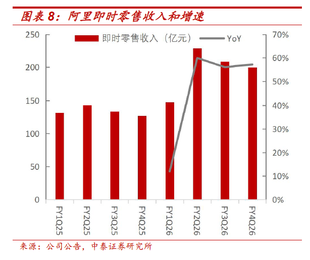
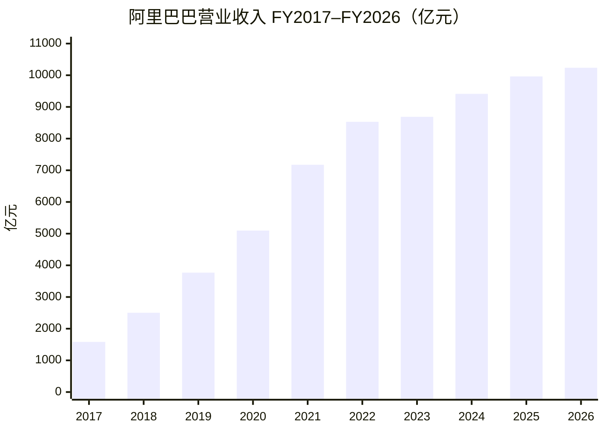
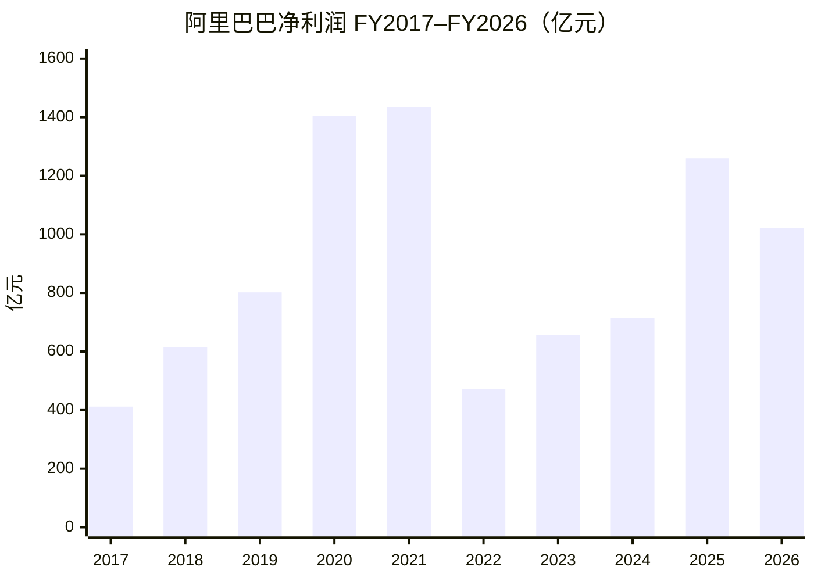
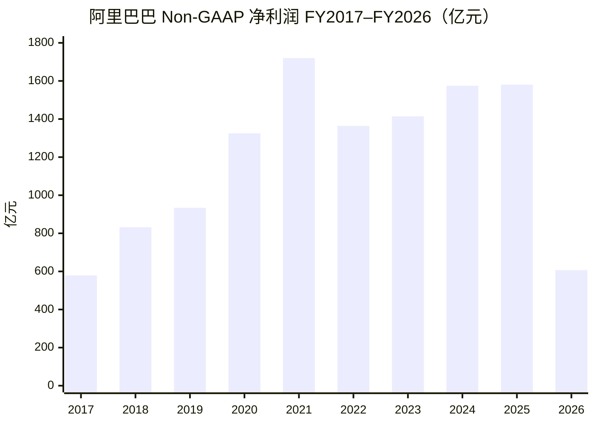
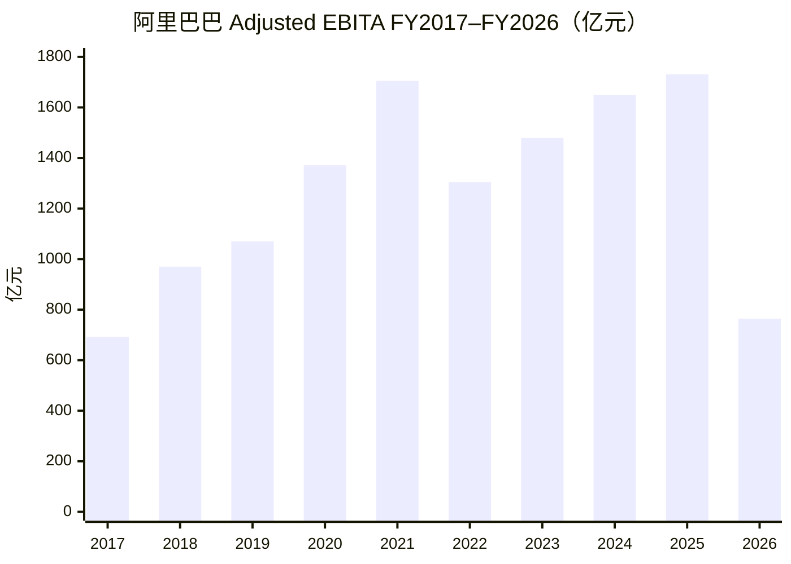
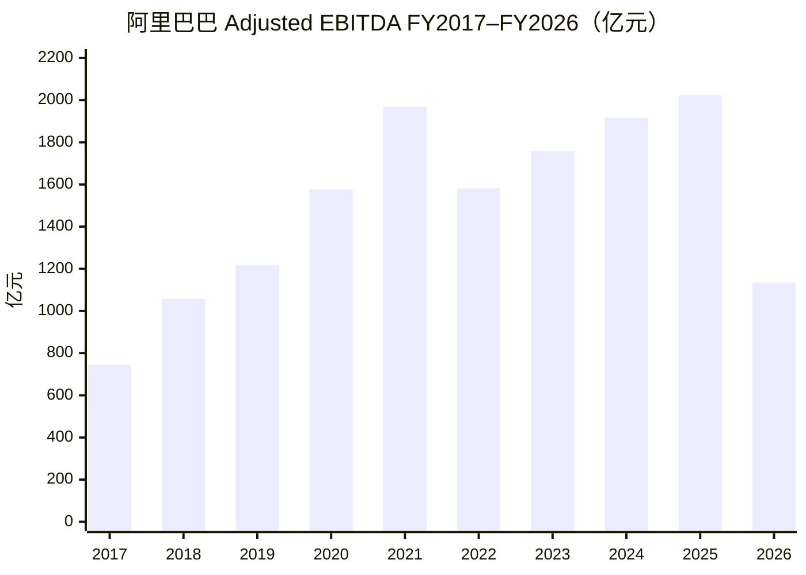
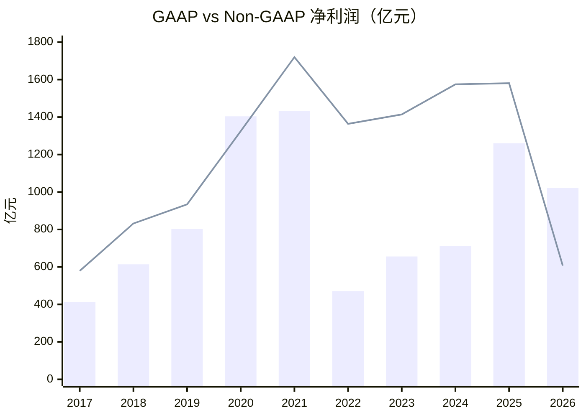
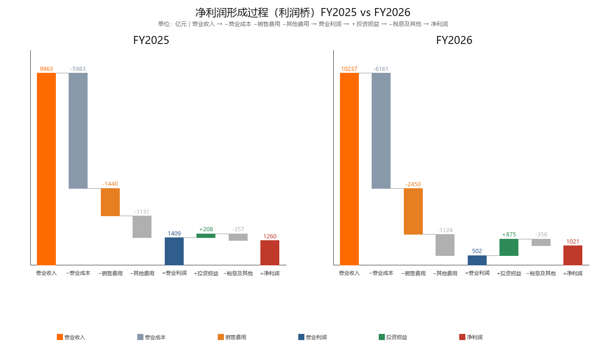

# 阿里巴巴投研分析



## 营业收入与净利润（FY2017–FY2026）

口径说明：

- 公司：阿里巴巴集团控股有限公司（港股 `9988.HK` / 美股 ADR `BABA`）
- 财年：每年 **4 月 1 日–次年 3 月 31 日**（下表「FY20xx」指截至该年 3 月 31 日的财年）
- 单位：人民币百万元（表内）；图表换算为 **亿元**
- 净利润：合并报表 **Net income**（非「归属于普通股股东净利润」）
- 来源：公司业绩公告 / 年报（港交所、SEC）；原始数据见 `data/alibaba_revenue_net_income_fy2017_2026.json`

| 财年 | 截至 | 营业收入（百万元） | 净利润（百万元） | 营收同比 | 净利润同比 |
|------|------|-------------------:|-----------------:|---------:|----------:|
| FY2017 | 2017-03-31 | 158,273 | 41,226 | — | — |
| FY2018 | 2018-03-31 | 250,266 | 61,412 | 58.1% | 49.0% |
| FY2019 | 2019-03-31 | 376,844 | 80,234 | 50.6% | 30.6% |
| FY2020 | 2020-03-31 | 509,711 | 140,350 | 35.3% | 74.9% |
| FY2021 | 2021-03-31 | 717,289 | 143,284 | 40.7% | 2.1% |
| FY2022 | 2022-03-31 | 853,062 | 47,079 | 18.9% | -67.1% |
| FY2023 | 2023-03-31 | 868,687 | 65,573 | 1.8% | 39.3% |
| FY2024 | 2024-03-31 | 941,168 | 71,332 | 8.3% | 8.8% |
| FY2025 | 2025-03-31 | 996,347 | 125,976 | 5.9% | 76.6% |
| FY2026 | 2026-03-31 | 1,023,670 | 102,127 | 2.7% | -18.9% |

### 营业收入（亿元）



### 净利润（亿元）



简要观察：

- **先纠正一点**：偏高的主要是 **净利润**，不是营业收入。投资公允价值变动 / 处置收益走「利息及投资收益」等线下科目，**不会抬高营收**。
- 营收从 FY2017 约 **1,583 亿元** 增至 FY2026 约 **10,237 亿元**，十年量级约 **6.5 倍**；近三年增速明显放缓（FY2024–FY2026 分别约 8%/6%/3%）。
- GAAP 净利润在 FY2020–FY2021 冲高（含股权投资浮盈等），FY2022 因投资浮亏大跌；FY2025 回升、FY2026 仍含较大投资相关收益（见下一节）。

## 刨除投资收益看什么：Non-GAAP vs Adjusted EBITA / EBITDA

### 该用哪个？

| 指标 | 是否剔除投资浮盈/浮亏/处置 | 还剔除什么 | 适合回答的问题 |
|------|:---:|------|------|
| **Non-GAAP 净利润**（优先） | ✅ 是 | SBC、无形资产摊销/减值、商誉减值等 + 税项调整 | 「把非常规投资损益拿掉后，赚了多少钱？」 |
| **Adjusted EBITA**（主业） | ✅ 天然不含（在利息及投资收益之上） | SBC、摊销等；**不含税、利息** | 「主业经营利润质量如何？」分部也主要看这个 |
| **Adjusted EBITDA** | ✅ 同上 | 在 EBITA 上再加回 PP&E/土地使用权折旧 | 现金流粗看、杠杆（Debt/EBITDA）；比 EBITA 更「厚」 |

**结论：**

1. 要对照 FY2020/2021/2026 那种「投资收益把净利润打歪」→ 用 **Non-GAAP 净利润** 最直接。  
2. 要看电商/云/即时零售等经营投入是否拖累主业 → 用 **Adjusted EBITA**（公司分部考核也用它）。  
3. **EBITDA 不是替代 Non-GAAP 看投资收益的首选**；它只是经营利润的加回折旧版。三者都看最好：Non-GAAP 看「干净利润」，EBITA 看「干净经营」，GAAP 看「含投资噪声的账面」。

### 指标数据（人民币百万元）

来源：公司业绩公告 / 20-F / 港交所年报；原始 JSON：`data/alibaba_nongaap_ebita_ebitda_fy2017_2026.json`

| 财年 | GAAP 净利润 | Non-GAAP 净利润 | Adjusted EBITA | Adjusted EBITDA | GAAP−Non-GAAP（约） |
|------|------------:|----------------:|---------------:|----------------:|-------------------:|
| FY2017 | 41,226 | 57,871 | 69,172 | 74,456 | -16,645 |
| FY2018 | 61,412 | 83,214 | 97,003 | 105,792 | -21,802 |
| FY2019 | 80,234 | 93,407 | 106,981 | 121,943 | -13,173 |
| FY2020 | 140,350 | 132,479 | 137,136 | 157,659 | **+7,871** |
| FY2021 | 143,284 | 171,985 | 170,453 | 196,842 | -28,701 |
| FY2022 | 47,079 | 136,388 | 130,397 | 158,205 | **-89,309** |
| FY2023 | 65,573 | 141,379 | 147,911 | 175,710 | -75,806 |
| FY2024 | 71,332 | 157,479 | 165,028 | 191,668 | -86,147 |
| FY2025 | 125,976 | 158,122 | 173,065 | 202,325 | -32,146 |
| FY2026 | 102,127 | 60,658 | 76,416 | 113,483 | **+41,469** |

> GAAP−Non-GAAP **为正** ≈ 当期 GAAP 相对 Non-GAAP「更肥」（常见：投资浮盈/处置收益进了 GAAP，却被 Non-GAAP 剔除）。  
> **为负** ≈ GAAP「更瘦」（常见：投资浮亏，或 Non-GAAP 加回了 SBC/罚款等）。

### FY2020–FY2026：GAAP − Non-GAAP 差值原因表

单位：人民币百万元。差值 = GAAP 净利润 − Non-GAAP 净利润。  
调节项来自公司业绩公告「Net income → Non-GAAP net income」调节表（加项抬高 Non-GAAP，减项压低 Non-GAAP）。

| 财年 | GAAP − Non-GAAP = 差值 | 主要原因（按影响大致排序） | 关键调节项（摘自公告） |
|------|------------------------|---------------------------|----------------------|
| FY2020 | 140,350 − 132,479 = **+7,871**（GAAP更肥） | **一次性获得蚂蚁 33% 股权相关收益约 716 亿**计入 GAAP，Non-GAAP 整笔剔除；虽加回 SBC/减值等，仍盖不过该项 | −蚂蚁股权收益 **71,561**；+SBC 31,742；+商誉/投资减值 25,656；+无形资产摊销减值 13,388；−其他投资重估/处置净收益 4,764；税项 −2,429 等 |
| FY2021 | 143,284 − 171,985 = **-28,701**（GAAP更瘦） | Non-GAAP **加回反垄断罚款约 182 亿 + SBC 约 501 亿**；同时剔除投资重估/处置等净收益约 663 亿——加回项合计仍大于剔除的投资收益，故 Non-GAAP > GAAP | +SBC **50,120**；+反垄断罚款 **18,228**；+商誉/投资减值 14,737；+无形资产摊销 12,427；−投资重估/处置等收益 **66,305**；税项 −506 |
| FY2022 | 47,079 − 136,388 = **-89,309**（GAAP显著更瘦） | **公开市场股权投资公允价值大跌**（投资亏损进 GAAP）；叠加商誉/投资减值约 403 亿、SBC 约 240 亿被 Non-GAAP 加回 | +商誉/投资减值 **40,264**；+SBC 23,971；+投资重估/处置等亏损 **21,671**；+无形资产摊销减值 11,647；税项 −8,244 |
| FY2023 | 65,573 − 141,379 = **-75,806**（GAAP更瘦） | 仍以 **SBC + 商誉/投资减值 + 投资相关净亏损** 加回为主；公允价值亏损较 FY2022 收窄，但 GAAP 仍明显低于 Non-GAAP | +SBC **30,831**；+商誉/投资减值 **24,351**；+投资重估/处置等净亏损 13,857；+无形资产摊销减值 13,504；+股权捐赠 511；税项 −7,248 |
| FY2024 | 71,332 − 157,479 = **-86,147**（GAAP更瘦） | **投资相关净亏损约 217 亿**（含市值变动）+ **商誉/投资减值及其他约 337 亿**（高鑫、优酷等减值）+ 无形资产摊销减值约 216 亿 + SBC；GAAP 被拖瘦 | +商誉/投资减值及其他 **33,679**；+投资重估/处置亏损 **21,659**；+无形资产摊销减值 **21,592**；+SBC 18,546；税项 −9,329 |
| FY2025 | 125,976 − 158,122 = **-32,146**（GAAP略瘦） | 出现 **投资重估/处置净收益约 88 亿**（抬高 GAAP），但 Non-GAAP 仍加回减值约 224 亿 + SBC 约 140 亿等，整体 Non-GAAP 仍更高；另有高鑫/银泰等处置亏损在经营叙述中出现 | +商誉/投资减值及其他 **22,435**；+SBC 13,970；+无形资产摊销减值 6,336；−投资重估/处置净收益 **8,764**；税项 −1,831 |
| FY2026 | 102,127 − 60,658 = **+41,469**（GAAP更肥） | **投资重估/处置净收益约 744 亿被 Non-GAAP 剔除**（含股权投资市值变动净收益、Trendyol 本地生活等处置收益；对比 FY2025 高鑫/银泰处置亏损）。经营利润大降，但账面净利被投资收益撑住 | −投资重估/处置净收益 **74,416**；+商誉/投资减值及其他 17,746；+SBC 11,180；+无形资产摊销减值 5,079；税项 −1,058 |

一句话对照：

| 财年 | 一句话 |
|------|--------|
| FY2020 | 蚂蚁 33% 股权一次性收益把 GAAP 抬过 Non-GAAP |
| FY2021 | 投资收益不小，但罚款 + SBC 加回更大 → Non-GAAP 更高 |
| FY2022 | 投资浮亏 + 大额减值 → GAAP 塌、Non-GAAP 稳 |
| FY2023–24 | 持续「SBC + 减值 + 投资噪声」格局，GAAP 系统性偏低 |
| FY2025 | 投资收益回正，但加回项仍占优，缺口收窄 |
| FY2026 | 超大额投资/处置收益抬高 GAAP；Non-GAAP 暴露主业承压 |

### 非常规投资收益相关注明

- **FY2020**：GAAP 净利润（约 1,404 亿）**高于** Non-GAAP（约 1,325 亿）。公司披露净利含股权投资市值变动等投资收益；Non-GAAP 明确剔除投资重估/处置损益。  
- **FY2021**：GAAP 净利仍高（约 1,433 亿），但 Non-GAAP 更高（约 1,720 亿）——因反垄断罚款、股份支付等被 Non-GAAP 加回；投资相关损益仍在 GAAP 路径里，不能把「FY21 净利高」全当成投资收益。  
- **FY2022**：GAAP 净利暴跌至约 471 亿，Non-GAAP 仍约 1,364 亿——主因公开市场股权投资公允价值下跌（公司明确写入业绩说明）。  
- **FY2025→FY2026**：GAAP 净利仅降约 19%（1,260→1,021 亿），但 **Non-GAAP 净利 -62%**（1,581→607 亿）、**Adjusted EBITA -56%**（1,731→764 亿）。差额来自：  
  - 「利息及投资收益，净额」FY2026 约 **875 亿元**（FY2025 约 208 亿；FY2024 为亏损约 100 亿）；  
  - 含股权投资市值变动净收益，以及处置收益（含 Trendyol 本地生活服务等）；对比 FY2025 有高鑫零售、银泰等处置亏损。  
  - 经营侧：即时零售（淘宝闪购）与技术投入显著压缩 Adjusted EBITA。

### Non-GAAP 净利润（亿元）



### Adjusted EBITA（亿元）



### Adjusted EBITDA（亿元）



### GAAP vs Non-GAAP 净利润对照（亿元）



> 柱 = GAAP 净利润；线 = Non-GAAP 净利润。FY2020、FY2026 柱高于线（投资收益抬高账面）；FY2022 柱远低于线（投资浮亏）。

## 分部收入与 EBITA（FY2025 vs FY2026）

口径：公司分部披露；单位 **亿元人民币**（由公告百万元÷100）；EBITA 为 Adjusted EBITA；利润率 = EBITA ÷ 该分部收入。  
来源：公司 FY2026 业绩公告 / 年报分部表。

### 简表（主分部）

| 分部 | 收入 FY25 | 收入 FY26 | EBITA FY25 | EBITA FY26 | 利润率 FY25 | 利润率 FY26 |
|------|----------:|----------:|-----------:|-----------:|------------:|------------:|
| 中国电商集团 | 5,084 | 5,542 | 1,932 | 1,075 | 38.0% | 19.4% |
|　└ 其中：淘天集团 | — | — | 1,962 | 2,046 | 43.1%* | 43.0%* |
|　└ 其中：即时零售 | 536 | 785 | -30 | -970 | -5.6% | -123.6% |
| 国际数字商业（AIDC） | 1,323 | 1,442 | -151 | -21 | -11.4% | -1.4% |
| 云计算（云智能） | 1,180 | 1,581 | 106 | 143 | 8.0% | 9.9% |
| 所有其他 | 3,383 | 2,544 | -95 | -357 | -2.8% | -14.0% |
| **合并合计** | **9,963** | **10,237** | **1,731** | **764** | **17.4%** | **7.5%** |

\*淘天利润率按公司披露口径（相对淘天相关收入）；「所有其他」EBITA 取年报分部 Adjusted EBITA。合并合计含未分摊及分部间抵消，不等于各分部简单加总。

要点：FY26 合并 EBITA 利润率从 17.4% 掉到 7.5%，主因 **即时零售亏损扩大至约 -970 亿元**；淘天利润率仍约 43%，云与国际在改善。

### 分部收入对比（亿元）

```mermaid
xychart-beta
    title "分部营业收入 FY25 vs FY26（亿元）"
    x-axis [中国电商, 国际AIDC, 云计算, 所有其他]
    y-axis "亿元" 0 --> 6000
    bar [5084, 1323, 1180, 3383]
    bar [5542, 1442, 1581, 2544]
```

> 每组左柱 FY25、右柱 FY26。

### 分部 EBITA 对比（亿元）

```mermaid
xychart-beta
    title "分部 Adjusted EBITA FY25 vs FY26（亿元）"
    x-axis [淘天集团, 即时零售, 国际AIDC, 云计算, 所有其他]
    y-axis "亿元" -1000 --> 2200
    bar [1962, -30, -151, 106, -95]
    bar [2046, -970, -21, 143, -357]
```

> 每组左柱 FY25、右柱 FY26。淘天 EBITA 仍稳增；即时零售 FY26 亏损显著扩大，拖累中国电商集团整体 EBITA。

## 利润表关键项（FY2025 vs FY2026）

单位：人民币百万元。摘自合并利润表（截至 3/31）。

| 项目 | FY25 | FY26 | 同比 |
|------|-----:|-----:|-----:|
| 营业收入 | 996,347 | 1,023,670 | +2.7% |
| 营业成本 | 598,285 | 616,136 | +3.0% |
| 销售费用 | 144,021 | 245,023 | +70.1% |
| 营业利润 | 140,905 | 50,150 | -64.4% |
| 投资损益（利息收入及投资损益） | 20,759 | 87,512 | +321.6% |
| 净利润（含少数股东权益） | 125,976 | 102,127 | -18.9% |

说明：

- 营业成本、销售费用按费用绝对值列示（原表为负向支出）。
- 投资损益取「利息收入及投资损益」；另有「应占股权投资损益」FY25 **5,966** / FY26 **2,785**，未并入上表。
- 归母净利润（归属普通股东）为 FY25 **129,470** / FY26 **105,904**。

### 怎么画图更好？

要表达「净利润怎么来的」，用 **利润桥（瀑布图 / Waterfall）**：

```text
营业收入
   − 营业成本
   − 销售费用
   − 其他费用（研发、管理、摊销、商誉减值等）
＝ 营业利润
   ＋ 投资损益
   − 税息及其他（利息、所得税等净影响）
＝ 净利润
```

### 净利润形成过程（利润桥）



| 步骤（亿元） | FY25 | FY26 |
|-------------|-----:|-----:|
| 营业收入 | 9,963 | 10,237 |
| −营业成本 | -5,983 | -6,161 |
| −销售费用 | -1,440 | -2,450 |
| −其他费用 | -1,131 | -1,124 |
| ＝营业利润 | 1,409 | 502 |
| ＋投资损益 | 208 | 875 |
| −税息及其他 | -357 | -356 |
| ＝净利润 | 1,260 | 1,021 |

读图要点：FY26 营业成本仅小幅增加（约 +3%），**销售费用接近翻倍**才是营业利润塌陷主因；投资损益从 208→875 部分托住账面，净利润降幅因此小于营业利润降幅。

### 关键项同比柱状图（亿元）

```mermaid
xychart-beta
    title "利润表关键项 FY25 vs FY26（亿元）"
    x-axis [营业收入, 营业成本, 销售费用, 营业利润, 投资损益, 净利润]
    y-axis "亿元" 0 --> 11000
    bar [9963, 5983, 1440, 1409, 208, 1260]
    bar [10237, 6161, 2450, 502, 875, 1021]
```

> 每组左柱 FY25、右柱 FY26。成本费用用绝对额便于同比；形成过程请看上方利润桥。
