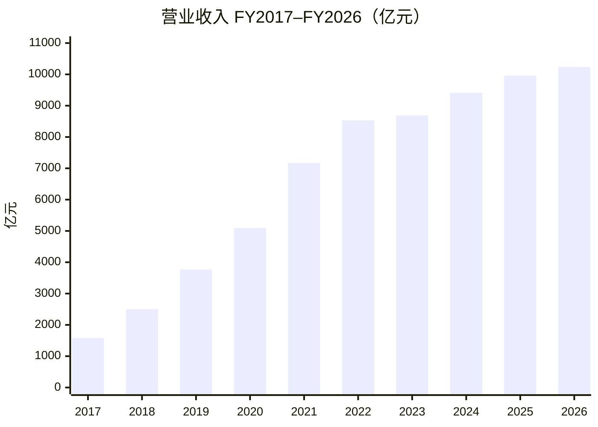
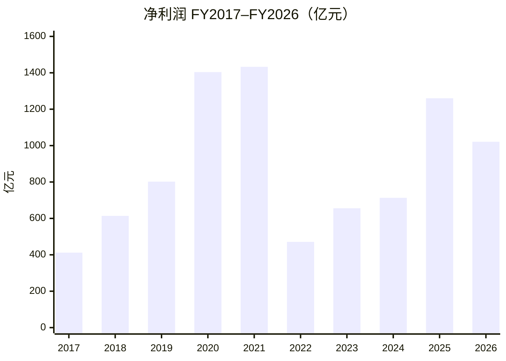
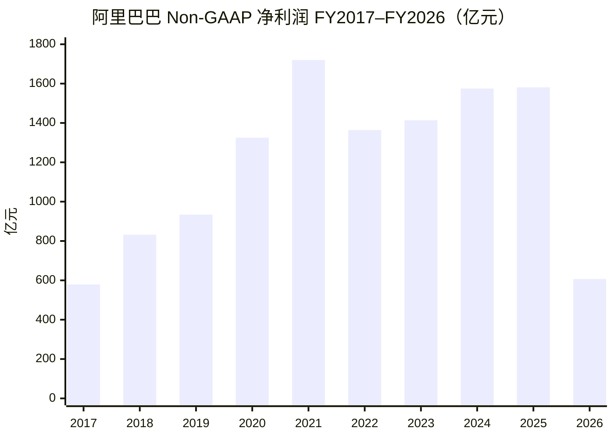
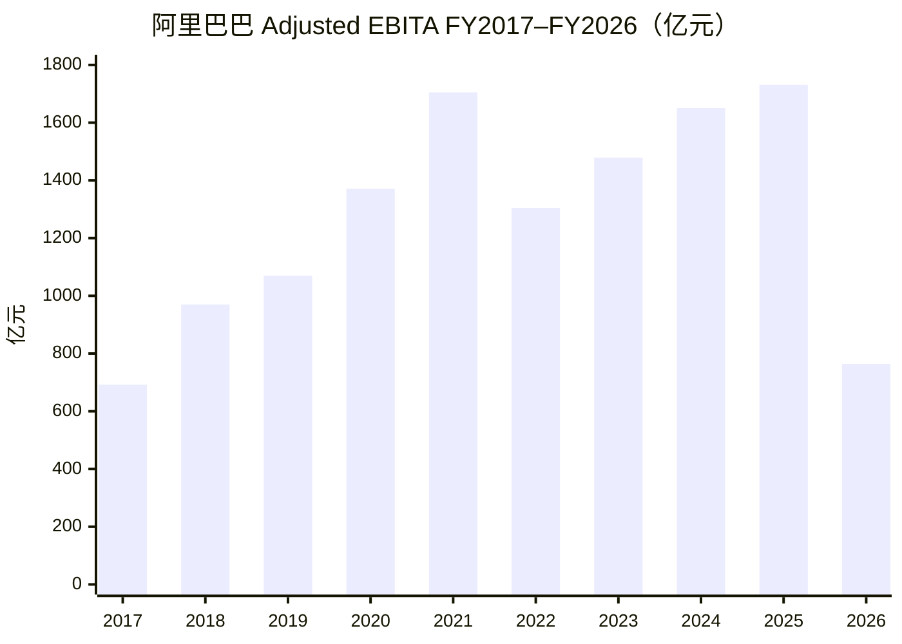
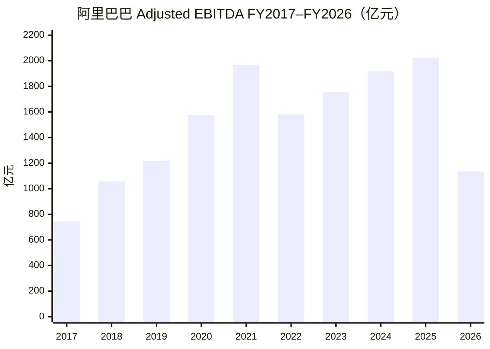

# 阿里巴巴投研分析框架

## 目录

### [第一部分：财务报表分析](#第一部分财务报表分析)

- [一、营业收入与净利润（FY2017–FY2026）](#一营业收入与净利润fy2017fy2026)
- [二、刨除投资收益看什么：Non-GAAP vs Adjusted EBITA / EBITDA](#二刨除投资收益看什么non-gaap-vs-adjusted-ebita--ebitda)
- [三、分部收入与 EBITA（FY2025 vs FY2026）](#三分部收入与-ebitafy2025-vs-fy2026)
- [四、利润表关键项（FY2025 vs FY2026）](#四利润表关键项fy2025-vs-fy2026)

### [第二部分：阿里云分析](#第二部分阿里云分析)

- [五、阿里云季度营收与增速（1Q23–1Q26）](#五阿里云季度营收与增速1q231q26)
- [六、中国 AI 云市场份额（2025）](#六中国-ai-云市场份额2025)
- [七、阿里 AI 相关产品收入：近 2 年分季与增速](#七阿里-ai-相关产品收入近-2-年分季与增速)
- [八、C 端用户：豆包 / 千问 / 元宝](#八c-端用户豆包--千问--元宝)

### [第三部分：大模型能力分析](#第三部分大模型能力分析)

- [九、国内大模型能力排序（2026 年 8–9 月）](#九国内大模型能力排序2026-年-89-月)

### [第四部分：平头哥分析](#第四部分平头哥分析)

- [十、平头哥芯片全栈矩阵](#十平头哥芯片全栈矩阵)

### [第五部分：即时零售分析](#第五部分即时零售分析)

- [十一、即时零售（淘宝闪购 / 饿了么体系）](#十一即时零售淘宝闪购--饿了么体系)

### [第六部分：企业文化分析](#第六部分企业文化分析)

- [十二、使命愿景、价值观与战略转译](#十二使命愿景价值观与战略转译)

### [第七部分：历史收购与投资分析](#第七部分历史收购与投资分析)

- [十三、主要收购、投资与成败](#十三主要收购投资与成败)

---

## 第一部分：财务报表分析

## 一、营业收入与净利润（FY2017–FY2026）

口径：阿里巴巴集团（`9988.HK` / `BABA`）；财年 **4/1–次年 3/31**；图表单位 **亿元**；净利润为合并报表 **Net income**（非归母净利）。来源：公司业绩公告 / 年报。

### 营业收入与净利润（亿元）





要点：

- **营收**：FY2017 约 **1,583 亿** → FY2026 约 **10,237 亿**（约 **6.5 倍**）；近三年增速放缓，约 **8% / 6% / 3%**。
- **GAAP 净利波动大**：FY2020–21 冲高（含投资浮盈等），FY2022 因投资浮亏大跌，FY2025 回升、FY2026 仍含较大投资相关收益——细节见第二节。
- **常见误读**：偏高的是净利润，不是营收；投资公允价值变动 / 处置收益走线下科目，**不抬高营收**。

## 二、刨除投资收益看什么：Non-GAAP vs Adjusted EBITA / EBITDA

### 该用哪个？

三个指标都在「利息及投资收益」之上或之外处理投资噪声，但回答的问题不同：

| 指标 | 是否剔除投资浮盈/浮亏/处置 | 还调什么 | 适合回答 |
|------|---------------------------|----------|----------|
| **Non-GAAP 净利润**（优先） | ✅ 是 | 再调 SBC、摊销/减值、商誉减值等 + 税项 | 把非常规投资损益拿掉后，赚了多少钱？ |
| **Adjusted EBITA**（主业） | ✅ 天然不含 | 调 SBC、摊销等；**不含税、利息** | 主业经营利润质量如何？（分部考核也用它） |
| **Adjusted EBITDA** | ✅ 同上 | 在 EBITA 上再加回 PP&E / 土地使用权折旧 | 粗看现金流、杠杆（Debt/EBITDA）；比 EBITA 更「厚」 |

怎么选：

1. 对照 FY2020 / 2021 / 2026 那种「投资收益把净利打歪」→ 看 **Non-GAAP 净利润**。  
2. 看电商 / 云 / 即时零售投入是否拖累主业 → 看 **Adjusted EBITA**。  
3. **EBITDA 不是替代 Non-GAAP 看投资收益的首选**，只是经营利润加回折旧版。三者分工：Non-GAAP = 干净利润，EBITA = 干净经营，GAAP = 含投资噪声的账面。

### Non-GAAP 净利润（亿元）



### Adjusted EBITA（亿元）



### Adjusted EBITDA（亿元）



读图：三条线 FY2021 前后见顶后震荡上行，**FY2026 同步大幅下滑**（Non-GAAP 约 607 亿、EBITA 约 764 亿、EBITDA 约 1,135 亿）——主业承压被暴露；同期 GAAP 净利因投资收益仍显得「没那么差」（见第一节）。

## 三、分部收入与 EBITA（FY2025 vs FY2026）

口径：公司分部披露；单位 **亿元**；EBITA 为 Adjusted EBITA。来源：FY2026 业绩公告 / 年报分部表。

### 分部收入对比（亿元）

```mermaid
xychart-beta
    title "分部营业收入 FY25 vs FY26（亿元）"
    x-axis [中国电商, 国际AIDC, 云计算, 所有其他]
    y-axis "亿元" 0 --> 6000
    bar [5084, 1323, 1180, 3383]
    bar [5542, 1442, 1581, 2544]
```

> 每组左柱 FY25、右柱 FY26。中国电商与云计算收入上行；「所有其他」收缩。

### 分部 EBITA 对比（亿元）

```mermaid
xychart-beta
    title "分部 Adjusted EBITA FY25 vs FY26（亿元）"
    x-axis [淘天集团, 即时零售, 国际AIDC, 云计算, 所有其他]
    y-axis "亿元" -1000 --> 2200
    bar [1962, -30, -151, 106, -95]
    bar [2046, -970, -21, 143, -357]
```

> 每组左柱 FY25、右柱 FY26。淘天 EBITA 仍稳；**即时零售 FY26 约 -970 亿**，拖累中国电商与合并利润率（约 17.4% → 7.5%）；云与国际在改善。

## 四、利润表关键项（FY2025 vs FY2026）

单位：人民币百万元。摘自合并利润表（截至 3/31）。


| 项目              | FY25    | FY26      | 同比      |
| --------------- | ------- | --------- | ------- |
| 营业收入            | 996,347 | 1,023,670 | +2.7%   |
| 营业成本            | 598,285 | 616,136   | +3.0%   |
| 销售费用            | 144,021 | 245,023   | +70.1%  |
| 营业利润            | 140,905 | 50,150    | -64.4%  |
| 投资损益（利息收入及投资损益） | 20,759  | 87,512    | +321.6% |
| 净利润（含少数股东权益）    | 125,976 | 102,127   | -18.9%  |


说明：

- 营业成本、销售费用按费用绝对值列示（原表为负向支出）。
- 投资损益取「利息收入及投资损益」；另有「应占股权投资损益」FY25 **5,966** / FY26 **2,785**，未并入上表。
- 归母净利润（归属普通股东）为 FY25 **129,470** / FY26 **105,904**。

### 关键项同比柱状图（亿元）

```mermaid
xychart-beta
    title "利润表关键项 FY25 vs FY26（亿元）"
    x-axis [营业收入, 营业成本, 销售费用, 营业利润, 投资损益, 净利润]
    y-axis "亿元" 0 --> 11000
    bar [9963, 5983, 1440, 1409, 208, 1260]
    bar [10237, 6161, 2450, 502, 875, 1021]
```

> 每组左柱 FY25、右柱 FY26。成本费用用绝对额便于同比。销售费用约 **+70%**、营业利润约 **-64%**，与即时零售投入同向；投资损益大幅抬升，支撑 GAAP 净利降幅小于经营利润。

## 第二部分：阿里云分析

## 五、阿里云季度营收与增速（1Q23–1Q26）

### 营收柱状图（亿元）

### 同比增速（%）

## 六、中国 AI 云市场份额（2025）

### 口径 A：Omdia 全链条营收（IaaS + MaaS 等）

### 口径 B：IDC 公有云大模型 Token 调用量

### 怎么读

## 七、阿里 AI 相关产品收入：近 2 年分季与增速

### 口径与数据限制

### 近 2 年分季主表（AI 相关产品）

### 已披露两季的结构变化

### 和「云分部总收入」差在哪（防再混）

### 与「中国 AI 云份额」对照

## 八、C 端用户：豆包 / 千问 / 元宝

### 2026 年 6 月（最新可比）

### 近期演变（同口径 MAU）

## 第三部分：大模型能力分析

## 九、国内大模型能力排序（2026 年 8–9 月）

### 综合能力（旗舰）

### 专项谁更强（勿与综合混读）

### 对千问的威胁：开源大模型 vs 豆包

### 怎么读威胁

## 第四部分：平头哥分析

## 十、平头哥芯片全栈矩阵

### 0. 由来与发展简史

### 1. 真武 ≈ 英伟达的哪一档？

### 2. 出货量级、竞品对比与市场地位

### 3. 服务哪些领域、哪些客户？

## 第五部分：即时零售分析

## 十一、即时零售（淘宝闪购 / 饿了么体系）

### 1. 为什么一定要做？对电商大盘有多重要？

### 2. 怎么做的？收获与代价

#### 过程（时间线）

#### 收获（阶段性）

#### 代价（账面与机会成本）

### 3. 未来战略往哪走？

### 投研小结

## 第六部分：企业文化分析

## 十二、使命愿景、价值观与战略转译

### 1. 使命、愿景（不变的锚）

### 2. 「新六脉神剑」（价值观骨架）

### 3. 吴泳铭阶段的战略转译：用户为先 × AI 驱动

### 4. 文化 → 组织与考核（和财报的接口）

### 5. 投研小结：文化是加分项还是风险项？

### 6. 近一两年 AI / 大模型人才出走

#### 主表（大模型相关）

#### 怎么读（投研）

### 7. 合伙人委员会：机制与核心成员

#### 机制（投研必记）

#### 四人深描（委员会执行层主力）

#### 怎么读（和前文对照）

## 第七部分：历史收购与投资分析

## 十三、主要收购、投资与成败

### 1. 收购 / 控股主表

### 2. 战略投资主表（少数股权 / 战投）

#### 2.1 社交、内容与广告触达

#### 2.2 物流与快递（绑菜鸟）

#### 2.3 出行与本地运力

#### 2.4 新零售与实体（少数股权，非全资收购）

#### 2.5 金融、运营商与资本市场

#### 2.6 国际电商少数股权（后或转控股）

#### 2.7 AI / 算力 / 半导体产业链（近年重心）

### 3. 分类读法（收购 + 投资合一）

### 4. 投研小结
