# 阿里巴巴投研分析框架

## 目录

### [第一部分：财务报表分析](#第一部分财务报表分析)

- [1. 营业收入与净利润（FY2017–FY2026）](#1-营业收入与净利润fy2017-fy2026)
- [2. 刨除投资收益看什么：Non-GAAP vs Adjusted EBITA / EBITDA](#2-刨除投资收益看什么non-gaap-vs-adjusted-ebita-ebitda)
- [3. 分部收入与 EBITA（FY2025 vs FY2026）](#3-分部收入与-ebitafy2025-vs-fy2026)
- [4. 利润表关键项（FY2025 vs FY2026）](#4-利润表关键项fy2025-vs-fy2026)
- [5. 股东分红、回购与年度股东收益率（FY2021–FY2026）](#5-股东分红回购与年度股东收益率fy2021-fy2026)


### [第二部分：阿里云分析](#第二部分阿里云分析)

- [1. 阿里云季度营收与增速（1Q23–1Q26）](#1-阿里云季度营收与增速1q23-1q26)
- [2. 中国 AI 云份额与 AI 相关产品收入](#2-中国-ai-云份额与-ai-相关产品收入)
- [3. C 端用户：豆包 / 千问 / DeepSeek / 元宝](#3-c-端用户豆包-千问-deepseek-元宝)


### [第三部分：大模型能力分析](#第三部分大模型能力分析)

- [1. 国内大模型能力排序（2026 年 8–9 月）](#1-国内大模型能力排序2026-年-8-9-月)


### [第四部分：平头哥分析](#第四部分平头哥分析)

- [1. 产品矩阵](#1-产品矩阵)
- [2. 由来与关键节点（简述）](#2-由来与关键节点简述)
- [3. 真武 ≈ 英伟达的哪一档？](#3-真武-英伟达的哪一档)
- [4. 出货量级、竞品对比与市场地位](#4-出货量级竞品对比与市场地位)
- [5. 服务哪些领域、哪些客户？](#5-服务哪些领域哪些客户)


### [第五部分：即时零售分析（淘宝闪购 / 饿了么）](#第五部分即时零售分析淘宝闪购-饿了么)

- [1. 为什么一定要做？对电商大盘有多重要？](#1-为什么一定要做对电商大盘有多重要)
- [2. 怎么做的？收获与代价](#2-怎么做的收获与代价)
- [3. 未来战略往哪走？](#3-未来战略往哪走)
- [投研小结](#投研小结)


### [第六部分：企业文化分析](#第六部分企业文化分析)

- [1. 使命、愿景（不变的锚）](#1-使命愿景不变的锚)
- [2. 侠客文化（花名、空间与六脉神剑）](#2-侠客文化花名空间与六脉神剑)
- [3. 对照：段永平「用户第一」与平台「客户第一」](#3-对照段永平用户第一与平台客户第一)
- [4. 造钟人与报时人：马云 vs 段永平](#4-造钟人与报时人马云-vs-段永平)
- [5. 扩张 vs 打磨：阿里 / 拼多多 / 腾讯](#5-扩张-vs-打磨阿里-拼多多-腾讯)
- [6. 近一两年 AI / 大模型人才出走](#6-近一两年-ai-大模型人才出走)


### [第七部分：历史收购与投资分析](#第七部分历史收购与投资分析)

- [1. 收购 / 控股主表](#1-收购-控股主表)
- [2. 战略投资主表（少数股权 / 战投）](#2-战略投资主表少数股权-战投)
- [3. 分类读法（收购 + 投资合一）](#3-分类读法收购-投资合一)
- [4. 投研小结](#4-投研小结)


### [第八部分：企业估值](#第八部分企业估值)

- [1. 分红回购估值](#1-分红回购估值)
  - [1.1 分年：分红、回购、分红+回购](#11-分年分红回购分红回购)
  - [1.2 累计总额、当前市值与回报/市值比](#12-累计总额当前市值与回报市值比)
- [2. 净利润（平滑）估值](#2-净利润平滑估值)
  - [2.1 阿里净利润与 PE](#21-阿里净利润与-pe)
  - [2.2 腾讯净利润与 PE](#22-腾讯净利润与-pe)
  - [2.3 京东净利润与 PE](#23-京东净利润与-pe)
  - [2.4 三家 PE 对照](#24-三家-pe-对照)
- [3. 分部估值法](#3-分部估值法)
  - [3.1 电商板块估值](#31-电商板块估值)
  - [3.2 云智能板块估值](#32-云智能板块估值)


---

## 第一部分：财务报表分析


### 1. 营业收入与净利润（FY2017–FY2026）

口径：阿里巴巴集团（`9988.HK` / `BABA`）；财年 **4/1–次年 3/31**；图表单位 **亿元**；净利润为合并报表 **Net income**（非归母净利）。来源：公司业绩公告 / 年报。

#### 营业收入与净利润（亿元）

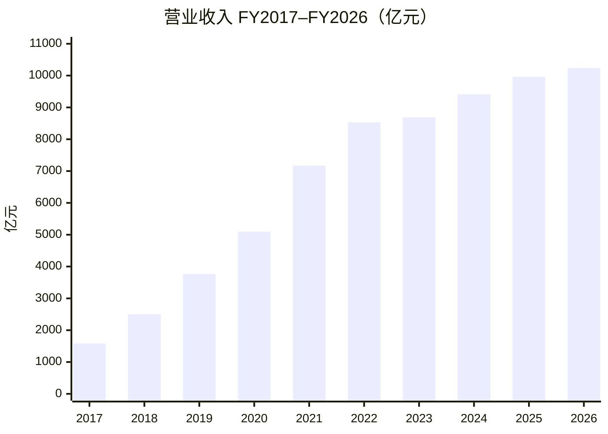


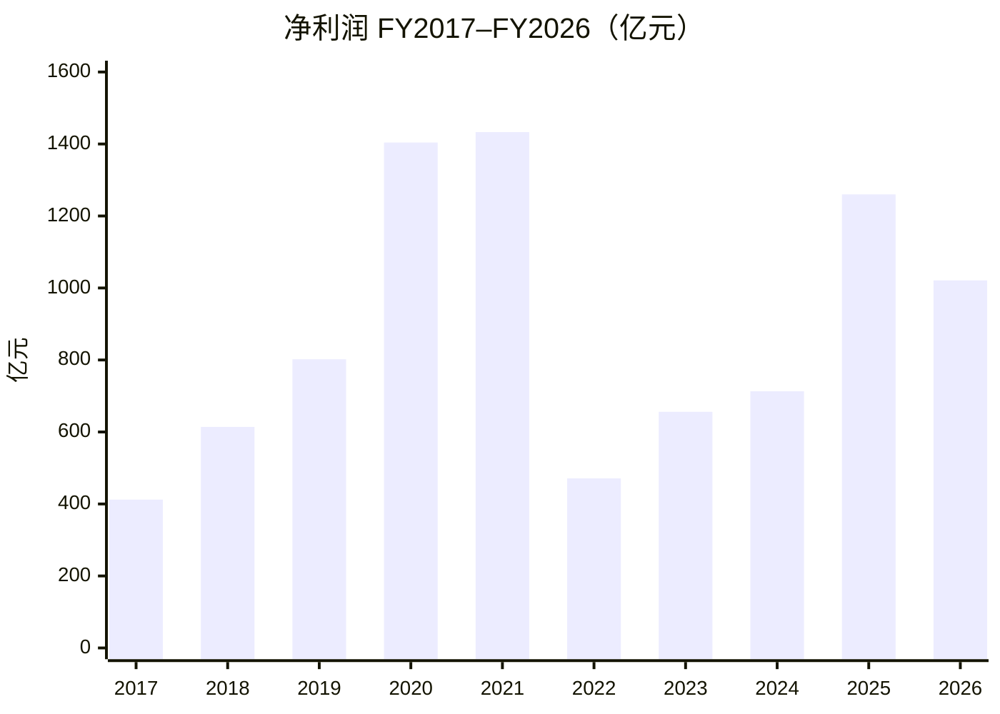


要点：

- **营收**：FY2017 约 **1,583 亿** → FY2026 约 **10,237 亿**（约 **6.5 倍**）；近三年增速放缓，约 **8% / 6% / 3%**。
- **GAAP 净利波动大**：FY2020–21 冲高（含投资浮盈等），FY2022 因投资浮亏大跌，FY2025 回升、FY2026 仍含较大投资相关收益——细节见第二节。
- **常见误读**：偏高的是净利润，不是营收；投资公允价值变动 / 处置收益走线下科目，**不抬高营收**。


### 2. 刨除投资收益看什么：Non-GAAP vs Adjusted EBITA / EBITDA


#### 该用哪个？

三个指标都在「利息及投资收益」之上或之外处理投资噪声，但回答的问题不同：


| 指标                     | 是否剔除投资浮盈/浮亏/处置 | 还调什么                        | 适合回答                               |
| ---------------------- | -------------- | --------------------------- | ---------------------------------- |
| **Non-GAAP 净利润**（优先）   | ✅ 是            | 再调 SBC、摊销/减值、商誉减值等 + 税项     | 把非常规投资损益拿掉后，赚了多少钱？                 |
| **Adjusted EBITA**（主业） | ✅ 天然不含         | 调 SBC、摊销等；**不含税、利息**        | 主业经营利润质量如何？（分部考核也用它）               |
| **Adjusted EBITDA**    | ✅ 同上           | 在 EBITA 上再加回 PP&E / 土地使用权折旧 | 粗看现金流、杠杆（Debt/EBITDA）；比 EBITA 更「厚」 |


怎么选：

1. 对照 FY2020 / 2021 / 2026 那种「投资收益把净利打歪」→ 看 **Non-GAAP 净利润**。
2. 看电商 / 云 / 即时零售投入是否拖累主业 → 看 **Adjusted EBITA**。
3. **EBITDA 不是替代 Non-GAAP 看投资收益的首选**，只是经营利润加回折旧版。三者分工：Non-GAAP = 干净利润，EBITA = 干净经营，GAAP = 含投资噪声的账面。


#### Non-GAAP 净利润（亿元）

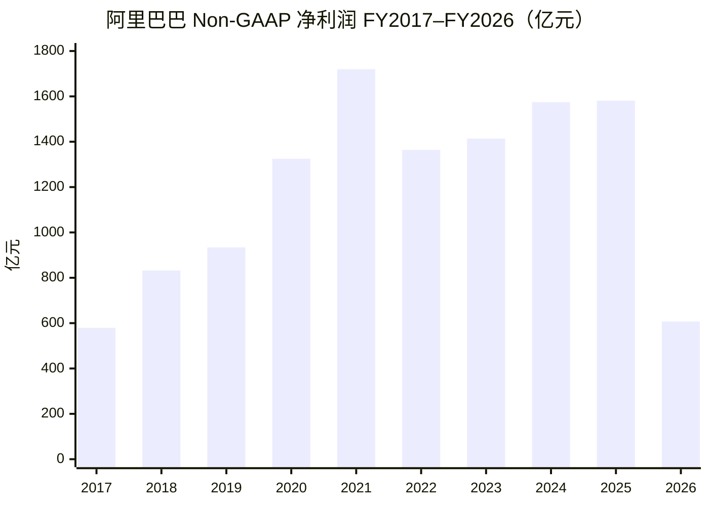


#### Adjusted EBITA（亿元）

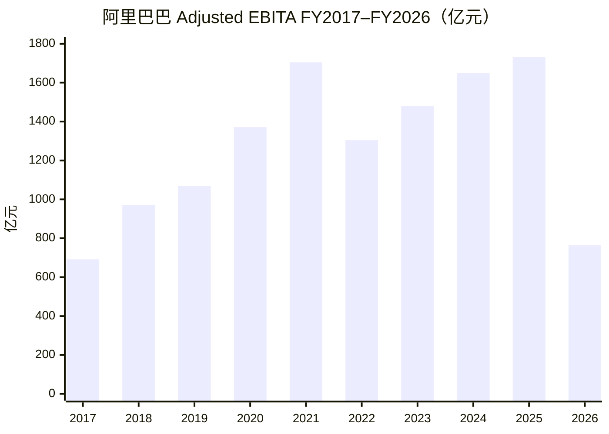


#### Adjusted EBITDA（亿元）

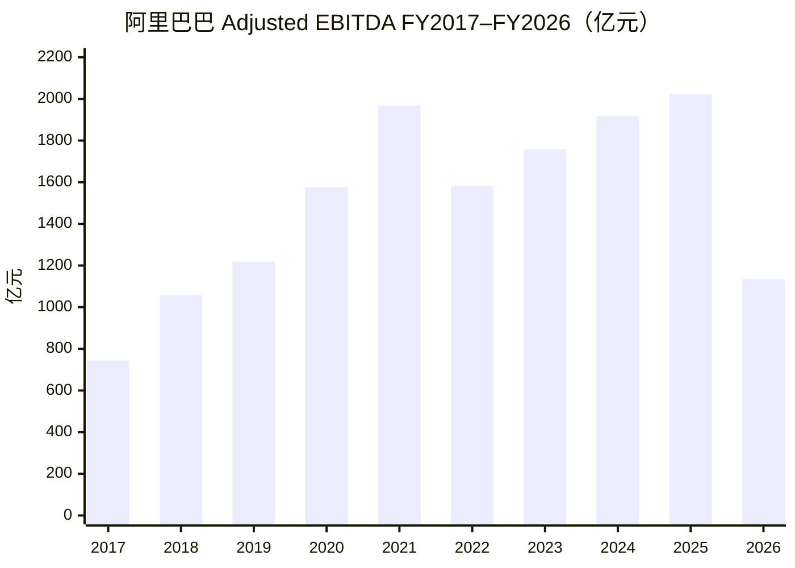


读图：三条线 FY2021 前后见顶后震荡上行，**FY2026 同步大幅下滑**（Non-GAAP 约 607 亿、EBITA 约 764 亿、EBITDA 约 1,135 亿）——主业承压被暴露；同期 GAAP 净利因投资收益仍显得「没那么差」（见第一节）。

### 3. 分部收入与 EBITA（FY2025 vs FY2026）

口径：公司分部披露；单位 **亿元**；EBITA 为 Adjusted EBITA。来源：FY2026 业绩公告 / 年报分部表。

#### 分部收入对比（亿元）

```mermaid
xychart-beta
    title "分部营业收入 FY25 vs FY26（亿元）"
    x-axis [中国电商, 国际AIDC, 云计算, 所有其他]
    y-axis "亿元" 0 --> 6000
    bar [5084, 1323, 1180, 3383]
    bar [5542, 1442, 1581, 2544]
```


> 每组左柱 FY25、右柱 FY26。中国电商与云计算收入上行；「所有其他」收缩。


#### 分部 EBITA 对比（亿元）

```mermaid
xychart-beta
    title "分部 Adjusted EBITA FY25 vs FY26（亿元）"
    x-axis [淘天集团, 即时零售, 国际AIDC, 云计算, 所有其他]
    y-axis "亿元" -1000 --> 2200
    bar [1962, -30, -151, 106, -95]
    bar [2046, -970, -21, 143, -357]
```


> 每组左柱 FY25、右柱 FY26。淘天 EBITA 仍稳；**即时零售 FY26 约 -970 亿**，拖累中国电商与合并利润率（约 17.4% → 7.5%）；云与国际在改善。


### 4. 利润表关键项（FY2025 vs FY2026）

单位：人民币百万元。摘自合并利润表（截至 3/31）。


| 项目              | FY25    | FY26      | 同比      |
| --------------- | ------- | --------- | ------- |
| 营业收入            | 996,347 | 1,023,670 | +2.7%   |
| 营业成本            | 598,285 | 616,136   | +3.0%   |
| 销售费用            | 144,021 | 245,023   | +70.1%  |
| 营业利润            | 140,905 | 50,150    | -64.4%  |
| 投资损益（利息收入及投资损益） | 20,759  | 87,512    | +321.6% |
| 净利润（含少数股东权益）    | 125,976 | 102,127   | -18.9%  |


说明：

- 营业成本、销售费用按费用绝对值列示（原表为负向支出）。
- 投资损益取「利息收入及投资损益」；另有「应占股权投资损益」FY25 **5,966** / FY26 **2,785**，未并入上表。
- 归母净利润（归属普通股东）为 FY25 **129,470** / FY26 **105,904**。


#### 关键项同比柱状图（亿元）

```mermaid
xychart-beta
    title "利润表关键项 FY25 vs FY26（亿元）"
    x-axis [营业收入, 营业成本, 销售费用, 营业利润, 投资损益, 净利润]
    y-axis "亿元" 0 --> 11000
    bar [9963, 5983, 1440, 1409, 208, 1260]
    bar [10237, 6161, 2450, 502, 875, 1021]
```


> 每组左柱 FY25、右柱 FY26。成本费用用绝对额便于同比。销售费用约 **+70%**、营业利润约 **-64%**，与即时零售投入同向；投资损益大幅抬升，支撑 GAAP 净利降幅小于经营利润。


### 5. 股东分红、回购与年度股东收益率（FY2021–FY2026）

口径：金额以公司披露 **美元** 为主（回购=当年执行；分红=对应财年**宣布**）。股东收益率 ≈（回购+宣布分红）÷ **财年末市值约值**。正式年度分红自 **FY2023** 起。

#### 分红（宣布口径）


| 对应财年   | ADS 每股      | 合计约         | 构成                |
| ------ | ----------- | ----------- | ----------------- |
| FY2023 | **US$1.00** | **US$25 亿** | 首次常规              |
| FY2024 | **US$1.66** | **US$40 亿** | 常规 1.00 + 特别 0.66 |
| FY2025 | **US$2.00** | **US$46 亿** | 常规 1.05 + 特别 0.95 |
| FY2026 | **US$1.05** | **US$25 亿** | 仅常规               |


累计宣布约 **US$136 亿**；特别分红来自资产处置，不宜当可持续派息。

#### 回购（执行口径）


| 财年     | 回购约          | 要点              |
| ------ | ------------ | --------------- |
| FY2021 | ~US$1 亿      | 可忽略             |
| FY2022 | **US$96 亿**  | 起量              |
| FY2023 | **US$109 亿** | —               |
| FY2024 | **US$125 亿** | 流通股净减约 **5.1%** |
| FY2025 | **US$119 亿** | 再净减约 **5.1%**   |
| FY2026 | **US$10 亿**  | 断崖式下降           |


FY2022–FY2026 合计约 **US$460 亿**；截至 2025-03 剩余回购额度约 **US$201 亿**（至 2027-03）。

#### 每年股东现金回报与收益率


| 财年     | 合计回报约（亿美元） | 财年末市值约 | 股东收益率约  |
| ------ | ---------- | ------ | ------- |
| FY2021 | ~1         | ~6000  | **~0%** |
| FY2022 | 96         | ~2900  | **~3%** |
| FY2023 | 134        | ~2670  | **~5%** |
| FY2024 | 165        | ~1820  | **~9%** |
| FY2025 | 165        | ~3070  | **~5%** |
| FY2026 | 35         | ~2990  | **~1%** |


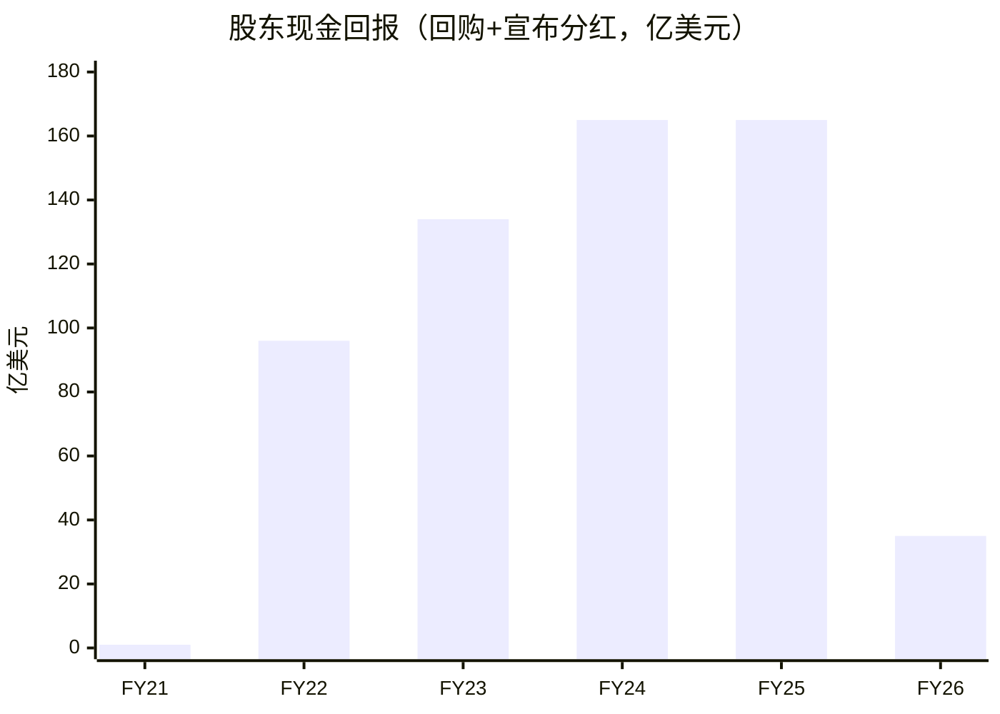


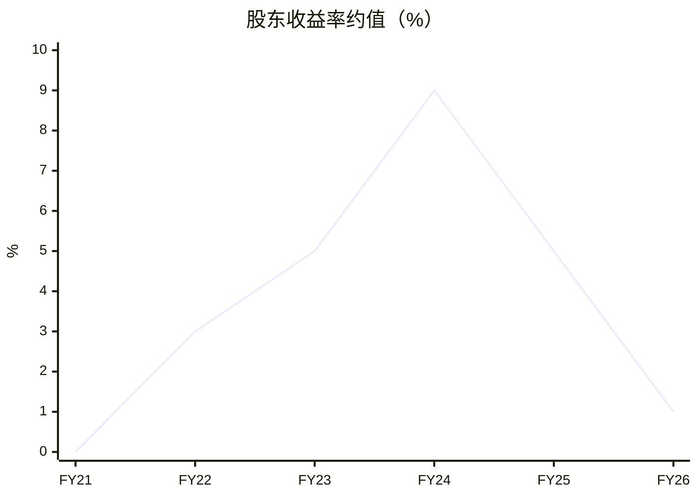


要点：FY2023–FY2025 约 **5%–9%** 偏厚；六年并非每年 ≥5%（简单平均约 **4%**）；**FY2026 回落至约 1%**，让位于云/AI 与即时零售。此为 cash return，不含股价涨跌。

## 第二部分：阿里云分析


### 1. 阿里云季度营收与增速（1Q23–1Q26）

口径：云智能集团（阿里云）分部收入；横轴为日历季度。**自 2Q26 起**云智能与平头哥整合，分部更名为 **「AI云与算力服务」**（序列仍可比）。来源：公司业绩公告。

#### 营收柱状图（亿元）

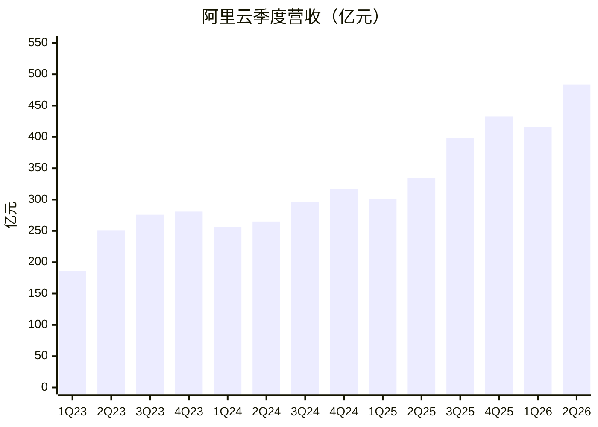


#### 同比增速（%）

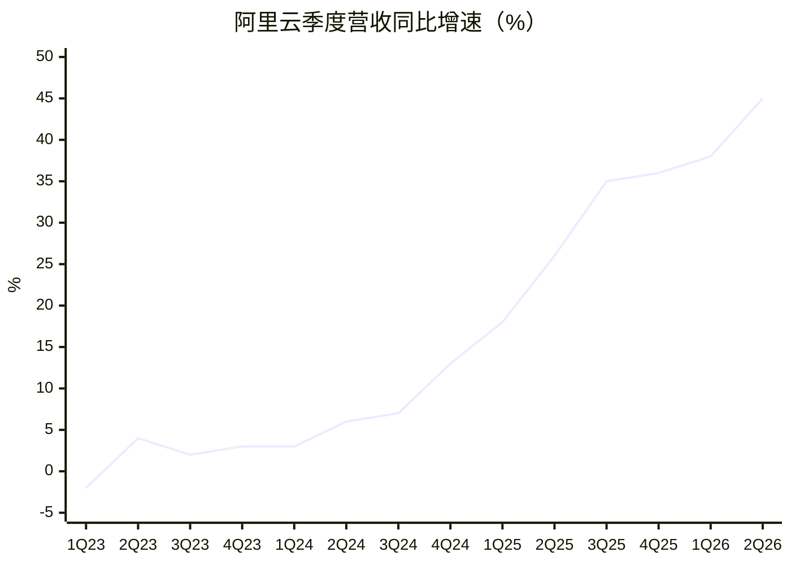


要点：2023–2024 同比多在个位数；2025 起台阶式加速。**2Q26 云分部收入约 484 亿元、同比约 +45%**；狭义 AI 相关产品见第六节。

### 2. 中国 AI 云份额与 AI 相关产品收入

第三方口径不同，会出现「两个第一」。**2026 全年完整份额尚未公开**；份额为可核对的 **2025** 数据。另附公司披露的 **AI 相关产品收入**（狭义，勿与云分部总收入混淆）。

#### 口径 A：Omdia 全链条营收（IaaS + MaaS 等）

测的是 AI 云相关**收入**谁卖得多。2025 年中国 AI 云市场约 **567 亿元**（Omdia，2026 年 5 月发布）。

全年份额大致：**阿里云 38.1%**、火山引擎 **20.4%**、百度 **9.4%**、腾讯云 **6.3%**、天翼云 **5.9%**；前五合计超八成。阿里在 AI IaaS、MaaS-MPS 亦居首。全年榜公开报道中华为云未进 Top5（上半年仍第 3）。

```mermaid
xychart-beta
    title "Omdia：中国AI云营收份额 2025（%）"
    x-axis [阿里云, 火山引擎, 百度, 腾讯云, 天翼云]
    y-axis "%" 0 --> 45
    bar [38.1, 20.4, 9.4, 6.3, 5.9]
```


#### 口径 B：IDC 公有云大模型 Token 调用量

测的是外部客户 **Token 调用量**（不含厂商自有业务）。2025 年中国公有云大模型调用量约 **1944 万亿 Tokens**（同比约 +16 倍）。

全年份额大致：**火山引擎约 49.5%**、**阿里云约 28%**、百度约 **10%**。按 MaaS **营收**口径，IDC 亦显示火山占 **40%+**。

```mermaid
xychart-beta
    title "IDC：公有云大模型Token调用量份额 2025（%）"
    x-axis [火山引擎, 阿里云, 百度]
    y-axis "%" 0 --> 55
    bar [49.5, 28, 10]
```


#### 怎么读份额

- 谁 AI 云**卖得多**（全栈收入）→ Omdia：**阿里约 38%**，火山约 20%。  
- 谁大模型 API **用得多**（Token）→ IDC：**火山约 50%**，阿里约 28%。

两套尺子不矛盾：阿里强在算力/全栈与政企；火山强在公有云 MaaS 调用生态。

#### 阿里 AI 相关产品收入（公司口径）

指标为业绩公告中的 **「AI 相关产品收入」**（AI 算力/存储、MaaS、AI 应用等），**不是**云分部总收入。公司自约 3Q23 起持续披露「三位数同比」（≥100%）；至 **2Q26** 为**连续第十二个季度**。更早季度多未公布绝对额。

已披露绝对额（来源：集团业绩公告）：

- **1Q26**（至 2026-03-31）：**89.71 亿元**，连续第 **11** 个季度三位数同比。  
- **2Q26**（至 2026-06-30）：**123.76 亿元**，连续第 **12** 个季度三位数同比。


### 3. C 端用户：豆包 / 千问 / DeepSeek / 元宝

口径：QuestMobile **AI 原生 App** 月活（独立下载安装，**不含**手机厂商预装助手）。用户可同时使用多款 App，下列「占行业月活池比例」会重叠、加总可超过 100%，仅作体量对照，不是互斥市场份额。

#### 2026 年 6 月（最新可比）

行业 AI 原生 App 整体月活约 **4.99 亿**（2026 年 5–6 月量级）。


| 产品           | 归属       | 月活 MAU     | 占行业月活池*     | 四者内部占比**    |
| ------------ | -------- | ---------- | ----------- | ----------- |
| **豆包**       | 字节       | **3.82 亿** | **约 76.6%** | **约 52.4%** |
| **千问**       | 阿里       | **1.67 亿** | **约 33.5%** | **约 22.9%** |
| **DeepSeek** | DeepSeek | **1.30 亿** | **约 26.1%** | **约 17.8%** |
| **元宝**       | 腾讯       | **0.50 亿** | **约 10.0%** | **约 6.9%**  |
| 四者合计（未去重）    | —        | 7.29 亿     | —           | 100%        |


占行业月活池 = 各产品 MAU ÷ 约 4.99 亿。  
四者内部占比 = 各产品 MAU ÷（豆包+千问+DeepSeek+元宝）；因重叠，合计 MAU > 行业去重用户。

```mermaid
xychart-beta
    title "C端AI原生App月活 2026年6月（亿）"
    x-axis [豆包, 千问, DeepSeek, 元宝]
    y-axis "亿人" 0 --> 4
    bar [3.82, 1.67, 1.30, 0.50]
```


#### 近期演变（同口径 MAU）


| 时点      | 豆包         | 千问         | DeepSeek   | 元宝         |
| ------- | ---------- | ---------- | ---------- | ---------- |
| 2025-12 | 约 2.27 亿   | 约 0.25 亿   | —          | —          |
| 2026-03 | 约 3.45 亿   | 约 1.66 亿   | 约 1.27 亿   | —          |
| 2026-06 | **3.82 亿** | **1.67 亿** | **1.30 亿** | **0.50 亿** |


要点：C 端呈 **豆包断层第一 → 千问第二 → DeepSeek 第三（约 1.3 亿）→ 元宝第四（约半亿）**；豆包约是千问的 **2.3 倍**、DeepSeek 的约 **2.9 倍**。来源：QuestMobile。

## 第三部分：大模型能力分析


### 1. 国内大模型能力排序（2026 年 8–9 月）

口径：综合 SuperCLUE 中文综合、Artificial Analysis 智能指数、Arena/Code 专项等公开榜做**合成判断**（非单一官方名次）。旗舰代际更迭快，名次会轮动；**1–2 名基本双雄，差一档都不大**。

#### 综合能力（旗舰）


| 档      | 排序      | 厂商 / 代表模型                | 一句话                       |
| ------ | ------- | ------------------------ | ------------------------- |
| **S**  | **1**   | **月之暗面 · Kimi K3**       | 国际第三方验证最完整，Agent/长程任务常最强  |
| **S**  | **2**   | **阿里 · 千问 Qwen3.8-Max**  | 中文综合最稳，Arena 国产综合常最高，生态最厚 |
| **A+** | **3**   | **智谱 · GLM-5.2/5.3**     | 编程/前端偏科顶尖，综合略逊于前二         |
| **A+** | **4**   | **DeepSeek · V4 / V4.1** | 推理与性价比仍强，综合已从「独一档」回落到第一梯队 |
| **A**  | **5**   | **字节 · 豆包 Seed 2.1**     | 国内中文榜常进前三，国际盲测参与少，公开坐标偏少  |
| **A−** | **6**   | **MiniMax · M 系列**       | Coding/多模态可用，综合一般不进前五     |
| **B+** | **7–9** | 腾讯混元 / 百度文心 / 小米 MiMo 等  | 能用、有场景，旗舰综合明显落后头五家        |


#### 专项谁更强（勿与综合混读）


| 用途            | 更优先          |
| ------------- | ------------ |
| Agent / 长工程编码 | **Kimi**     |
| 前端/代码盲测       | **智谱 GLM**   |
| 中文综合 / 少幻觉办公  | **千问**       |
| 数学推理 / 极致性价比  | **DeepSeek** |
| 科学推理等（国内榜）    | **豆包** 偶有亮点  |


补充：开源榜上常是 **Kimi / GLM / DeepSeek** 轮流领跑；千问开源家族仍是下载量与衍生模型生态第一。C 端月活另册（见上节），**与模型能力榜不是一回事**。

#### 对千问的威胁：开源大模型 vs 豆包

结论先说：**战场不同，威胁类型不同。**  
对**开发者心智 / 开源叙事 / API·Coding 份额**，开源厂（Kimi、智谱、DeepSeek 等）威胁更大；对**C 端用户与大众心智**，豆包威胁更大。落到阿里「千问 + 云」整体，**豆包（+火山）的商业挤压通常更硬，开源对手的技术叙事更锋利。**


| 维度                        | 开源大模型（Kimi / 智谱 / DeepSeek 等） | 豆包（字节 Seed + App + 火山）          | 孰大                 |
| ------------------------- | ----------------------------- | ------------------------------- | ------------------ |
| 模型能力对标                    | 常在开源/Agent/编程榜与千问互换领先         | 综合常进国内前三，但少刷国际开源榜               | 开源略大（榜面）           |
| 开源声望与开发者心智                | **直接抢「国产开源第一」叙事**，逼千问持续发版、价格战 | 旗舰偏闭源，不靠开源榜获客                   | **开源更大**           |
| API / Coding Plan / Token | 收入高度 API 化，直接分流高价值调用          | 火山 Token/MaaS 份额高，与阿里云抢企业与开发者负载 | **双方都大**（云侧豆包系常更硬） |
| C 端助手月活                   | Kimi 等千万级，远小于千问               | 豆包约 **3.8 亿**，约千问 **2.3 倍**     | **豆包更大**           |
| 分发与产品生态                   | 缺大厂级分发，变现靠 API/订阅             | 抖音系流量 + 免费体验 + 多端入口             | **豆包更大**           |
| 对阿里云 AI 云份额               | 抬高「可替代模型」预期，压 API 毛利          | 全栈竞对（算力+MaaS+应用），改份额尺子          | **豆包（火山）更大**       |
| 对阿里集团主业                   | 几乎不动电商/本地生活盘子                 | 间接争注意力与 AI 入口，仍非主业存亡级           | 均有限；豆包略更可见         |


#### 怎么读威胁

1. **开源威胁 =「技术可替代 + 叙事被改写」**
  某代 Kimi/GLM 开源跑赢 Qwen 开源款时，媒体会改写「谁最强」；开发者与 Coding 订阅更容易搬家。这是**高频、可见、逼迭代**的压力，但对阿里云政企全栈订单的替代并不自动成立。
2. **豆包威胁 =「用户入口 + 云侧份额」**
  C 端已断层领先，削弱千问作为国民助手的心智；火山在 Token/MaaS 收入口径上常压过阿里。这是**更贴近收入与份额**的压力，且字节不需要靠开源榜也能持续获客。
3. **综合判断（投研口径）**
  - 盯**千问品牌/开源第一** → 开源厂威胁 **更大**。  
  - 盯**千问 App 用户、AI 云份额、ToC 入口** → 豆包威胁 **更大**。  
  - 盯**阿里集团估值与主业** → 两者都不是存亡级；相对而言，豆包系对「阿里 AI 故事完整性」的挤压更持续。


## 第四部分：平头哥分析


口径：平头哥（T-Head）产品线；对应阿里「云 + 芯片 + 模型」全栈算力。来源：平头哥官网、国联民生等公开梳理。

### 1. 产品矩阵


| 类型       | 主要产品                    | 核心定位                            | 主要应用场景                     | 阿里全栈 AI                     |
| -------- | ----------------------- | ------------------------------- | -------------------------- | --------------------------- |
| AI 芯片    | 含光 800                  | 高能效 AI 推理芯片                     | 电商营销、电商搜索、AI 推理等           | 早期验证 AI 推理芯片降本与内部业务落地能力     |
| AI 芯片    | **真武 810E**、**真武 M890** | 高易用训推一体 AI 芯片 / 全场景训推一体 AI 加速芯片 | 大模型训推、多模态模型训推、自动驾驶模型训推等    | 支撑阿里云国产 AI 算力供给             |
| 服务器 CPU  | 倚天 710                  | 高能效服务器 CPU                      | 视频编解码、大数据分析、电子商务、AI 推理等    | 降低阿里云通用计算成本，提升云服务器能效        |
| 智能网卡     | 磐脉 920                  | 高性能智能网卡                         | 智算集群、通算集群、高性能存储、数据库与大数据分析等 | 有效缩短训练场景任务完成时间，确保关键业务免受拥塞影响 |
| SSD 主控芯片 | 镇岳 510                  | 高性能 SSD 主控芯片                    | AI 训推、分布式存储、在线交易等          | 为 AI 场景提供高容量、高性能存力          |


读表：含光偏早期推理验证；**真武**是当前训推一体主力；倚天 / 磐脉 / 镇岳补齐通用算力、网力与存力。与 2Q26 起分部「AI云与算力服务」（云智能 + 平头哥）口径一致。

### 2. 由来与关键节点（简述）

**由来**：名称取自蜜獾别称「平头哥」。技术根脉含中天微与达摩院芯片团队；2018 年 4 月阿里收购中天微，**2018-09** 云栖大会宣布整合成立平头哥，定位端云一体造芯（非单纯卖卡）。

**关键节点（列举）**

- **2019-09**：**含光 800**（云端 AI 推理）— 首款自研 AI 芯片，内部电商搜索/营销等验证  
- **2021-10**：**倚天 710**（5nm Arm 服务器 CPU）— 上云降通用计算成本  
- **2026-01 前后**：**真武 810E**（训推一体）公开商用 — AI 加速从「推理专用」升级到训推一体  
- **2026-05**：**真武 M890**（云峰会）— 官方称整体性能约为 810E 约 **3 倍**，随云大规模外售

路径概括：含光验推理 → 倚天打通服务器 CPU → 真武冲训推算力 → 再与阿里云、千问做系统级协同。

### 3. 真武 ≈ 英伟达的哪一档？

不要简单说「等于某张卡」，宜分型号、分「硬件规格 / 软件生态 / 销售形态」三层看：


| 型号          | 较贴近的英伟达参照                                                             | 依据与边界                                                                                                                                           |
| ----------- | --------------------------------------------------------------------- | ----------------------------------------------------------------------------------------------------------------------------------------------- |
| **真武 810E** | 更接近面向中国市场的 **H20** 档（Hopper 裁切款），整体叙事「超 A800、对齐 H20」                  | 公开：最高约 **96GB HBM2e**、片间互联约 **700GB/s**（自研 ICN）；报道称功耗约 400W 量级。与 H20 同为训推一体、大显存路线；**非 H100 满血对等**（H100 峰值算力与 NVLink 生态显著更强）。制程/官方 FLOPS 多未完整披露。 |
| **真武 M890** | 仍落在 **Hopper 世代（H20/H100 叙事区间）**；显存容量接近 **H200** 量级，但不宜直接等同 H200/H100 | 约 **144GB HBM**、互联约 **800GB/s**；厂商标称相对 810E 约 **3×**。部分自媒体写「H200 的 80%–100%」**缺乏权威第三方验证**，投研宜保守。                                                |
| 形态类比        | 更像 **谷歌 TPU**：云内自研加速器 + 模型/云共优化，主要随 **阿里云算力** 交付                      | 不是英伟达那种全球零售 CUDA GPU 生态；差距最大往往在 **软件栈（CUDA vs 自研 SAIL 等）与开发者习惯**，而非单看显存数字。                                                                      |


**一句话**：真武是国产「云端训推一体加速卡」；**810E ≈ H20 档参照**，**M890 ≈ 同代上探、规格向 Hopper 高端靠**，整体仍远未到公开对标最新 Blackwell 旗舰的程度。

### 4. 出货量级、竞品对比与市场地位

口径：下列「AI 加速卡」以 **IDC《2025 中国云端 AI 加速器》** 等媒体转述为主；累计出货以阿里管理层/峰会披露为主。倚天 CPU、玄铁 IP 勿与 AI 卡混加。

**2025 年中国云端 AI 加速卡（年交付）**


| 主体            | 约出货                    | 地位（粗）                                 |
| ------------- | ---------------------- | ------------------------------------- |
| 市场合计          | 约 **400 万** 张          | —                                     |
| 英伟达等境外        | 约 **220 万**（约 **55%**） | 仍最大，但份额较此前约七成回落                       |
| 国产合计          | 约 **165 万**（约 **41%**） | 替代加速                                  |
| **华为昇腾**      | 约 **81.2 万**           | **国产第 1**（约占国产一半）                     |
| **平头哥**       | 约 **26.5 万**           | **国产第 2**（约占总市场 **6.6%**、国产约 **16%**） |
| 昆仑芯 / **寒武纪** | 各约 **11.6 万**          | 并列国产第 3 左右                            |


**累计（真武等 AI 加速，公司口径）**


| 时点             | 披露                            | 来源口径           |
| -------------- | ----------------------------- | -------------- |
| 截至 2026-02     | 累计规模化交付约 **47 万** 片；年化营收破百亿量级 | 阿里业绩电话会（吴泳铭）   |
| 截至 2026-04     | 真武系列累计出货约 **56 万** 片；客户约 400+ | 阿里云峰会 / 平头哥管理层 |
| 2026-06 季度公告语境 | 真武（含 M890）外溢至 **650+** 外部客户   | 公司 2Q26 业绩公告   |


**怎么定位**

- **相对华为**：出货约为昇腾的约 **1/3**；华为更像独立算力品牌，平头哥更贴 **阿里云供给**。  
- **相对寒武纪**：2025 年加速卡年出货已明显高于寒武纪；商业模式不同（云厂芯片臂 vs 独立芯片公司）。  
- **相对英伟达**：国内份额仍差一个数量级以上；优势在管制环境下的可供货 + 云模一体降本，短板在 CUDA 生态。  
- **综合**：国产 AI 加速卡 **明确第二**；战略价值在保障阿里云 AI 供给与自主可控叙事。


### 5. 服务哪些领域、哪些客户？

**交付形态**：以 **阿里云智算/实例** 为主；管理层称平头哥芯片中 **六成以上** 服务外部商业化客户。

**领域（公开表述）**


| 领域             | 要点                                                                             |
| -------------- | ------------------------------------------------------------------------------ |
| 互联网 / 内容       | 大模型训推、搜推与内容理解等；公开案例含微博等                                                        |
| 金融服务           | 部署规模报道称突破 **10 万卡** 量级，覆盖银行/证券/保险/基金等 **150+** 机构；场景含财富管理、信贷风控、投研投顾、进件识别、合规监控等 |
| 自动驾驶 / 出行      | 智驾模型训推；报道称智驾相关部署超 **10 万卡** 量级、数十家客户；公开点名含 **小鹏** 等                            |
| 电信 / 智算中心      | **中国联通**「三江源」等绿电智算、**中国电信**等；真武万卡级集群                                           |
| 制造 / 车企 / 能源科研 | 公开提及 **中国一汽**、**国家电网**、**中科院** 等                                               |
| 阿里内部           | 早期含光服务电商营销/搜索；真武支撑通义/千问及云上 AI 产品                                               |


**客户规模**：2026 年 4 月约 **400+** 家 → 2026 年 6 月季度披露 **650+** 家外部客户，覆盖 **20+** 行业。客户感知上多数是「买阿里云 AI/算力」，而非单独「买一张平头哥卡」。

## 第五部分：即时零售分析（淘宝闪购 / 饿了么）


口径：公司分部「即时零售」含淘宝闪购、饿了么履约及相关近场零售（盒马等协同逐步并入大消费叙事）；财务以公司披露为准，订单/DAU 等运营指标多来自业绩电话会与公开报道。单位未特别注明时为人民币。

### 1. 为什么一定要做？对电商大盘有多重要？

**远场大盘正在被分流**：不只是「增长放缓」，而是 **零售额份额被持续切走**（Euromonitor，中国银河证券研究所读图约值）。

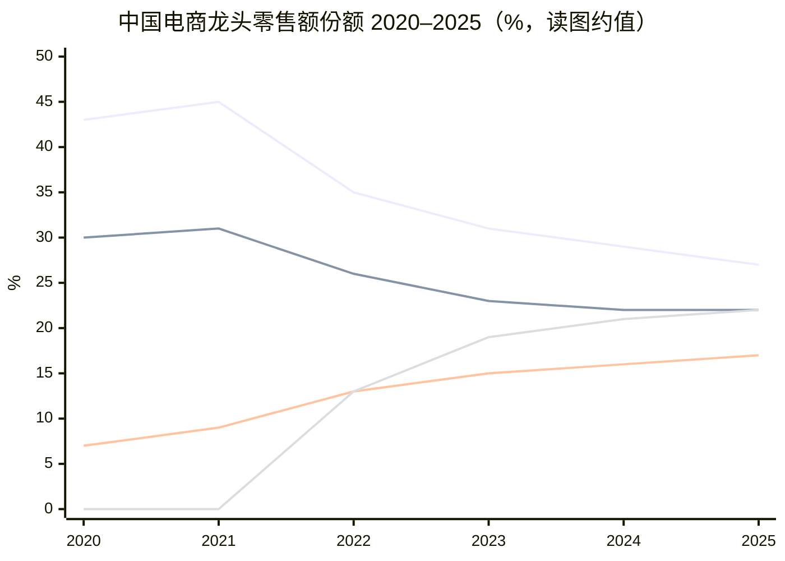


> 线序：阿里 / 京东 / 拼多多 / 字节（2020–21 字节未单列，图中记 0 仅占位）。来源：Euromonitor，中国银河证券研究所。

要点：阿里份额自 2021 高点约 **45%** 滑至 2025 约 **27%**（约 **-18pct**）；拼多多约 7%→17%，字节约 13%→22%（已追上京东）。远场「货架电商」心智被低价与内容电商两头夹击——**只守淘宝天猫快递达，份额还会继续失血**。

**因此必须做即时零售**：用闪购/外卖这类 **更高频打开 App 的场景**，把用户拉回淘宝体系，再外溢到远场成交与广告，以 **即时流量对冲远场份额流失**。同时，消费者对「**30 分钟达**」的预期正在变成常态（蔡崇信、吴泳铭 2026 年 5 月股东信）；京东把即时能力塞进主站也验证了「高频履约反哺电商 App」。若再缺席，本地生活被美团切、主站入口被拼多多/字节切，双线失守。

**对电商大盘的战略意义**：闪购拉高打开频次（公开称手淘 **DAU +20%**，2025-08）。长期叙事：有望贡献中国电商平台交易额约 **30%**（蒋凡 2026-08）。一句话——用高频履约重做淘宝的用户操作系统，短期利润让位于份额与入口。

### 2. 怎么做的？收获与代价


#### 过程（时间线）

1. **主站入口**：2025-04/05，「小时达」升级为 **淘宝闪购**，登上淘宝首页一级入口，与饿了么运力/供给打通。
2. **组织并表**：2025-06，饿了么、飞猪并入中国电商事业群，向蒋凡汇报，集中目标统一作战。
3. **结局（份额与资源）**：公开称消费侧约 **500 亿元** 量级投入；补贴 + 运力扩张下日订单峰值约 **1.2 亿**、周日均约 **8000 万**，日活骑手约 **200 万**、月买家约 **3 亿**。阿里系外卖/即时订单份额由约 **30%** 抬至约 **42%–43%**，逼近与美团双寡头；2025-12 饿了么 App 焕新为淘宝闪购，品牌并入大消费平台。


#### 收获（阶段性）

**补贴大战前后份额**（餐饮/外卖订单口径，第三方；非公司官方审计）

```mermaid
xychart-beta
    title "大战前 vs 大战后订单份额（%，约值）"
    x-axis [美团, 阿里, 京东]
    y-axis "%" 0 --> 80
    bar [69, 30, 0]
    bar [47, 43, 10]
```


> 每组左柱大战前（约至 2025 初）、右柱大战高峰后（2025Q3，红餐产业研究院·日订单）。美团约七成 → 约五成；阿里约三成 → 约四成+；京东从近零起量到约一成。大战由京东 2025-02 点燃，淘宝闪购 2025-05 起全面加码；口径（订单 vs GMV）不同会差几个点，趋势一致。


#### 代价（账面与机会成本）

FY26 即时零售 Adjusted EBITA 约 **-970 亿**（FY25 约 -30 亿）；几乎单季即可吞噬中国电商大部分利润弹性。合并 EBITA 利润率 FY25 **17.4%** → FY26 **7.5%**，主因即此。

**双方单均 UE 水平**（跟踪口径，元/单；非两家公司官方披露）


| 时点               | 美团                  | 淘宝闪购（阿里系）       | 差距（闪购更亏）      |
| ---------------- | ------------------- | --------------- | ------------- |
| 补贴高峰附近（约 2025Q3） | 约 **-2.5**          | 约 **-5.5～-6**   | 约 **3+**      |
| 2025Q4 前后        | 约 **-1.6～-2**       | 约 **-4**        | 约 **2**       |
| 2026Q1           | 约 **-1.0**          | 约 **-2.8**      | 约 **1.8**     |
| 2026Q2（补贴规范后）    | 约 **+0.1～+0.2**（转正） | 约 **-1.5～-1.6** | 约 **1.7～1.8** |


**为何美团效率更高**：十年本地生活沉淀带来的 **高客单用户盘 + 骑手密度/调度 + 更低的「买份额」补贴强度**；闪购用淘宝流量换来了份额，但订单更「便宜」、履约网更新、补贴更重，故同样一单美团少亏（或已微利）约 **1.5–2 元**。履约差距在缩小，**结构和补贴效率**才是中期仍难追上的部分。

### 3. 未来战略往哪走？

管理层公开指引可概括为「**守份额 → 改 UE → 非餐扛增长 → 远期占大盘三成**」：


| 时间锚              | 目标（公司/电话会口径）                        |
| ---------------- | ----------------------------------- |
| FY27（约至 2027-03） | 有信心实现**月度 UE（单位经济）转正**              |
| FY28             | 即时零售整体**交易规模过万亿**；在此规模上追求规模化正向现金流   |
| FY29             | 即时零售板块**整体盈利**                      |
| 更长期              | 即时零售有望贡献中国电商平台交易额约 **30%**，成为第二增长曲线 |


**战略抓手（2026 中后段定调）**

1. **外卖守基本盘，非餐做增量**：餐饮零售仍要份额，但下一财年目标是**非餐交易额超过餐饮**；食品百货、酒水、3C、生鲜等沉淀粘性与笔单价。
2. **整合盒马、天猫超市，猛攻前置仓**：从「流量补贴换单」转向「仓网密度 + 供应链」；淘宝便利店等连锁化近场业态对标对手便利/前置仓网络。
3. **远近场一体**：猫超与品牌从纯 B2C 远场升级为「价格竞争力 + 小时达」；百万品牌门店入驻叙事服务三年约 **1 万亿** 交易增量预期（蒋凡 2025-08 口径）。
4. **与 AI 双线并行**：即时零售抢消费入口与频次，AI+云抢效率与利润率；短期都烧钱，中期用规模与效率对冲补贴。
5. **投入纪律**：宣称会按市场情况控制节奏，但在万亿交易与份额目标达成前，**未来约两年仍处坚定投入期**。


### 投研小结


| 问题       | 结论                                                            |
| -------- | ------------------------------------------------------------- |
| 为何必做     | 远场电商增长见顶 + 「30 分钟达」成用户默认；不做则丢入口与频次                            |
| 对大盘重要性   | 拉 DAU/年活、外溢 CMR、打开近场品类，长期或占平台 GMV 约三成                         |
| 过程       | 收购饿了么 → 长期本地生活拉锯 → 2025 闪购上主站并组织合并 → 补贴换份额 → 品牌统一 → UE/非餐/前置仓 |
| 收获 vs 代价 | 份额与主站协同显著；FY26 即时零售 EBITA 约 **-970 亿** 是主要代价                  |
| 未来       | FY28 万亿交易、FY29 板块盈利；非餐超餐饮、前置仓与猫超/盒马整合是胜负手                     |


风险点：补贴退坡后留存是否稳；非餐履约密度能否追上对手；与 AI 资本开支争抢集团现金流时，资本市场容忍度是否够到 FY29。

## 第六部分：企业文化分析


口径：企业文化本身不直接进三表，但决定**投入优先级、亏损容忍度、组织协同方式**。读法是把公开使命/价值观，对照近年战略动作，看文化是「口号」还是「约束函数」。

### 1. 使命、愿景（不变的锚）


| 层级         | 官方表述             | 投研含义                    |
| ---------- | ---------------- | ----------------------- |
| **使命**     | 让天下没有难做的生意       | 帮商家/客户做成生意的平台公司         |
| **愿景**     | 活 **102 年** 的好公司 | 容忍短期利润波动，为即时零售与 AI 投入辩护 |
| **优先级口头禅** | 客户第一，员工第二，股东第三   | 利益冲突时的排序                |


**客户第一、员工第二、股东第三**：本质是利益冲突时的排序，不是三句口号。

- **客户第一**：客户/用户体验优先于当期利润。落地：闪购可亏约 **-970 亿** EBITA 仍做、不单独考核外卖盈亏、让利优先于短期 CMR——「可以亏着抢入口」。
- **员工第二**：排在股东之前，历史上支撑聚人与战役动员；但不是永久护城河——通义骨干出走说明战役高压、组织拆合仍可能压过体感。
- **股东第三**：冲突时股东让位 ≠ 零回报。FY2023–FY2025 回购+分红约 **5%–9%** 股东收益率；**FY2026 约 1%**，现金让给云/AI 与即时零售（见第一部分第 5 节）。回购/分红与投入并行，叙事上投入优先。

一句话：允许用利润换用户、入口与算力的长期主义操作系统；对估值既解释双线投入 persistence，也带来「故事兑不现则文化变烧钱借口」的风险。

### 2. 侠客文化（花名、空间与六脉神剑）

阿里早期有鲜明的**金庸武侠 / 侠客**组织符号，不只是趣味命名，而是平等感与「侠义、担当」动员语言的一部分。马云公开称：十八罗汉里十六七个爱金庸，看重想象力、浪漫主义与侠义精神。

- **花名**：入职取花名，早期多出自武侠正面角色（后放宽到玄幻等）；内部邮件、会议直呼花名，弱化层级。例：马云「风清扬」、张勇「逍遥子」、邵晓锋「郭靖」；现任高管中亦有如吴泽明「范禹」。
- **空间命名**：西溪园区办公室/会议室多用武侠地名——桃花岛、光明顶、摩天崖、聚贤庄、罗汉堂等；洗手间、取快递点亦有「听雨轩」「镖局」一类叫法。
- **平头哥**：不服就干

投研读法：侠客叙事是文化外壳与动员语言；硬约束仍看「客户第一」的投入排序、合伙人制度与财报落地，侠客符号本身不直接解释三表。

### 3. 对照：段永平「用户第一」与平台「客户第一」

段永平（步步高系）常讲**本分**与**用户第一**：更盯产品最终使用者，不为冲量做伤害用户信任的事；用户第一通常被理解成通往长期价值的路径，而非与股东对立。

与阿里式平台「客户第一」对照：**用户第一**更注重产品最终用户；**客户第一**注重平台上所有参与方，商家和买家都要照顾。买家体验与商家利益冲突时，平台若更偏买家侧规则，就可能伤商家——例如拼多多「仅退款」抬高了买家保障，也加重商家被滥用与成本压力。阿里的客户第一，则是在多方之间做排序与取舍（并可为此承受短期利润压力）。

延伸观点：正因为阿里更强调**客户第一**（平台多方）而非**用户第一**（最终使用者的产品体验），组织上相对更缺「把单款产品打磨到极致」的产品意识；对照腾讯长期以 C 端产品（社交、内容等）为中枢，阿里侧不少产品体验常被认为逊于腾讯——平台撮合与商家经营能力强，不等于 C 端产品力强。

### 4. 造钟人与报时人：马云 vs 段永平

口径：借用柯林斯「造钟人 / 报时人」隐喻——**造钟人**让组织不依赖某一个天才亲自知道「现在几点」；**报时人**则以个人愿景、产品判断或资本感觉直接报时。此处不按「马云=魅力报时人」的流行说法，而按**经营实质**对照：马云偏组织造钟；段永平兼造钟与报时，结构上更近乔布斯。

马云不太懂技术、也不深耕具体品类打法，强项是管理与动员——用使命/价值观、合伙人与侠客组织符号，把各类精英压进同一台协作机器；自己主要在**使命层**报时，**产品/技术层基本不报时**。段永平既能定制度/文化/价值观（「本分」「用户第一」），也对具体产品有强认知，产品对不对、值不值得做、投资买什么都能亲自把关。


| 创始人 | 含义                              | 企业       |
| --- | ------------------------------- | -------- |
| 马云  | **使命报时 + 组织造钟**——钟是「如何组织精英把事做成」 | **阿里**   |
| 段永平 | 像乔布斯——**造钟兼报时**；原则是钟，产品与资本判断是报时 | **步步高系** |


投研读法：阿里波动与战役能力，更吃「谁在业务上报时 + 组织钟是否还能装下精英」；段永平系更吃「原则会不会被稀释、产品报时准不准」。前者故事与组织弹性大；后者钝、但更像可传承的经营系统。亦与上一小节衔接：平台「客户第一」利于造组织钟，却相对削弱「用户第一」式的单品报时——故阿里组织动员强、C 端产品极致感常弱于腾讯/步步高系叙事。

### 5. 扩张 vs 打磨：阿里 / 拼多多 / 腾讯

口径：接第 3、4 节。组织造钟解决「能否把人聚齐开战」；产品报时解决「单点体验能否打到极致」。三家在**扩张半径**与**单品打磨**上不是同一类公司。


| 公司      | 扩张性                                   | 产品打磨                                 | 能力能否复制到多产品                             | 一句话                |
| ------- | ------------------------------------- | ------------------------------------ | -------------------------------------- | ------------------ |
| **阿里**  | **强**：电商之外持续铺云、本地生活、文娱、国际、即时零售、AI     | **有限**：战役与撮合强，C 端单品常「能上线、难极致」        | 弱——新战场常靠组织与补贴起量，体验与留存跟不上腾讯级单品          | 会开很多战线，真正打磨成功的产品偏少 |
| **拼多多** | **弱/克制**：主业仍是价值电商（国内 + Temu 是同一套肌肉外溢） | **极强（在赛道内）**：价格、供给、广告与履约围绕「便宜好买」抠到极致 | 不追求多产品帝国，专注把电商这一件事做深                   | 少扩张、深专注，电商领域能做到极致  |
| **腾讯**  | **强**：社交、游戏、支付、视频、音乐、云、投资孵化           | **强**：核心 C 端产品体验可做到行业标杆              | **强**——同一套「用户产品 + 流量分发」能力能铺到多条产品线且条条能成 | 既扩张，又能把多个产品做到极致成功  |


### 6. 近一两年 AI / 大模型人才出走

口径：下列为 **2024 年中–2026 年中** 公开报道较集中的通义 / 千问侧出走（偏负责人与核心贡献者）；去向以媒体交叉报道为准，部分尚未官方确认。贾扬清等更早离职、以及 **周靖人「辞职」已被集团辟谣** 的不列入「出走表」，但后者角色从通义业务实权转向首席科学家/研究院，本身也是组织信号。

#### 主表（大模型相关）


| 时间（约）             | 人物                  | 原岗位 / 标签                                             | 公开去向（媒体口径）                                       | 备注                                             |
| ----------------- | ------------------- | ---------------------------------------------------- | ------------------------------------------------ | ---------------------------------------------- |
| **2024-07**（约秋落地） | **周畅**（花名钟煌）        | 通义千问大模型技术负责人之一；M6/OFA 骨干                             | **字节 Seed**（视觉/多模态生成方向负责人）；据报道带十余名原团队成员          | 先称「创业」后曝入职字节；有竞业仲裁相关报道；字节侧称高薪挖角                |
| **2025 前后**       | **黄非**              | 通义实验室 NLP / 应用算法方向负责人（AliceMind、灵码等）                 | 离职（去向公开较少）                                       | 资深 NLP；团队改向周靖人直接汇报                             |
| **2025-02**       | **鄢志杰**             | 通义语音团队负责人；听悟技术负责人；达摩院「扫地僧」之一（P10）                    | 先 **腾讯 AI Lab** 副主任 → 架构调整后再转 **京东**             | 语音/听悟链路；短时间内两跳                                 |
| **2025-04**       | **薄列峰**             | 通义应用视觉团队负责人（图像/多模态，P10）                              | **腾讯混元** 多模态相关（向蒋杰汇报）                            | 2022 自京东入职阿里 XR / 通义视觉                         |
| **2026-01**       | **惠彬原**             | Qwen Code / Coder 负责人                                | 曾报道赴 **Meta**；2026 年中又传改投**国内某大厂** AI Coding 负责人 | 去向口径有迭代，宜标注「未官方确认」                             |
| **2026-03**       | **林俊旸**             | 通义千问系列技术负责人（最年轻 P10 之一）；Qwen 开源叙事核心                  | 卸任后创业（媒体称 **Pragmatik / p7k Labs**，智能体方向）        | 组织拆分为预训练/后训练等水平团队、管理权收缩后离职；吴泳铭内邮批准辞职           |
| **2026-03**       | **郁博文**             | Qwen **后训练**负责人                                      | **字节 Seed**（视觉模型与多模态交互后训练）                       | 与林俊旸同日波次；接任方为前 DeepMind 的周浩                    |
| **2026-03**       | **李凯新**（Kaixin Li）等 | Qwen3.5 / VL / Coder 核心贡献者                           | 随千问人事波次公开表态离职                                    | 属骨干层，非单一岗位负责人                                  |
| **2026-08**（约）    | **林伟**              | 阿里云计算平台首席架构师、PAI 负责人（P10）；后转 ATH 负责通义千问 **AI Infra** | **离职创业**（赛道未披露）                                  | 在阿里约 11 年；此前微软约 10 年；内网告别帖；三轮 AI 组织调整后出走；官方未确认 |


#### 怎么读（投研）

1. **流失结构**：不是零星个例，而是 **「千问底座负责人 → 后训练 → Code → 语音/视觉 → AI Infra」多条线** 在约 18–24 个月内被抽空一茬；字节（Seed）与腾讯（混元）是主要接收方，林伟等则偏创业。
2. **与文化/组织的接口**：官方仍讲「认真生活，快乐工作」「唯一不变的是变化」，但实测是 **战役高压 + 组织反复水平拆分/空降汇报线**；林俊旸波次的直接导火索是权责收缩，不是「不爱开源」。这与第 8 节投研小结、第 5 节「扩张 vs 打磨」同向。
3. **对能力榜的含义**：「千问综合仍强」与「灵魂人物出走」可并存——模型权重与开源生态有惯性，但 **下一世代预训练/后训练/Coding Agent 的迭代速度与士气** 更依赖现团队；需盯 Qwen 发版节奏、开源下载/衍生模型、以及云侧 AI 收入是否跟得上（第二部分云智能）。
4. **对估值的含义**：人才出走本身不自动改财报，但提高两条风险溢价——① 对标字节/腾讯时 **组织与分发短板被放大**；② 「AI 驱动」叙事若兑现慢，市场会把投入解读为 **烧钱换故事**，文化上的「股东第三」更难卖。
5. **对冲信号**：集团加大外部挖人（如周浩等）、吴泳铭直管 Token Foundry / 基础模型支持小组，是在用组织与资源补洞；能否留住下一批评测与工程型骨干，比辟谣单一高管去留更重要。


## 第七部分：历史收购与投资分析


口径分两类：

1. **收购 / 控股**：取得控制权或私有化（含与蚂蚁联合全资）。
2. **战略投资**：少数股权、战投加仓、基石认购等——**不强求控股**，看生态协同与资本回报。

成败仍用三问：战略意图、经营/份额、资本回报（含减值、出售、浮盈）。评级：**成功 / 部分成功 / 偏失败 / 进行中**。金额与持股多为公开报道或年报约数；阿里全市场投资极多，下表抓**标志性、金额大或与当前 AI/电商叙事相关**的标的，无法穷尽。

### 1. 收购 / 控股主表


| 时间（约）       | 标的               | 代价（约）                 | 战略意图        | 后来怎样                                    | 成败             |
| ----------- | ---------------- | --------------------- | ----------- | --------------------------------------- | -------------- |
| **2013**    | **友盟**           | 约 **0.8 亿美元**         | 移动数据；带入蒋凡团队 | 并入体系；蒋凡成电商操盘手                           | **成功**         |
| **2014**    | **UC 优视**        | 约 **40+ 亿美元** 级       | 移动流量入口      | 长期占分发一席，未成「第二手淘」                        | **部分成功**       |
| **2014**    | **高德** 私有化       | 累计约 **10–15 亿美元**     | 地图/出行基础设施   | 国内地图头部，服务本地生活与履约                        | **成功**         |
| **2015–16** | **优酷土豆**         | 约 **45–48 亿美元**       | 文娱时长        | 份额落后、亏损减值，大文娱拖累叙事                       | **偏失败**        |
| **2016**    | **Lazada**       | 首轮约 **10 亿美元**，后增持控股  | 东南亚电商       | 与 Shopee 苦战，仍是国际电商支柱                    | **进行中 / 部分成功** |
| **2016**    | **豌豆荚**          | 约 **2 亿美元**           | 安卓分发        | 势能衰减、沉寂                                 | **偏失败**        |
| **2016–18** | **饿了么**          | 联合蚂蚁约 **95 亿美元** 全资   | 本地生活/外卖     | 长期落后美团；2025 起并入淘宝闪购再赌（见第五部分）            | **部分成功**       |
| **2017**    | **银泰**           | 累计百亿级人民币              | 新零售百货       | **2024-12** 约 74 亿出售，预计亏损约 **93 亿**     | **偏失败**        |
| **2017–**   | **高鑫零售**         | 增持合计数百亿港元量级           | 商超新零售       | **2025-01** 最高约 **131 亿港元** 售约 78.7% 股权 | **偏失败**        |
| **2017–**   | **菜鸟** 增持控股      | 多轮增资                  | 物流网络        | 履约基建必要；分拆上市反复                           | **部分成功**       |
| **2018**    | **Trendyol**     | 约 **7.3 亿美元** 控股约 85% | 土耳其/新兴市场电商  | 国际电商拼图；部分本地生活资产后有处置                     | **部分成功 / 进行中** |
| **2019**    | **网易考拉**         | **20 亿美元**            | 跨境进口份额      | 并入天猫国际叙事，独立品牌沉寂                         | **部分成功**       |
| **2017–21** | **Daraz** 等      | 区域电商收购                | 南亚等         | 国际拼图，回报周期长                              | **进行中**        |
| 早期/并行       | **虾米、天天动听、酷盘** 等 | 相对较小                  | 音乐/网盘       | 多停服或沉寂                                  | **偏失败**        |


### 2. 战略投资主表（少数股权 / 战投）


#### 2.1 社交、内容与广告触达


| 时间（约）       | 标的         | 投入 / 持股（约）                          | 意图             | 后来怎样                          | 成败                            |
| ----------- | ---------- | ----------------------------------- | -------------- | ----------------------------- | ----------------------------- |
| **2013–16** | **微博**     | 首轮 **5.86 亿美元** 约 18%，后增至约 **30%+** | 社交电商、广告投放      | 长期第二大股东级存在；广告协同有，电商闭环未达早期想象   | **部分成功**（财务与投放渠道价值 > 社会化电商革命） |
| **2018**    | **分众传媒**   | 阿里系约 **150 亿元** 级，持股约 **8–10%+**    | 线下电梯广告 + 新零售触达 | 曾为第二大股东档；广告协同有阶段性价值           | **部分成功**                      |
| **2018**    | **B 站**    | 增资扩股（金额未完整公开）                       | 年轻用户/二次元流量     | A/T 同台股东；内容电商协同有限             | **部分成功 / 偏财务**                |
| **2016–**   | **小红书**    | 参与多轮（含过亿美元级轮次）                      | 生活方式社区导购       | 仍独立；与腾讯等共投；电商协同不如预期强          | **进行中**                       |
| **2015–**   | **华人文化** 等 | 持股约 **20%+** 档（公开口径有变动）             | 文娱资本版图         | 媒体/文娱投资收缩期部分退出他标的（如芒果超媒曾持后转出） | **部分成功→收缩**                   |
| 并行          | **陌陌** 等   | 财务/战略参股                             | 社交流量           | 非主航道                          | **偏财务**                       |


#### 2.2 物流与快递（绑菜鸟）


| 时间（约）     | 标的       | 投入 / 持股（约）                    | 意图         | 后来怎样               | 成败                   |
| --------- | -------- | ----------------------------- | ---------- | ------------------ | -------------------- |
| **2015–** | **圆通速递** | 联合云锋等，持股一度约 **10–17%** 档      | 通达系绑定、服务升级 | 仍为重要快递股东；支撑双 11 运力 | **部分成功**（生态必要，非暴利财务） |
| **2018**  | **中通快递** | 阿里+菜鸟约 **13.8 亿美元**，约 **10%** | 快递龙头协同     | 上市快递龙头持股，物流话语权     | **部分成功**             |
| **较早–**   | **百世** 等 | 持股一度近 **28%** 档               | 仓配/供应链     | 后有资本重组与业务调整        | **部分成功 / 复杂**        |


#### 2.3 出行与本地运力


| 时间（约）       | 标的      | 投入 / 持股（约）                  | 意图           | 后来怎样                | 成败                   |
| ----------- | ------- | --------------------------- | ------------ | ------------------- | -------------------- |
| **2016–**   | **滴滴**  | 多轮，持股曾约 **5–10%**           | 出行入口、支付/地图协同 | 监管与竞争后叙事降温；持股被稀释/调整 | **偏失败→持有观望**（战略溢价消退） |
| **2017–18** | **ofo** | 约 **3.4 亿美元** 等，持股约 **12%** | 共享单车         | 爆雷退场，资本基本归零叙事       | **偏失败**              |
| **2021–**   | **哈啰**  | 与蚂蚁等同轮（如约 **2.8 亿美元** 轮）    | 两轮出行/换电      | 相对 ofo 存活更好，协同中     | **进行中 / 部分成功**       |


#### 2.4 新零售与实体（少数股权，非全资收购）


| 时间（约）     | 标的         | 投入 / 持股（约）                  | 意图          | 后来怎样         | 成败           |
| --------- | ---------- | --------------------------- | ----------- | ------------ | ------------ |
| **2015**  | **苏宁易购**   | 约 **283 亿元**，约 **20%**      | 家电 3C 新零售联盟 | 协同不及预期；市值波动大 | **部分成功→偏冷**  |
| **2016**  | **三江购物** 等 | 约 **21.5 亿元** 入股约 **32%** 等 | 区域商超        | 新零售退潮后存在感弱   | **偏失败 / 沉寂** |
| **2018–** | **居然之家** 等 | 家装家居入股                      | 家装新零售       | 非核心，后聚焦期边缘化  | **偏冷**       |
| **2018**  | **万达电影** 等 | 约 **46.8 亿元**，约 **7–8%**    | 文娱线下        | 非主航道         | **偏财务**      |


> 银泰、高鑫见上节「收购/控股」——已折价退出，是新零售资本账最清晰的失败样本。


#### 2.5 金融、运营商与资本市场


| 时间（约）    | 标的                  | 投入 / 持股（约）            | 意图        | 后来怎样              | 成败                    |
| -------- | ------------------- | --------------------- | --------- | ----------------- | --------------------- |
| **2017** | **中国联通**            | 约 **43 亿元**，约 **2%**  | 混改、云与通信协同 | 持股市值随联通波动；战略象征意义大 | **部分成功**              |
| **2018** | **华泰证券**            | 约 **35 亿元**，约 **3%+** | 金融牌照/财富生态 | 财务投资色彩浓           | **偏财务**               |
| （蚂蚁侧）    | **Paytm / One97** 等 | 累计近 **10 亿美元** 量级、高持股 | 海外支付      | 印度监管与竞争剧烈，叙事降温    | **偏失败 / 进行中**（主体多在蚂蚁） |


#### 2.6 国际电商少数股权（后或转控股）


| 时间（约）       | 标的            | 投入 / 持股（约）                           | 意图   | 后来怎样               | 成败      |
| ----------- | ------------- | ------------------------------------ | ---- | ------------------ | ------- |
| **2017–18** | **Tokopedia** | 约 **4.5–9+ 亿美元** 累计，持股约 **29%** 档后继续 | 印尼电商 | 后与 GoTo 等资本整合；长期投入 | **进行中** |


#### 2.7 AI / 算力 / 半导体产业链（近年重心）


| 时间（约）       | 标的                  | 投入 / 持股（约）                                                            | 意图                            | 后来怎样                                               | 成败                            |
| ----------- | ------------------- | --------------------------------------------------------------------- | ----------------------------- | -------------------------------------------------- | ----------------------------- |
| **2021–25** | **长鑫科技**（长鑫存储）      | 累计约 **76 亿元**；IPO 前合计持股近 **5%**（阿里云约 3.85% + 阿里网络约 1.12%），产业投资方中持股最高档 | DRAM「粮草」+ 云采购绑定、国产算存          | 冲刺科创板超大 IPO；阿里亦为客户；媒体按上市估值测算浮盈可达十余倍量级（**视定价，非保证**） | **进行中 → 偏成功**（战略+账面目前最亮的样本之一） |
| **2026**    | **澜起科技**（港股 A+H 等）  | 基石认购约 **5 亿元** 档                                                      | 内存接口 / PCIe·CXL Retimer、服务器互连 | 算力互连配套；报道称浮盈数倍（随股价变）                               | **进行中 / 偏成功**                 |
| **近年**      | **翱捷、曦智、瀚博、硅基流动** 等 | 早期/成长期战投（单笔小于长鑫）                                                      | 通信芯片、光计算、推理芯片、AI Infra        | 「投早投小投前沿」组合；成败分化中                                  | **进行中**                       |
| 说明          | **平头哥**             | 自研子公司，非外部收购                                                           | 云+芯片                          | 见第四部分                                              | —                             |
| 说明          | **寒武纪等**            | 以采购/兼容为主，大规模股权战投未成公开主叙事                                               | 一云多芯                          | 曾辟谣「巨量采购」类传闻                                       | 供应链关系 ≠ 控股投资                  |


媒体不完全统计：阿里近三年对外 **AI 相关股权投资约 360 亿元** 量级，组合浮盈曾被估算超千亿——**波动大，只作方向参考**，投研仍应以招股书/年报持股与减值测试为准。

### 3. 分类读法（收购 + 投资合一）


| 类型              | 代表                           | 规律                                   |
| --------------- | ---------------------------- | ------------------------------------ |
| **基础设施（收购或战投）** | 高德、菜鸟、圆通/中通、**长鑫**、澜起        | 嵌进电商/云主航道的，成功率与「必要性」最高               |
| **入口/流量**       | UC、微博、分众、B 站、小红书             | 买得到曝光，难买到独占闭环                        |
| **内容/文娱**       | 优酷、音乐系、部分传媒股                 | 最容易战略高估、财务低估                         |
| **新零售实体**       | 银泰、高鑫、苏宁、三江                  | 故事退潮后多折价退出或沉寂                        |
| **本地生活/出行**     | 饿了么、滴滴、ofo、哈啰                | 入场券贵；运营与监管决定最终分数                     |
| **跨境/国际**       | 考拉、Lazada、Tokopedia、Trendyol | 卡位常成，利润慢                             |
| **AI 供应链战投**    | 长鑫、澜起及早期芯片/Infra             | 当前资本开支叙事下的「第二战场」；浮盈亮眼但集中度与流动性风险要单独评估 |


### 4. 投研小结

1. **收购成绩单**：成功样本少（**高德、友盟**）；大额现金收购里 **优酷、银泰、高鑫** 偏失败；**饿了么** 仍是「部分成功 + 二期加注」。
2. **投资成绩单**：物流与地图类偏「战略分红」；社交广告类（微博、分众）偏「部分成功」；共享单车/部分出行偏失败；**近年 AI 链（尤其长鑫）是少数同时讲得通战略与账面的方向**。
3. **长鑫的含义**：不是「又买一个 App」，而是云与 AI 资本开支的**上游保险**——持股 + 采购；读本部分要和第四部分（平头哥）与第二部分（云/AI 收入）对照。
4. **纪律变化**：蔡崇信口径下非核心实体可退；战投从「新零售/文娱广撒网」转向 **AI 产业链投早投小 + 少数硬核重仓**。观察清单：后续大额动作是继续买「嵌主航道的粮草/管道」，还是再买需独立烧钱的平行王国。

## 第八部分：企业估值

### 1. 分红回购估值

口径：回购=当年/当财年**执行额**；分红=对应年**宣布**现金分红（不含实物分派）。阿里为财年 **FY2022–FY2026**（美元）；腾讯为日历年 **2021–2025**（港元，汇总表按 USD/HKD≈7.8 换算）；京东为日历年 **2021–2025**（美元）。当前市值取 **2026-09-17** 港股约值（`9988.HK` / `0700.HK` / `9618.HK`）。明细来源：第一部分第 5 节；`data/tencent_dividend_buyback_cy2021_2025.json`；`data/jd_dividend_buyback_cy2021_2025.json`。

#### 1.1 分年：分红、回购、分红+回购

**阿里（亿美元）**


| 财年 | 宣布分红 | 回购 | 分红+回购 |
| --- | ---: | ---: | ---: |
| FY2022 | — | 96 | **96** |
| FY2023 | 25 | 109 | **134** |
| FY2024 | 40 | 125 | **165** |
| FY2025 | 46 | 119 | **165** |
| FY2026 | 25 | 10 | **35** |


**腾讯（亿港元）**


| 年 | 宣布分红 | 回购 | 分红+回购 |
| --- | ---: | ---: | ---: |
| 2021 | 153 | 26 | **179** |
| 2022 | 228 | 338 | **566** |
| 2023 | 320 | 494 | **814** |
| 2024 | 410 | 1,120 | **1,530** |
| 2025 | 486 | 800 | **1,286** |


**京东（亿美元）**


| 年 | 宣布分红 | 回购 | 分红+回购 |
| --- | ---: | ---: | ---: |
| 2021 | — | 8 | **8** |
| 2022 | 30 | 3 | **33** |
| 2023 | 12 | 4 | **16** |
| 2024 | 15 | 36 | **51** |
| 2025 | 14 | 30 | **44** |


> 京东口径：回购取 20-F / 业绩稿执行额（2021 **8.06**、2022 **2.86**、2023 **3.56**、2024 **36.45**、2025 约 **30**，表内四舍五入）；分红为对应财年宣布额——2022=特别息约 **20**（2022-05）+ YE2022 年度息约 **10**（2023-03），其后年度息约 **12 / 15 / 14**。

#### 1.2 累计总额、当前市值与回报/市值比


| 项目 | 阿里 | 腾讯 | 京东 |
| --- | ---: | ---: | ---: |
| 近 5 年分红总额 | **136** 亿美元 | ~1,597 亿港元（~**205** 亿美元） | **71** 亿美元 |
| 近 5 年回购总额 | **459** 亿美元 | ~2,778 亿港元（~**356** 亿美元） | **81** 亿美元 |
| 近 5 年分红+回购总额 | **595** 亿美元 | ~4,375 亿港元（~**561** 亿美元） | **152** 亿美元 |
| 当前总市值 | ~**2.09** 万亿港元（~**2,680** 亿美元） | ~**3.84** 万亿港元（~**4,920** 亿美元） | ~**2,868** 亿港元（~**368** 亿美元） |
| 累计分红回购 ÷ 当前市值 | **~22%** | **~11%** | **~41%** |


读表：绝对额阿里回购体量最大；相对当前市值，**京东股东现金回报强度最高**（~41%，主因 2024–2025 合计约 **66** 亿美元回购叠相对小市值），腾讯最低（~11%）。京东 2021–2023 回购尚薄，强度是近两年才抬起来的。


### 2. 净利润（平滑）估值

#### 2.1 阿里净利润与 PE

##### 思路是否成立？

**方向对，但别把它当成无条件正确的「真 PE」。**

1. **平滑波动**：用趋势利润代替单年利润做 PE 分母，本质接近「常态化盈利 / normalized earnings」——能压住投资浮盈浮亏、战役式投入造成的一年大起大落，**这个动机成立**。
2. **线性回归 + 总和约束**：带截距的普通最小二乘（OLS）拟合 \(y=a+bt\) 时，残差和恒为 0，故 **拟合值之和自动等于真实值之和**，不必再额外加约束。
3. **关键限制**：
   - 阿里 10 年利润并非干净的直线上行——GAAP 受投资公允价值剧烈扰动；Non-GAAP 在 FY2021 见顶后震荡，**FY2026 因即时零售/科技投入断崖**，全样本线性拟合的 \(R^2\) 很低（见下表），直线「向上」很弱。
   - 用**最近一年的拟合值**作分母时，若末年真实利润已被结构性压低，拟合线仍会被前几年高点「拉高」，末年拟合值可能**偏乐观**（低估 PE）。
   - 更稳妥的对照：10 年均值 PE、或剔除异常年后再拟合 / 用 FY2022–FY2025 平台期均值。
4. **口径建议**：估值平滑优先用 **Non-GAAP 净利润**；GAAP 只作对照。市值用港股 `9988` 当日约值，按 **1 HKD≈0.92 CNY** 换成人民币后再除以人民币利润。

##### 线性拟合结果（FY2017–FY2026）

时间编码：\(t=0\) 为 FY2017，…，\(t=9\) 为 FY2026。单位：亿元人民币。


| 口径 | 拟合式 | \(R^2\) | 真实合计 | 拟合合计 |
| --- | --- | ---: | ---: | ---: |
| GAAP 净利润 | \(y=705.4+38.5\,t\) | **0.10** | 8,786 | 8,786 |
| Non-GAAP 净利润 | \(y=958.2+52.2\,t\) | **0.14** | 11,930 | 11,930 |


| 财年 | GAAP 真实 | GAAP 拟合 | Non-GAAP 真实 | Non-GAAP 拟合 |
| --- | ---: | ---: | ---: | ---: |
| FY2017 | 412 | 705 | 579 | 958 |
| FY2018 | 614 | 744 | 832 | 1,010 |
| FY2019 | 802 | 782 | 934 | 1,063 |
| FY2020 | 1,404 | 821 | 1,325 | 1,115 |
| FY2021 | 1,433 | 859 | 1,720 | 1,167 |
| FY2022 | 471 | 898 | 1,364 | 1,219 |
| FY2023 | 656 | 936 | 1,414 | 1,271 |
| FY2024 | 713 | 975 | 1,575 | 1,323 |
| FY2025 | 1,260 | 1,013 | 1,581 | 1,376 |
| FY2026 | 1,021 | 1,052 | **607** | **1,428** |


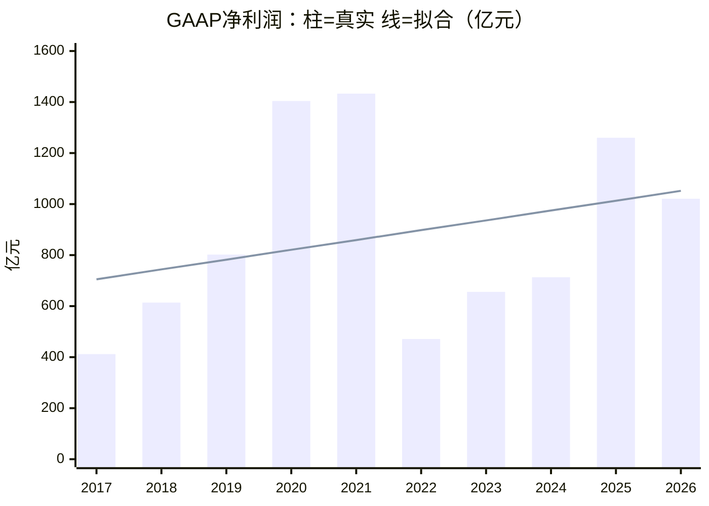

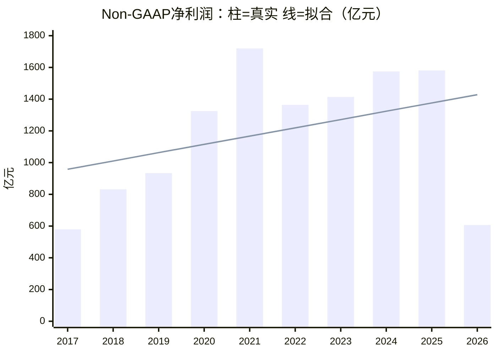

读表：总和约束已满足；但 \(R^2\) 仅约 **0.1**，说明「一条向上直线」解释力很弱。Non-GAAP 末年真实 **607** vs 拟合 **1,428**，差距极大——直线几乎把 FY2026 战役投入当成噪声抹掉了。

##### 当前 PE（市值 ÷ 利润）

市值口径：约 **2026-09-17** 收盘，`9988.HK` 市值约 **2.09 万亿港元** ≈ **1.92 万亿人民币**（×0.92）。


| 分母（亿元） | 利润取值 | PE |
| --- | ---: | ---: |
| GAAP FY2026 真实 | 1,021 | **~18.8×** |
| GAAP FY2026 拟合 | 1,052 | **~18.3×** |
| Non-GAAP FY2026 真实 | 607 | **~31.7×** |
| Non-GAAP FY2026 拟合（全样本直线） | 1,428 | **~13.5×** |
| Non-GAAP 10 年均值 | 1,193 | **~16.1×** |
| Non-GAAP FY2022–FY2025 均值（投入前平台） | 1,483 | **~13.0×** |


##### 结论（怎么用）

- **可以做**线性拟合，且总和约束天然满足；用来做一个「去波动」的参考 PE 没问题。
- **不要单独迷信「末年拟合 PE ~13.5×」**：全样本 \(R^2\) 太低，且末年拟合显著高于近期平台与 FY2026 真实值。
- **更可辩护的平滑分母**：Non-GAAP **10 年均值 → PE ~16×**，或 **FY2022–FY2025 均值 → PE ~13×**；再与真实 Non-GAAP PE ~32×（被 FY2026 砸低分母）并排看。
- 若坚持回归：可考虑**剔除 FY2026 后再拟合**（样本内 \(R^2\) 会升到约 0.7），但外推末年带主观，需单独标注「情景」而非「事实」。

#### 2.2 腾讯净利润与 PE

口径：腾讯控股（`0700.HK`）；日历年 **2016–2025**（10 年）。**IFRS 归母** = 本公司权益持有人应占盈利；**Non-IFRS 归母** ≈ 阿里 Non-GAAP（剔 SBC、投资相关等）。来源：年报五年摘要；`data/tencent_ifrs_nonifrs_profit_cy2016_2025.json`。拟合为带截距 OLS（残差和=0，合计自动对齐）。

##### 线性拟合结果（2016–2025）

时间编码：\(t=0\) 为 2016，…，\(t=9\) 为 2025。单位：亿元人民币。


| 口径 | 拟合式 | \(R^2\) | 真实合计 | 拟合合计 |
| --- | --- | ---: | ---: | ---: |
| IFRS 归母净利润 | \(y=561.5+184.5\,t\) | **0.68** | 13,917 | 13,917 |
| Non-IFRS 归母盈利 | \(y=330.9+211.9\,t\) | **0.89** | 12,846 | 12,846 |


| 年 | IFRS 真实 | IFRS 拟合 | Non-IFRS 真实 | Non-IFRS 拟合 |
| --- | ---: | ---: | ---: | ---: |
| 2016 | 411 | 562 | 454 | 331 |
| 2017 | 715 | 746 | 651 | 543 |
| 2018 | 787 | 930 | 775 | 755 |
| 2019 | 933 | 1,115 | 944 | 967 |
| 2020 | 1,598 | 1,299 | 1,227 | 1,179 |
| 2021 | 2,248 | 1,484 | 1,238 | 1,391 |
| 2022 | 1,882 | 1,668 | 1,156 | 1,602 |
| 2023 | 1,152 | 1,853 | 1,577 | 1,814 |
| 2024 | 1,941 | 2,037 | 2,227 | 2,026 |
| 2025 | 2,248 | 2,222 | 2,596 | 2,238 |


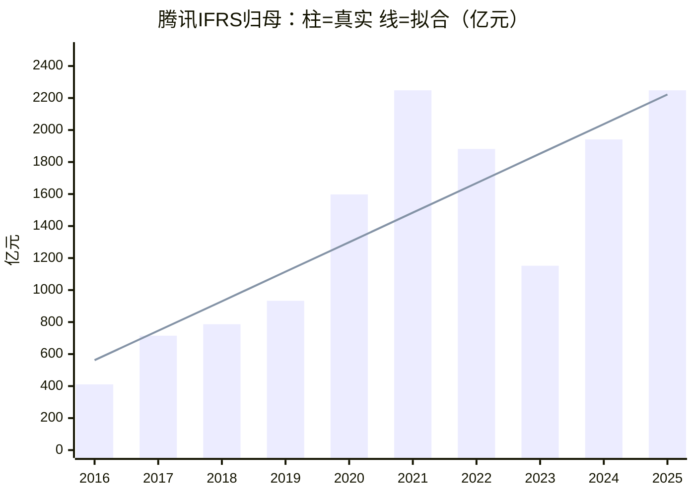

```mermaid
xychart-beta
    title "腾讯Non-IFRS归母：柱=真实 线=拟合（亿元）"
    x-axis [2016, 2017, 2018, 2019, 2020, 2021, 2022, 2023, 2024, 2025]
    y-axis "亿元" 0 --> 2800
    bar [454, 651, 775, 944, 1227, 1238, 1156, 1577, 2227, 2596]
    line [331, 543, 755, 967, 1179, 1391, 1602, 1814, 2026, 2238]
```

读表：相对阿里，腾讯线性拟合**好得多**（尤其 Non-IFRS \(R^2\approx0.89\)），说明近十年盈利上行趋势更干净。IFRS 在 2021–2023 受投资/减值扰动更大；Non-IFRS 2022 低点后连续抬升，2025 真实 **2,596** 高于拟合 **2,238**（趋势线略保守于末年）。

##### 当前 PE（市值 ÷ 利润）

市值口径：约 **2026-09-17** 收盘，`0700.HK` 约 **3.84 万亿港元** ≈ **3.53 万亿人民币**（×0.92）。


| 分母（亿元） | 利润取值 | PE |
| --- | ---: | ---: |
| IFRS 2025 真实 | 2,248 | **~15.7×** |
| IFRS 2025 拟合 | 2,222 | **~15.9×** |
| Non-IFRS 2025 真实 | 2,596 | **~13.6×** |
| Non-IFRS 2025 拟合 | 2,238 | **~15.8×** |
| Non-IFRS 10 年均值 | 1,285 | **~27.5×** |


##### 与阿里对照（一眼）

- 腾讯 Non-IFRS 末年真实 PE ~**14×**、拟合 PE ~**16×**，两者接近；阿里 Non-GAAP 末年真实 ~**32×**、拟合 ~**14×**，被 FY2026 断崖拉歪——**腾讯更适合用「末年拟合 PE」**。
- 腾讯 10 年均值 PE 偏高（~28×），因早期盈利基数低；看趋势估值时优先 **末年真实 / 末年拟合**，均值仅作长周期参照。

#### 2.3 京东净利润与 PE

口径：京东集团（`9618.HK` / `JD`）；日历年 **2016–2025**（10 年）。**GAAP 归母** = 归属于普通股股东净利润（U.S. GAAP；2016–2018 优先用持续经营口径，与京东金融分拆后披露一致）；**Non-GAAP 归母** ≈ 阿里 Non-GAAP（剔 SBC、并购无形摊销、投资损益/减值及相关税项等，以公司定义为准）。来源：历年业绩公告 / SEC EX-99.1；中间文件 `data/jd_gaap_nongaap_profit_cy2016_2025.json`。拟合为带截距 OLS（残差和=0，合计自动对齐）。

##### 线性拟合结果（2016–2025）

时间编码：\(t=0\) 为 2016，…，\(t=9\) 为 2025。单位：亿元人民币。


| 口径 | 拟合式 | \(R^2\) | 真实合计 | 拟合合计 |
| --- | --- | ---: | ---: | ---: |
| GAAP 归母净利润 | \(y=-3.1+33.9\,t\) | **0.30** | 1,492 | 1,492 |
| Non-GAAP 归母净利润 | \(y=-7.0+44.6\,t\) | **0.80** | 1,935 | 1,935 |


| 年 | GAAP 真实 | GAAP 拟合 | Non-GAAP 真实 | Non-GAAP 拟合 |
| --- | ---: | ---: | ---: | ---: |
| 2016 | -20 | -3 | 21 | -7 |
| 2017 | 1 | 31 | 50 | 38 |
| 2018 | -25 | 65 | 35 | 82 |
| 2019 | 122 | 98 | 107 | 127 |
| 2020 | 494 | 132 | 168 | 171 |
| 2021 | -36 | 166 | 172 | 216 |
| 2022 | 104 | 200 | 282 | 260 |
| 2023 | 242 | 234 | 352 | 305 |
| 2024 | 414 | 268 | 478 | 349 |
| 2025 | 196 | 301 | 270 | 394 |


```mermaid
xychart-beta
    title "京东GAAP归母：柱=真实 线=拟合（亿元）"
    x-axis [2016, 2017, 2018, 2019, 2020, 2021, 2022, 2023, 2024, 2025]
    y-axis "亿元" -100 --> 550
    bar [-20, 1, -25, 122, 494, -36, 104, 242, 414, 196]
    line [-3, 31, 65, 98, 132, 166, 200, 234, 268, 301]
```

```mermaid
xychart-beta
    title "京东Non-GAAP归母：柱=真实 线=拟合（亿元）"
    x-axis [2016, 2017, 2018, 2019, 2020, 2021, 2022, 2023, 2024, 2025]
    y-axis "亿元" -50 --> 550
    bar [21, 50, 35, 107, 168, 172, 282, 352, 478, 270]
    line [-7, 38, 82, 127, 171, 216, 260, 305, 349, 394]
```

读表：Non-GAAP \(R^2\approx0.80\)，十年上行趋势清晰（2022–2024 连续抬升至 **478**）；**2025 真实 270 vs 拟合 394**，被外卖/即时零售补贴大战明显压低——形态接近阿里 FY2026 断崖，只是幅度更小。GAAP \(R^2\) 仅 **0.30**：2020 投资浮盈（约 **494**）与 2021 亏损（**-36**）把直线打散，**不宜单独用 GAAP 末年拟合做 PE**。

##### 当前 PE（市值 ÷ 利润）

市值口径：约 **2026-09-17**，`9618.HK` 约 **2,868 亿港元** ≈ **2,639 亿人民币**（×0.92）。


| 分母（亿元） | 利润取值 | PE |
| --- | ---: | ---: |
| GAAP 2025 真实 | 196 | **~13.5×** |
| GAAP 2025 拟合 | 301 | **~8.8×** |
| Non-GAAP 2025 真实 | 270 | **~9.8×** |
| Non-GAAP 2025 拟合 | 394 | **~6.7×** |
| Non-GAAP 10 年均值 | 194 | **~13.6×** |
| Non-GAAP 2022–2024 均值（补贴大战前高点） | 371 | **~7.1×** |


##### 与阿里 / 腾讯对照（一眼）

见下节 **§2.4** 总表。要点：京东 Non-GAAP 真实 PE ~**10×** 低于腾讯 ~**14×**、远低于阿里真实 ~**32×**（阿里末年利润被砸）；京东/阿里末年拟合 PE 都偏乐观（投入压低真实利润、趋势线抬高分母）。

#### 2.4 三家 PE 对照

口径：市值约 **2026-09-17**（港币×0.92→人民币）；利润为各节末年真实 / 全样本线性拟合值。阿里财年 **FY2026**（至 2026-03），腾讯/京东为日历年 **2025**。Non-GAAP ≈ Non-IFRS。单位：市值、利润为亿元人民币。


| 公司 | 市值 | 口径 | 末年利润·真实 | 末年利润·拟合 | PE·真实 | PE·拟合 |
| --- | ---: | --- | ---: | ---: | ---: | ---: |
| 阿里 `9988` | ~19,200 | GAAP | 1,021 | 1,052 | **~18.8×** | **~18.3×** |
| 阿里 `9988` | ~19,200 | Non-GAAP | 607 | 1,428 | **~31.7×** | **~13.5×** |
| 腾讯 `0700` | ~35,300 | IFRS | 2,248 | 2,222 | **~15.7×** | **~15.9×** |
| 腾讯 `0700` | ~35,300 | Non-IFRS | 2,596 | 2,238 | **~13.6×** | **~15.8×** |
| 京东 `9618` | ~2,639 | GAAP | 196 | 301 | **~13.5×** | **~8.8×** |
| 京东 `9618` | ~2,639 | Non-GAAP | 270 | 394 | **~9.8×** | **~6.7×** |


读表：优先横比 **Non-GAAP / Non-IFRS**。真实 PE：京东最便宜（~10×）→ 腾讯（~14×）→ 阿里（~32×，分母被即时零售投入砸低）。拟合 PE：腾讯真实/拟合接近；阿里、京东拟合显著低于真实（趋势线抹掉末年投入），**拟合 PE 作下限参考即可，不宜单独定价**。

### 3. 分部估值法

#### 3.1 电商板块估值

#### 3.2 云智能板块估值
